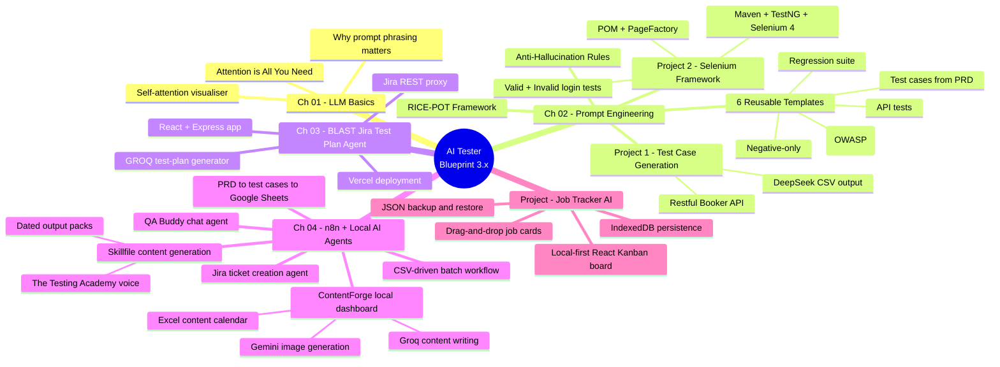
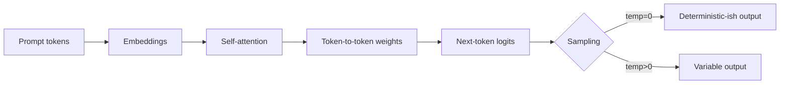
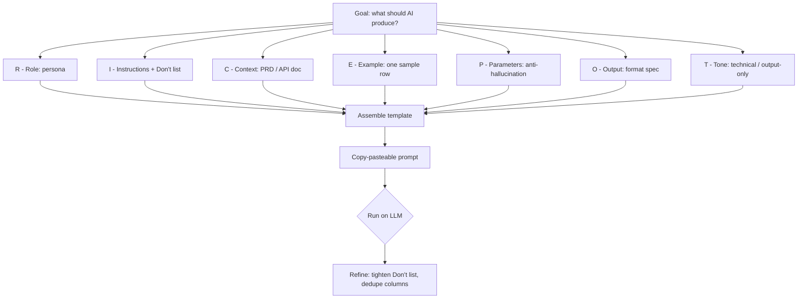

# AI Tester Blueprint 3.x

A practical, project-driven curriculum for QA engineers learning to use LLMs as a real testing tool — not a toy.
Each chapter pairs concept material with a hands-on project, a prompt template, and runnable code where applicable.

- **Author:** Pramod Dutta — Principal SDET
- **Website:** [The Testing Academy](https://thetestingacademy.com/)
- **LinkedIn:** [linkedin.com/in/pramoddutta](https://www.linkedin.com/in/pramoddutta/)

---

## Curriculum Map



---

## Repository Layout

```
.
├── chapter_01_LLM_Basics/         How transformers and attention work
│   ├── attention_interactive.html
│   ├── attention_is_all_you_need.html
│   └── Notes.md
│
├── chapter_02_Prompt_Eng/         Prompt engineering for QA work
│   ├── Anti_Hallucinations_Rules.md
│   ├── Project1_TC_Gen/           Test case generation from a PRD/API doc
│   │   ├── RICE-POT-TestCase-Prompt.md
│   │   ├── RICE_POT_FRAMEWORK/
│   │   ├── Restful-booker.pdf
│   │   ├── Restful_Booker_API_Test_Cases.md
│   │   └── output/
│   ├── Project2_Selenium_Framework/   POM-based Selenium framework built from a prompt
│   │   ├── Problem.md
│   │   ├── SKILL.md                   RICE-POT prompt-builder skill
│   │   ├── blank-template-rice-pot.md
│   │   └── AdvanceSeleniumFramework/  Maven + TestNG + Selenium 4
│   └── templates/                 Reusable prompt templates (RTCFR / RICE-POT)
│       ├── 01_TestCaseGeneration_Prompt.md
│       ├── 02_TestCases_from_prd
│       ├── 03_API_Test_Generation.md
│       ├── 04_Negative_TC_Only.md
│       ├── 05_Secuirty_Test.md
│       └── 06_Regression_Suite.md
│
├── chapter_03_BLAST_FW_JIRA_AI_AGENT/   Jira to test-plan generator
│   ├── README.md
│   ├── B.L.A.S.T.md
│   ├── architecture/              Layer 1 SOPs and test-plan template
│   ├── api/                       Vercel serverless endpoints
│   ├── src/                       React UI
│   ├── tools/                     Jira, GROQ, and Markdown engines
│   ├── server.js                  Local Express proxy
│   └── package.json
│
├── chapter_04_AI_Agents_n8n/      n8n workflows + local AI agent projects
│   ├── README.md
│   ├── n8n_AIAgent/
│   │   ├── AI_3X_01_QA_Buddy.json
│   │   ├── AI_3X_02_JIRA_Agent.json
│   │   ├── AI_3X_03_Read_PRD_TestCases_Excel.json
│   │   └── AI_3X_04_Read_PRD_TestCases_Excel_v2.json
│   ├── social_ai_agent/
│   │   └── contentforge/          Next.js local content pipeline dashboard
│   └── skillfile_content_generation/
│       ├── SKILL.md               The Testing Academy content engine
│       └── output/                Dated publish-ready content packs
│
└── Project_Job_TRACKERAI/         Local-first job application tracker
    ├── README.md
    ├── package.json
    ├── src/
    │   ├── App.jsx
    │   ├── constants.js
    │   └── db.js
    └── public/
        └── favicon.svg
```

---

## Chapter 01 — LLM Basics

Foundational material on how Large Language Models read text and decide what to output. The key idea: a model is not a database lookup — it weighs every token against every other token (attention) and predicts the next one.

**What's here:**
- `attention_is_all_you_need.html` — interactive walkthrough of the original Transformer paper concepts.
- `attention_interactive.html` — visualises self-attention so you can see why prompt phrasing changes outputs.
- `Notes.md` — short recap notes.

**Why a QA engineer should care:** the model's behaviour is deterministic-ish on a per-token level, but every word you add to a prompt shifts the attention weights. That is why structured prompt frameworks (next chapter) outperform free-form questions.

**Q&A — why this matters for testing:**
- **Q: Why does the same prompt give different test cases each run?** A: Sampling temperature plus floating-point non-determinism in attention. Pin `temperature=0` and set explicit constraints to flatten variance.
- **Q: Why does adding "be thorough" rarely help?** A: Vague tokens add weight without direction. Replace with measurable constraints — "cover boundary, negative, and security cases" steers attention to specific output shape.
- **Q: Do I need to read the original Transformer paper?** A: No — but understanding that the model weighs every token against every other token explains why irrelevant words in your prompt pollute the answer.

**Mental model — how one prompt token influences the output:**



**Quick demo — try it locally:**

```bash
# clone, then just open the HTML files in a browser - no build, no install
open chapter_01_LLM_Basics/attention_interactive.html
open chapter_01_LLM_Basics/attention_is_all_you_need.html
```

Hover over tokens in `attention_interactive.html` to see the live attention matrix. Edit the input sentence to see weights shift in real time — that's the same mechanism that makes your prompt wording matter.

---

## Chapter 02 — Prompt Engineering for QA

This chapter turns prompt engineering into a repeatable QA skill. Three pillars:

1. **Anti-hallucination rules** — guardrails so the model only uses provided input.
2. **RICE-POT framework** — a structured prompt template (Role, Instructions, Context, Example, Parameters, Output, Tone).
3. **Two projects + six templates** — applied on real artifacts (a PRD-style API doc and a Selenium framework build).

**Q&A — RICE-POT vs free-form prompting:**
- **Q: I already get OK results from "write test cases for this PRD." Why bother with a framework?** A: "OK" is the ceiling. RICE-POT forces you to declare the persona, format, and constraints, which is what turns a 60% useful answer into a 95% useful one — every time, not just on lucky runs.
- **Q: Isn't this just over-engineering a chat message?** A: For one-offs, yes. For repeatable QA tasks (regression suites, security checklists, daily test-case generation), the template pays for itself within three uses.
- **Q: Which letter is most often skipped — and what breaks?** A: `P` (Parameters). Without the anti-hallucination block, the model invents fields, IDs, and error codes that don't exist in your PRD. Output looks plausible but ships bugs.

**RICE-POT prompt flow — from goal to copy-pasteable prompt:**



### Anti-Hallucination Rules (`Anti_Hallucinations_Rules.md`)

A drop-in `ROLE` block you prepend to any QA prompt. Forces the model to:
- Use only the inputs you provide (PRD, screenshots, API docs).
- Refuse to assume "typical" system behaviour.
- Output exactly `"Insufficient information to determine."` when an input is missing.
- Label inferred details as `"Inference (low confidence)"`.
- Produce a Verified Facts / Missing Info / Output / Self-Validation block.

Use this on every factual-generation prompt in this repo.

### Project 1 — Test Case Generation with RICE-POT

Goal: turn an API PDF (`Restful-booker.pdf`) into a CSV of enterprise-grade test cases.

- `RICE-POT-TestCase-Prompt.md` — the worked prompt. Targets `app.vwo.com` as the example product, but the structure transfers to any PRD/API doc.
- `RICE_POT_FRAMEWORK/RICE_POT.md` — explanation of each letter of the framework.
- `Restful-booker.pdf` + `Restful_Booker_API_Test_Cases.md` — input PDF and the generated test-case set.
- `output/deepseek_csv_20260524_0d9b7c.csv` — actual model output produced from the prompt.

**Q&A — Project 1 design choices:**
- **Q: Why a PDF input and not just pasted text?** A: PDFs mirror how QA actually receives PRDs and API specs. Forcing the model to extract from the document tests whether the prompt's anti-hallucination block holds under realistic input noise.
- **Q: Why CSV output instead of Markdown?** A: CSV imports cleanly into Jira, TestRail, qTest, and Zephyr. The model is told the exact column order so the file drops straight into a test-management tool.
- **Q: How do I trust the output?** A: Cross-check the `Traceability` column — every test case row must cite a section of the source PDF. Rows without traceability fail review.

**Sample output row (from `deepseek_csv_20260524_0d9b7c.csv`):**

```csv
TC_ID,Title,Preconditions,Steps,Test Data,Expected Result,Type,Priority,Traceability
TC_API_007,Create booking with valid payload,"Auth token obtained","POST /booking with required fields","firstname=Jim, lastname=Brown, totalprice=111, depositpaid=true","HTTP 200 + bookingid + booking object echoed back",Positive,High,"Restful-booker.pdf §Booking → CreateBooking"
```

**How to exercise it:**
1. Open `RICE-POT-TestCase-Prompt.md` in any AI tool (ChatGPT, Claude, Gemini, DeepSeek).
2. Attach `Restful-booker.pdf` (or your own PRD).
3. Confirm the output is CSV only, columns match the spec, and every test case traces back to the PDF.

### Project 2 — Selenium Framework from a Prompt

Goal: prove RICE-POT can build production code, not just test cases.

- `Problem.md` — the brief: "generate a Selenium framework from scratch with two page objects, production ready."
- `SKILL.md` — the RICE-POT prompt-builder skill definition. Tells the AI how to interview you, assemble the prompt, and deliver it copy-pasteable.
- `blank-template-rice-pot.md` — fill-in template with the recommended anti-hallucination Parameters block.
- `AdvanceSeleniumFramework/` — the actual output the framework generates:
  - Maven project, Java 11, Selenium 4.25, TestNG 7.10.
  - `LoginPage.java` — PageFactory POM with explicit waits, fluent API, no Thread.sleep.
  - `BaseTest.java` — driver lifecycle.
  - `ConfigReader.java` — `config.properties` loader.
  - `ValidLoginTest.java` / `InvalidLoginTest.java` — positive + negative TestNG cases.
  - `testng.xml` / `testng-smoke.xml` — full and smoke suites.

**Q&A — Project 2 design choices:**
- **Q: Why XPath only?** A: The prompt locked it to one locator strategy on purpose — consistency makes generated code reviewable. In production you'd mix CSS + XPath, but the discipline of "one strategy" is what the prompt enforces.
- **Q: Where do real credentials go?** A: `src/main/resources/config.properties`. Placeholders `REPLACE_WITH_...` fail fast in `@BeforeTest` so a forgotten config never silently passes a test.
- **Q: Why headless Chrome by default?** A: macOS 26.1 + Chrome 148 dropped windowed sessions mid-test in this repo. Headless avoids the focus/sandbox issue and is what CI uses anyway.

**Framework architecture — what the prompt generated:**

```mermaid
flowchart TD
    CFG[config.properties] --> CR[ConfigReader]
    CR --> BT[BaseTest]
    BT -->|@BeforeMethod| D[ChromeDriver headless]
    BT -->|@AfterMethod| Q[driver.quit]
    LP[LoginPage - POM + PageFactory] --> XP["@FindBy xpath only"]
    VT[ValidLoginTest] --> LP
    IT[InvalidLoginTest + @DataProvider] --> LP
    VT -.extends.-> BT
    IT -.extends.-> BT
    SUITE[testng.xml] --> VT
    SUITE --> IT
    SMOKE[testng-smoke.xml] --> IT
```

**LoginPage snippet (XPath + explicit waits, no Thread.sleep):**

```java
public class LoginPage {
    @FindBy(xpath = "//input[@id='username']") private WebElement usernameField;
    @FindBy(xpath = "//input[@id='password']") private WebElement passwordField;
    @FindBy(xpath = "//input[@id='Login']")    private WebElement loginButton;
    @FindBy(xpath = "//div[@id='error']")      private WebElement errorMessage;

    public LoginPage(WebDriver driver) {
        this.wait = new WebDriverWait(driver,
            Duration.ofSeconds(ConfigReader.getInt("timeout.explicit")));
        PageFactory.initElements(driver, this);
    }

    public void loginAs(String user, String pass) {
        wait.until(ExpectedConditions.visibilityOf(usernameField)).sendKeys(user);
        passwordField.sendKeys(pass);
        wait.until(ExpectedConditions.elementToBeClickable(loginButton)).click();
    }
}
```

**Run it:**
```bash
cd chapter_02_Prompt_Eng/Project2_Selenium_Framework/AdvanceSeleniumFramework
mvn -q clean test-compile
mvn test                       # full suite
mvn test -DsuiteXmlFile=testng-smoke.xml   # smoke only
```

### Templates — RTCFR + RICE-POT (`templates/`)

Six copy-paste prompt templates for the most common QA tasks. Each follows the **RTCFR** shape — Role, Task, Constraints, Format, Requirements — which is the lightweight cousin of RICE-POT.

| # | File | Purpose |
|---|------|---------|
| 01 | `01_TestCaseGeneration_Prompt.md` | Basic test-case generation from free-form requirements. |
| 02 | `02_TestCases_from_prd` | Comprehensive PRD → test cases (functional, negative, boundary, edge). |
| 03 | `03_API_Test_Generation.md` | API endpoint test cases from API docs. |
| 04 | `04_Negative_TC_Only.md` | Negative-only suite — invalid inputs, auth violations, malformed data. |
| 05 | `05_Secuirty_Test.md` | OWASP-top-10-aligned security test cases. |
| 06 | `06_Regression_Suite.md` | Regression suite for a module with execution-time estimates. |

**Use any template:**
1. Open the file and copy the fenced block.
2. Replace `[FEATURE]` / `[PASTE REQUIREMENTS]` / `[PASTE PRD]` etc. with your input.
3. Paste into your AI tool. Keep the `CONSTRAINTS` block intact — that's what stops hallucination.

---

## Chapter 03 — B.L.A.S.T. Jira Test Plan Generator

This chapter turns a Jira ticket into a formal QA test plan through a lightweight **React + Express** app. It uses the **B.L.A.S.T.** protocol (Blueprint, Link, Architect, Stylize, Trigger) and an **A.N.T.** 3-layer architecture.

**What's here:**
- `README.md` — setup, local run, production run, and Vercel deployment notes.
- `src/` — React UI for Settings, Generate, and Test Plan views.
- `server.js` + `tools/` — local Express proxy, Jira fetcher, GROQ client, and deterministic Markdown renderer.
- `api/` + `vercel.json` — serverless production deployment path.
- `architecture/` — SOPs for Jira fetch, GROQ generation, and the 13-section test-plan template.

**Why a QA engineer should care:** Jira tickets are often the real source of truth. This project shows how to keep credentials out of the browser, fetch ticket context safely, ask an LLM for structured JSON, and render a repeatable test plan without relying on free-form chat output.

**Run it locally:**
```bash
cd chapter_03_BLAST_FW_JIRA_AI_AGENT
npm install
npm run dev
```

Open `http://localhost:5173`, add Jira + GROQ credentials in the Settings tab, then generate a plan from a Jira ID.

---

## Chapter 04 — n8n and Local AI Agents for QA

This chapter adds importable **n8n** workflows and local AI-agent projects for practical QA and content automation. It shows how to connect chat triggers, LLM nodes, Jira tools, Google Sheets output, Slack/Teams triggers, CSV-driven batch processing, a local Next.js dashboard, local Excel persistence, and content-generation skill files.

**What's here:**
- `AI_3X_01_QA_Buddy.json` — chat-triggered QA assistant using a GROQ-backed LLM node.
- `AI_3X_02_JIRA_Agent.json` — chat agent that can create Jira tickets.
- `AI_3X_03_Read_PRD_TestCases_Excel.json` — fetches PRD/ticket context and writes generated test cases into Google Sheets.
- `AI_3X_04_Read_PRD_TestCases_Excel_v2.json` — extends the PRD-to-test-cases flow with CSV upload and batch Jira processing.
- `social_ai_agent/contentforge/` — local Next.js + TypeScript dashboard for a daily content-generation pipeline.
- `skillfile_content_generation/SKILL.md` — content engine skill for The Testing Academy publish-ready content packs.
- `skillfile_content_generation/output/2026-06-14/` — generated content pack for "Your AI Agent Needs a QA Contract, Not More Prompts."

**How to use the n8n workflows:**
1. Open n8n Cloud or a self-hosted n8n instance.
2. Import the JSON workflow from `chapter_04_AI_Agents_n8n/n8n_AIAgent/`.
3. Reconnect credentials for the nodes you use: GROQ, DeepSeek, Jira, Google Sheets, Slack, or Microsoft Teams.
4. Run the chat trigger, form trigger, schedule trigger, or team-channel trigger depending on the workflow.

**Run ContentForge locally:**
```bash
cd chapter_04_AI_Agents_n8n/social_ai_agent/contentforge
npm install
cp .env.example .env.local
npm run dev
```

Add your local keys to `.env.local` or `.env`:

```bash
GROQ_API_KEY=...
GEMINI_API_KEY=...
```

ContentForge keeps generated data local:

- `content_calendar.xlsx` in the app root.
- Generated runtime images under `public/images/`.
- API keys in `.env.local` or `.env`.

Those local files are ignored and should not be committed.

**Use the content skill output:**

Open `chapter_04_AI_Agents_n8n/skillfile_content_generation/output/2026-06-14/` for separate Markdown files covering the topic, LinkedIn post, Medium article, YouTube script, Instagram carousel copy, and image prompts.

---

## Project - Job Tracker AI

`Project_Job_TRACKERAI/` is a local-first job application tracker built as a Vite + React single-page app. It stores every job card in the browser with IndexedDB through the `idb` library, so there is no backend, authentication, or external database.

**What's here:**
- Six Kanban columns: Wishlist, Applied, Follow-up, Interview, Offer, and Rejected.
- Drag-and-drop cards between columns with `@dnd-kit/core`.
- Add, edit, delete, search, and sort job cards.
- Resume-name reuse, LinkedIn job links, days-since-applied labels, salary notes, and status color accents.
- Light/dark mode plus JSON export/import for backups.

**Run it locally:**
```bash
cd Project_Job_TRACKERAI
npm install
npm run dev
```

Open the local Vite URL and use the app directly in the browser. Data persists in the browser's IndexedDB database named `job-tracker-ai`.

---

## How to Use This Repo

You can read it linearly (chapter 01 → 04) or jump straight to a project:

- **"I want better test cases now."** → `chapter_02_Prompt_Eng/templates/01_TestCaseGeneration_Prompt.md` or `02_TestCases_from_prd`.
- **"I want to write tests from a PDF/API doc."** → `chapter_02_Prompt_Eng/Project1_TC_Gen/`.
- **"I want to scaffold a Selenium project."** → `chapter_02_Prompt_Eng/Project2_Selenium_Framework/SKILL.md`, then run the Maven project under `AdvanceSeleniumFramework/`.
- **"I want my model to stop making things up."** → `chapter_02_Prompt_Eng/Anti_Hallucinations_Rules.md`.
- **"I want to generate a test plan from Jira."** → `chapter_03_BLAST_FW_JIRA_AI_AGENT/`.
- **"I want reusable QA automation agents."** → `chapter_04_AI_Agents_n8n/n8n_AIAgent/`.
- **"I want a local AI content dashboard."** → `chapter_04_AI_Agents_n8n/social_ai_agent/contentforge/`.
- **"I want publish-ready Testing Academy content."** → `chapter_04_AI_Agents_n8n/skillfile_content_generation/output/`.
- **"I want to track job applications locally."** → `Project_Job_TRACKERAI/`.

## Requirements

- Any modern LLM (Claude / GPT / Gemini / DeepSeek). No specific provider required.
- For Project 2 only: **JDK 11+** and **Maven 3.9+** to compile and run the Selenium framework.
- For Chapter 3: **Node.js 18+**, npm, Jira API credentials, and a GROQ API key.
- For Chapter 4 n8n workflows: n8n Cloud or self-hosted n8n, plus credentials for whichever workflow nodes you enable.
- For Chapter 4 ContentForge: **Node.js 20+**, npm, `GROQ_API_KEY`, and `GEMINI_API_KEY`.
- For Job Tracker AI: **Node.js 20.19+ or 22.12+** and npm for Vite 8.

## Chapter History

`a2eb280` — chapter 01 LLM basics with interactive attention visualisations.
`dfe2653` — chapter 02 prompt engineering with RICE-POT framework + Selenium project.
`187a77f` — chapter 03 B.L.A.S.T. Jira to Test Plan generator.
`f67b4f6` — chapter 04 ContentForge local content pipeline + skill output pack.

---

Made by [Pramod Dutta](https://thetestingacademy.com/) for The Testing Academy.
