# AI Tester Blueprint 3.x

A practical, project-driven curriculum for QA engineers learning to use LLMs as a real testing tool — not a toy.
Each chapter pairs concept material with a hands-on project, a prompt template, and runnable code where applicable.

- **Author:** Pramod Dutta — Principal SDET
- **Website:** [The Testing Academy](https://thetestingacademy.com/)
- **LinkedIn:** [linkedin.com/in/pramoddutta](https://www.linkedin.com/in/pramoddutta/)

### Live

| | |
|---|---|
| **[DeepEval Dashboard](https://deepeval-dashboard.vercel.app)** | 25 metrics scored against a live chatbot and RAG pipeline. Real scores, judge reasons, latencies and token counts from one recorded run. |
| **[How the framework works](https://deepeval-dashboard.vercel.app/how-it-works)** | Illustrated walkthrough: the evaluation loop, what each metric reads, the attack library, and the four ways the numbers mislead you. |

Both are chapter 16. Nothing to install to read them; clone the repo to run the suite live.

---

## Curriculum Map


```mermaid
mindmap
  root((AI Tester<br/>Blueprint 3.x))
    Ch 01 - LLM Basics
      Attention is All You Need
      Self-attention visualiser
      Why prompt phrasing matters
    Ch 02 - Prompt Engineering
      Anti-Hallucination Rules
      RICE-POT Framework
      Project 1 - Test Case Generation
        Restful Booker API
        DeepSeek CSV output
      Project 2 - Selenium Framework
        Maven + TestNG + Selenium 4
        POM + PageFactory
        Valid + Invalid login tests
      6 Reusable Templates
        Test cases from PRD
        API tests
        Negative-only
        Security (OWASP)
        Regression suite
    Ch 03 - BLAST Jira Test Plan Agent
      React + Express app
      Jira REST proxy
      GROQ test-plan generator
      Vercel deployment
    Ch 04 - n8n + Local AI Agents
      QA Buddy chat agent
      Jira ticket creation agent
      PRD to test cases to Google Sheets
      CSV-driven batch workflow
      ContentForge local dashboard
        Groq content writing
        Gemini image generation
        Excel content calendar
      Skillfile content generation
        The Testing Academy voice
        Brand voice + 8-beat video script
        Dated output packs
      Social Media AI Agent
        Schedule trigger
        DeepSeek / Gemini / OpenAI
        Google Sheets + Drive
      Resume Tailor skill
        Score + ATS gap check
        No-fabrication gate
        Clean .docx build
    Ch 05 - AI Agents with LangFlow
      Visual low-code flows
      Published flow = REST API
      Flaky Test Analyzer + React UI
      API Contract Validator
      Bug Triage agent
      LangFlow vs LangGraph vs LangSmith
    Ch 06 - AI Social Media Content
      Hook - Story - Offer planning
      YouTube + Reel + Post + Carousel
      Medium + Blog + LinkedIn
      Plan once, repurpose everywhere
    Ch 07 - RAG
      RAG Explorer app
      PDF to chunk to embed
      Nomic Embed via Ollama
      Local ChromaDB store
      Retrieve top-k + Groq answer
      Vector Store viewer + upload
      n8n + LangFlow RAG flows
      Advanced RAG (hybrid + rerank)
    Ch 08 - QABuddy.ai
      Multi-source hybrid RAG
      10 QA knowledge sources
      bge-m3 dense + sparse
      Qdrant + RRF + reranker
      Cited answers only
      Answer / generate / review / RCA modes
      Cream chat UI
      VPS deploy pack
    Ch 09 - MCP Basics
      The N x M integration problem
      Host - Client - Server
      JSON-RPC 2.0 wire format
      Tools - Resources - Prompts
        Who triggers each one
      Templated resource URIs
      Elicitation and sampling
      Capability negotiation
        server/discover
      stdio vs Streamable HTTP
        Never write to stdout
      Spec 2026-07-28 is stateless
      Security and consent model
    Ch 10 - Build an MCP Server
      FastMCP over 5,000 test cases
      Tools - model invoked
      Resources - app fetched by URI
      Prompts - user invoked
      Templated resource URIs
      stdio JSON-RPC transport
      MCP Inspector + Claude Desktop
    Ch 11 - Python for Testers
      185 Python files
      ex_01 - print + comments
      ex_02 - keywords + identifiers + variables
        Identifier rules cheat sheet
        Dynamic typing + type&#40;&#41;
        BODMAS + max/min
      ex_03 - literals + data types
        Multi-line comments
        Built-in functions
        input&#40;&#41; + int&#40;&#41; casting
        Escape sequences + raw strings
      ex_04 - operators
        Arithmetic, // and % and **
        Comparison + logical + membership
        Ternary one-liner
      ex_05 - if / elif / else
        Nested conditions + input guards
      ex_06 - match-case
        Python 3.10 structural switch
      ex_07 - loops
        for + range&#40;&#41;, while, break/continue/pass
      ex_08 - functions
        4 function types
        Default + keyword args
        Multiple return values
        *args - infinite arguments
        Nested function definitions
      ex_09 - scopes
        Local vs global variables
        Shadowing inside a function
        Inner function visibility
      ex_10 - decorators
        Wrapper pattern - before/after
        @time_decorator for test timing
        Stacked decorators - bottom-up
      ex_11 - type conversion
        int&#40;&#41; str&#40;&#41; float&#40;&#41; bool&#40;&#41; list&#40;&#41; tuple&#40;&#41;
      ex_12 - lambda expressions
        One-line anonymous functions
        Ternary inside lambda
      ex_13 - list
        Mutable, indexed, mixed types
        append / extend / insert / remove
        pop / sort / slice / nested lists
      ex_14 - tuple
        Immutable - TypeError on assign
        Single-element trailing comma
        tuple&#40;&#41; and list&#40;&#41; round trip
      ex_15 - set + frozenset
        Unique unordered values
        Union + intersection + difference
        Set comprehensions
      ex_16 - map + filter
        Transform every item with map&#40;&#41;
        Select matching items with filter&#40;&#41;
        QA result + response-time examples
      ex_17 - dictionary
        Key-value CRUD + iteration
        Nested test data
        zip + merge + frequency counting
      ex_18 - object-oriented Python
        Classes + objects
        Constructors + instance variables
        Encapsulation + access conventions
        5 inheritance patterns + MRO
        QA BaseTest examples
        Polymorphism + method overriding
        Abstract base classes
        Static methods + class methods
        Exceptions + custom errors
        Standard-library modules
      ex_19 - packages
        Local modules + imports
        __init__.py package marker
      ex_20 - collections + file I/O
        namedtuple + Counter + defaultdict
        os.path absolute-path fixes
        python-dotenv secrets
        CSV login data + pandas
      ex_21 - pytest basics
        assert + @pytest.mark smoke/regression
        -k keyword vs -m marker filtering
        Fixtures + parametrize cheat sheet
    Ch 12 - CrewAI Test Analyst Agent
      Agent role + goal + backstory
      Groq LLM via OpenAI-compatible URL
      Task + Crew + kickoff
      Requirement to 5-10 P0 test cases
      Bug triage crew
        Severity vs priority
        Root cause + kill tests
        Test strategy handoff
    Ch 13 - Jira QA Crew (app)
      Four agents, sequential
        Analyst - Plan - Cases - Playwright
      MCP primary, REST fallback
        Chosen in Python, not by an agent
      Pydantic contracts per stage
        Validation gate + one repair
      Traceability computed, not claimed
      Streamlit UI + ZIP artifacts
      260 tests, no live Jira or LLM
    Ch 14 - LLM Evaluation
      Why assertEquals breaks
        Non-determinism
        Open-ended outputs
      Hallucination + faithfulness
      Golden dataset + ground truth
      LLM-as-judge
      Relevancy + context precision
      Cost and latency as signals
    Ch 15 - DeepEval Hands-On
      pytest-shaped LLM tests
        LLMTestCase + assert_test
      AnswerRelevancyMetric
        Threshold, not equality
      The judge is configurable
        Groq gpt-oss-120b as local model
        OpenAI, Ollama, LiteLLM
      deepeval CLI provider switch
    Ch 16 - DeepEval Framework
      Three subsystems
        A - ShopSphere chatbot :8201
        B - RAG Explorer :8202
        C - the grader :8203
      Two models, never one
        qwen3.8-27b under test
        gpt-oss-120b as judge
      One catalogue, two front doors
        metrics_catalog.py
        pytest + dashboard share it
      25 metric cards
        Quality + retrieval
        Safety + security
        G-Eval rubrics
        Conversational
      27-prompt attack library
        Direct injection
        Jailbreak + obfuscation
        Exfiltration
        Social engineering
        Out-of-domain misuse
      Token accounting
        Target vs judge split
      289 pytest cases
    Ch 17 - E2E AI QA Pipeline (blueprint)
      Jira JQL to test plan
      RAG test cases
      Playwright .md automation
      Browser Bash execution
      Flakiness + RCA + dashboard
    Project - Job Tracker AI
      Local-first React Kanban board
      IndexedDB persistence
      Drag-and-drop job cards
      JSON backup and restore
```

---

## Repository Layout

```
.
├── chapter_01_LLM_Basics/         How transformers and attention work
│   ├── attention_interactive.html
│   ├── attention_is_all_you_need.html
│   └── Notes.md
│
├── chapter_02_Prompt_Eng/         Prompt engineering for QA work
│   ├── Anti_Hallucinations_Rules.md
│   ├── Project1_TC_Gen/           Test case generation from a PRD/API doc
│   │   ├── RICE-POT-TestCase-Prompt.md
│   │   ├── RICE_POT_FRAMEWORK/
│   │   ├── Restful-booker.pdf
│   │   ├── Restful_Booker_API_Test_Cases.md
│   │   └── output/
│   ├── Project2_Selenium_Framework/   POM-based Selenium framework built from a prompt
│   │   ├── Problem.md
│   │   ├── SKILL.md                   RICE-POT prompt-builder skill
│   │   ├── blank-template-rice-pot.md
│   │   └── AdvanceSeleniumFramework/  Maven + TestNG + Selenium 4
│   └── templates/                 Reusable prompt templates (RTCFR / RICE-POT)
│       ├── 01_TestCaseGeneration_Prompt.md
│       ├── 02_TestCases_from_prd
│       ├── 03_API_Test_Generation.md
│       ├── 04_Negative_TC_Only.md
│       ├── 05_Secuirty_Test.md
│       └── 06_Regression_Suite.md
│
├── chapter_03_BLAST_FW_JIRA_AI_AGENT/   Jira to test-plan generator
│   ├── README.md
│   ├── B.L.A.S.T.md
│   ├── architecture/              Layer 1 SOPs and test-plan template
│   ├── api/                       Vercel serverless endpoints
│   ├── src/                       React UI
│   ├── tools/                     Jira, GROQ, and Markdown engines
│   ├── server.js                  Local Express proxy
│   └── package.json
│
├── chapter_04_AI_Agents_n8n/      n8n workflows + local AI agent projects
│   ├── README.md
│   ├── n8n_AIAgent/
│   │   ├── AI_3X_01_QA_Buddy.json
│   │   ├── AI_3X_02_JIRA_Agent.json
│   │   ├── AI_3X_03_Read_PRD_TestCases_Excel.json
│   │   ├── AI_3X_04_Read_PRD_TestCases_Excel_v2.json
│   │   └── AI_3X_05_Social_media_AI agent.json   Scheduled social-post agent
│   ├── social_ai_agent/
│   │   └── contentforge/          Next.js local content pipeline dashboard
│   ├── resume-tailor/             Resume scoring + ATS tailoring skill
│   │   ├── SKILL.md
│   │   ├── references/            ATS analysis, docx build, input reading
│   │   └── scripts/build_resume.js
│   └── skillfile_content_generation/
│       ├── SKILL.md               The Testing Academy content engine
│       ├── brand-voice.md         Brand voice + 8-beat video script guide
│       └── output/                Dated publish-ready content packs
│
├── chapter_05_AI_Agents_LangFlow/ Visual low-code AI agents (LangFlow)
│   ├── README.md
│   ├── LangFlow vs LangGraph vs LangSmith.md
│   ├── Project/
│   │   ├── AI3X_001_HelloWorld.json
│   │   ├── AI3X_002_Flaky_Test_AIAgent.json
│   │   ├── AI3X_003_Bug_Triage_AI_Agent.json
│   │   └── AI3X_004_API_Contract_Validator.md
│   ├── flaky_test_analyzer_ai_Agent/
│   │   ├── PROMPTS.md             Agent prompt + UI build prompt (shareable)
│   │   ├── result1.json / result2.json   Sample Playwright runs
│   │   └── ui/                    React UI proxied to the LangFlow API
│   ├── langflow-up.sh             Start Docker + Langflow, wait for /health
│   └── langflow-down.sh           Stop container + quit Docker Desktop
│
├── chapter_06_AI_Social_Media_Content_Creation/   One idea to a full content pack
│   ├── README.md
│   ├── 00_Hook_Story_Offer_Planning.md    Plan any idea before writing
│   ├── 01_YouTube_Video_Template.md
│   ├── 02_Instagram_Reel_Template.md
│   ├── 03_Instagram_Post_Template.md
│   ├── 04_Instagram_Carousel_Template.md
│   ├── 05_Medium_Article_Template.md
│   ├── 06_Blog_Post_Template.md
│   └── 07_LinkedIn_Post_Template.md
│
├── chapter_07_RAG/                Retrieval-Augmented Generation
│   ├── RAG_Explorer.jpg
│   ├── BASIC_RAG_N8N.jpg
│   ├── Basic_RAG/
│   │   ├── data/                  Source PDF (VWO PRD)
│   │   └── rag-explorer/          React + Express RAG demo app
│   │       ├── server/            Express API: pdf, chunk, embed, chroma, groq
│   │       ├── src/               React UI (pipeline view, ingest, query)
│   │       └── README.md
│   ├── n8n_BASIC_RAG/             No-code Basic RAG (n8n workflow)
│   │   └── AI3X_Basic_RAG.json
│   ├── LangFlow_RAG/              Visual RAG flows (Naive + improved chunking)
│   │   ├── AI_3X_Naive RAG.json
│   │   ├── AI_3X_Naive RAG_Imporve_Chunk.json
│   │   └── data/                  VWO_500_Test_Cases.csv
│   └── Advance_RAG/               Hybrid RAG app (bge-m3 + Qdrant + rerank)
│       ├── app.py, rag_core.py, ingest.py
│       ├── testcase/              5,000 VWO test cases (Jira CSV)
│       ├── templates/, static/    Two-pane Flask UI
│       └── Advanced_RAG_Explained.html   Standalone animated explainer
│
├── chapter_08_QABuddyAI/          QABuddy.ai — multi-source hybrid RAG for QA teams
│   ├── Plan.md                    Approved architecture, decisions, phases
│   ├── app/
│   │   ├── core/                  bge-m3 embedder, Qdrant store, RRF, reranker, chunkers
│   │   ├── ingestion/             10 source loaders + idempotent pipeline + CLI
│   │   ├── retrieval.py           condense -> rewrite -> hybrid -> rerank -> cite
│   │   └── server/                Flask API (SSE) + cream chat UI
│   ├── data/01..10_*/             The 10 knowledge sources (payloads gitignored)
│   ├── eval/ + tests/             Golden-question retrieval eval + 12 unit tests
│   ├── scripts/                   fetch_repos, jira_fetch, eval, backup, dev
│   ├── docker-compose.yml         qdrant + app + caddy — 24x7 VPS stack
│   ├── deploy to VPS information.md   Step-by-step droplet runbook
│   └── docs/                      architecture, phase 2 plan, JIRA MCP how-to
│
├── chapter_09_MCP_Basics/         MCP concepts — read before chapter 10
│   └── MCP.md                     Protocol, roles, 3 primitives, transports, security
│
├── chapter_10_MCP_Creation_VIBE/  Build your own MCP server (FastMCP)
│   ├── Prompt.md                  The RISE-CEPT brief used to generate it
│   ├── resource/
│   │   └── vwo_5000_test_cases.csv    5,000 VWO test cases (Jira CSV)
│   └── testcase-creator-mcp/
│       ├── server.py              3 tools + 4 resources + 2 prompts, stdio
│       ├── pyproject.toml         Pinned fastmcp==3.4.4
│       └── README.md              Install / run / Inspector / Claude Desktop
│
├── chapter_11_Python_Learning/    Python fundamentals for testers (185 Python files)
│   ├── ex_01_Python_Basics/
│   │   ├── Lab001_Hello.py            print() with many arguments
│   │   ├── Lab002_Comment.py          Single-line comments
│   │   └── Lab003_Print.py            sep= and end= arguments
│   ├── ex_02_Keywords_Identifier_Variables/
│   │   ├── Lab004_Keyword.py          keyword.kwlist — the 35 reserved words
│   │   ├── Lab005..009                Variables, identifiers, dynamic typing
│   │   ├── Lab010..012                Arithmetic, BODMAS, multiple assignment
│   │   ├── Lab013..015                str + int TypeError and str() fix
│   │   └── rules_for_identifier.md    7 naming rules + PEP 8 + cheat sheet
│   ├── ex_03_Literals/
│   │   ├── Lab016..018                Literals, single vs multi-line comments
│   │   ├── Lab019_Data_Type.py        type(), max(), min()
│   │   ├── Lab020_BuiltIn_Functions.py  pow(), abs()
│   │   ├── Lab021..025                input(), int() casting, str concat
│   │   ├── Lab026_Literals.py         bin 0b / oct 0o / hex 0x / float / bool / complex
│   │   ├── Lab027_Escape_Char.py      \n  \t  \b
│   │   ├── Lab028_String_Double_Single_Diff.py  r"" raw strings for Windows paths
│   │   └── Lab029..030                Practice tasks (arithmetic, divmod)
│   ├── ex_04_Operators/
│   │   ├── Lab031..035                Arithmetic, //, %, **, unary +/-
│   │   ├── Lab036..039                Comparison and logical operators
│   │   ├── Lab040_Operators_P9.py     divmod(), tuple unpack, += -= *= (no ++)
│   │   ├── Lab040_Ternary_Operator.py  value if cond else value
│   │   ├── Lab041                     Ternary vs if/else on user input
│   │   └── Lab042_Memership_Operator.py  in / not in + math module
│   ├── ex_05_Condition_Loops/
│   │   ├── Lab043_IF_Condition.py     if / else on int(input())
│   │   ├── Lab044_ELSEIF.py           Nested if — sign then even/odd
│   │   ├── Lab046_if_else_elif.py     Max of 3 numbers with elif
│   │   └── src/.../Lab043_..._Optimized.py  Input validation guard + .strip()
│   ├── ex_06_Switch_Match/
│   │   ├── LabSwitch01.py             match-case day-of-week + case _ default
│   │   └── LabSwitch02.py             match on test type (API/UI/Perf/Security)
│   ├── ex_07_Loops/
│   │   ├── Lab048..051                range(start, stop, step), for, while
│   │   ├── Lab054..056                break, pass, condition-in-loop
│   │   └── Lab058..059                Even numbers, continue
│   ├── ex_08_Functions/
│   │   ├── Lab060..062                Built-in vs user-defined, def + call
│   │   ├── Lab063..064                Parameters, return values
│   │   ├── Lab065..067                Default params, multi-return, keyword args
│   │   ├── Lab068..069                input() into a function, all 4 function types
│   │   ├── Lab071_IQ.py               All-default params called 5 different ways
│   │   ├── Lab072_Infinite_Args.py    *args — variable-length argument tuple
│   │   ├── Lab073_Real_Args.py        *args applied (make_pizza toppings)
│   │   └── LabIQ02.py                 Nested def — inner function is not callable outside
│   ├── ex_09_Functions_Scopes/
│   │   ├── Lab075_Local_Variable.py   Local invisible outside, global visible inside
│   │   ├── Lab076.py                  Public vs private "toilet" scope analogy
│   │   ├── Lab077_Local_Var.py        Assigning to a global name shadows it locally
│   │   └── Lab078_Inner_Functions.py  Closure read vs local shadow in sibling inners
│   ├── ex_10_Decortors/
│   │   ├── Lab079_Decortors.py        @add_security — wrapper before/after
│   │   ├── Lab080_Decor.py            @before_after_ui_test — setup/teardown shape
│   │   ├── Lab081.py                  The same thing without decorators (start/end)
│   │   ├── Lab082.py                  @time_decorator + @print_logs stacked
│   │   └── Lab083.py                  Stacking order — bottom decorator wraps first
│   ├── ex_11_TypeConversion/
│   │   └── Lab087_Type_Conversion.py  "10" -> int(); the 9 conversion built-ins
│   ├── ex_12_Lambda_Exp/
│   │   ├── Lab090.py                  def triple vs lambda num: num*3
│   │   ├── Lab091_Lambda.py           Multi-arg lambdas (mul, sum of three)
│   │   └── Lab094_User_Input_ODD_Even.py  Ternary inside lambda + IIFE one-liner
│   ├── ex_13_LIST/
│   │   ├── Lab096_List.py             [] literal, len(), indexing, IndexError
│   │   ├── Lab097.py                  append / extend / insert / remove / copy
│   │   └── Lab098_POP.py              pop, index, count, sort, slice, nested, del
│   ├── ex_14_Tuple/
│   │   ├── Lab099_Tuple.py            Immutability TypeError + single-element (3,)
│   │   ├── Lab100_Tuple.py            Tuples as frozen API URL config
│   │   └── Lab101.py                  in, len, iterate, tuple() <-> list() round trip
│   ├── ex_15_SET_MAP_DICT/
│   │   ├── 102.py                     Set literals discard duplicates
│   │   ├── 103_SET.py                 union, intersection, difference
│   │   ├── 104_Set_Advance.py         set() conversion, add(), iteration
│   │   └── 105_Extra.py               Set comprehension + frozenset
│   ├── ex_16_MAP_Filters/
│   │   ├── 106..108                   filter() with functions and lambdas
│   │   └── 109..111                   map() transformations for QA data
│   ├── ex_17_Dict/
│   │   ├── 112..115                   Dictionary CRUD + nested test data
│   │   ├── 116_Dict_Imp.py            zip(), merge operator, get()
│   │   └── 117..119                   Equality + character/vowel counting
│   ├── ex_18_OOPs_Python/
│   │   ├── 01_Class_Object/          Person + Dog classes, methods, self
│   │   ├── 02_Constructor/           __init__, required args, user input, calculator
│   │   ├── 03_Instance_Variable/     Global, class, instance, and local scope
│   │   ├── 04_Encapsulation/         Public, protected, private + env login
│   │   ├── 05_Inheritance/           Single, multiple, multilevel, hierarchical, hybrid
│   │   ├── 06_Polymorphism/
│   │   │   ├── MethodOverloading/
│   │   │   │   ├── 137_MO.py         Same method name: the later definition wins
│   │   │   │   ├── 138_MO_ALL.py     Default argument as an overload alternative
│   │   │   │   ├── 139_MO.py         Optional third argument for int/float addition
│   │   │   │   └── 140_IQ.py         Optional authentication argument
│   │   │   └── MethodOverrding/
│   │   │       ├── 141_MOR.py        Child class overrides run()
│   │   │       └── 142_MO.py         Login/API test run() overrides
│   │   ├── 07_Abstraction/
│   │   │   ├── 143_Abs.py            ABC Animal with abstract sound()
│   │   │   ├── 144_Abs.py            Abstract loan contract
│   │   │   ├── 145_REAL_.py          Browser manager start/stop contract
│   │   │   ├── 146_REAL2.py          Engine + gearbox abstractions
│   │   │   └── 147_REAL_Browser.py   Browser + Excel reader test flow
│   │   ├── 08_Static/
│   │   │   ├── 148_Static.py         Shared class counter
│   │   │   ├── 149.py                Static greeting utility
│   │   │   ├── 150.py                Static sum utility
│   │   │   ├── 151_Non_Static.py     Instance method vs static method
│   │   │   ├── 152_REAL_Exmaple.py   Static Excel/MySQL helpers in tests
│   │   │   └── 154_Ex.py             Class, static, and instance members
│   │   ├── 09_Exceptions/
│   │   │   ├── 153_Ex.py             NameError example
│   │   │   ├── 154.py                ZeroDivisionError example
│   │   │   ├── 155.py                TypeError example
│   │   │   ├── 156.py                ValueError example
│   │   │   ├── 157.py                IndexError example
│   │   │   ├── 158.py                SyntaxError example
│   │   │   ├── 159.py                Unhandled input/division errors
│   │   │   ├── 160.py                Catch ZeroDivisionError
│   │   │   ├── 161.py                Catch a tuple of exception types
│   │   │   ├── 162.py                Separate exception handlers
│   │   │   ├── 163.py                try/except/finally
│   │   │   ├── 164.py                requests connection + timeout errors
│   │   │   ├── 165.py                try/except/else/finally
│   │   │   ├── 166.py                Raise an authorization exception
│   │   │   ├── 167.py                Custom InvalidAgeException
│   │   │   ├── 168.py                FileNotFoundError handling
│   │   │   └── 169.py                Python 3.11 ExceptionGroup
│   │   └── 10_Modules/
│   │       └── 170.py                os module and environment access
│   ├── ex_19_Package/
│       ├── 170.py                     Import local modules and a package
│       ├── mymodule.py                Greeting module
│       └── package/
│           ├── __init__.py            Package marker
│           ├── util_module.py         First package utility
│           └── util_module2.py        Second package utility
│   ├── ex_20_Collections_FileIO/
│   │   ├── 171.py                     collections: namedtuple, Counter, defaultdict
│   │   ├── 172_Main.py                if __name__ == '__main__' guard
│   │   ├── 173_Usage.py               Local functions dispatched under __main__
│   │   ├── 174_OS.py                  os.getcwd() + os.path.join path fixes
│   │   ├── 175_File.py                open() with os.path.join absolute paths
│   │   ├── 176_Env.py                 python-dotenv secrets (DB_PASSWORD gate)
│   │   ├── 177.py                     with open() + FileNotFoundError handling
│   │   ├── 178.py                     csv.reader over login test data
│   │   ├── 179.py                     pandas read_csv DataFrame
│   │   ├── testdata.txt               Sample user CSV (20 rows, some empty cells)
│   │   ├── td.csv                     Login test data (username, password, expected)
│   │   └── pramod.txt                 Small text file for the read labs
│   └── ex_21_PyTest/
│       ├── 179.py                     ER == AR testing mindset note
│       ├── test_180.py                @pytest.mark.reg + smoke asserts
│       ├── test_181.py                @pytest.mark.smoke + regression tests
│       └── PyTest_Cheatsheet.md       Full pytest reference (markers, fixtures, parametrize)
│
├── chapter_12_CrewAI/             CrewAI multi-agent framework labs
│   ├── 01_test_analyst_Agent.py   QA Analyst agent: requirement -> P0 test cases
│   ├── 02_Research_Write_AI_Agent.py  Two-agent research + documentation crew
│   ├── 04_Build_QABugTriageCrew_Prod.py  Bug triage: severity, RCA, test strategy
│   └── .env                       Groq key + model id (gitignored)
│
├── chapter_13_CREW_AI_QA_Pipeline/  Jira QA Crew: Streamlit app, 4 CrewAI agents
│   ├── app.py                     Streamlit entry point (presentation only)
│   ├── src/jira_qa_crew/          config, models, jira/, crew/, services/, ui/
│   │   ├── jira/gateway.py        MCP primary -> REST fallback, decided in Python
│   │   ├── services/pipeline.py   Stage gates, validation, one repair attempt
│   │   └── services/traceability.py  Coverage computed, never claimed by an agent
│   ├── tests/                     260 tests, no live Jira and no LLM cost
│   └── .env                       LLM + Jira credentials (gitignored)
│
├── chapter_14_LLM_Eval/           Why assertEquals breaks on generated text
│   └── README.md                  Ground truth, golden dataset, judges, faithfulness
│
├── chapter_15_DeepEval/           DeepEval hands-on: the first scored test
│   ├── Notes.md                   venv setup, install, LLM-brain options
│   ├── test_01_Anwser_Relevancy.py  AnswerRelevancyMetric at threshold 0.9
│   ├── .deepeval/                 Provider config + run cache (gitignored)
│   └── .env                       Judge model API key (gitignored)
│
├── chapter_16_DeepEval_Framwork/  A judge model grading two live apps
│   ├── prompts_deep_eval_framework.md   Every prompt that built it, in order
│   ├── How_The_DeepEval_Framework_Works.html   Illustrated walkthrough
│   │                              -> deepeval-dashboard.vercel.app/how-it-works
│   ├── 01_Chatbot_Shopeasy_chatbot/     Subsystem A - the app under test (:8201)
│   │   └── 01_chatbot/            FastAPI + Groq support bot, React UI
│   ├── 02_RAG_Explorer/           Subsystem B - retrieval, exposed (:8202)
│   │   └── 02_rag_explorer/       Flask/FastAPI + Chroma + Ollama embeddings
│   └── 03_DeepFramework/          Subsystem C - the grader (:8203)
│       ├── metrics_catalog.py     25 MetricSpecs; pytest and the dashboard
│       │                          both import these, so thresholds cannot drift
│       ├── llm_providers/judge.py gpt-oss-120b on Groq + rate-limit backoff
│       ├── targers/               HTTP clients for subsystems A and B
│       ├── datasets/              goldens, conversations, 27-prompt attack library
│       ├── token_meter.py         target vs judge token split
│       ├── dashboard/snapshot/    capture a run -> bake a static page -> Vercel
│       │                          -> deepeval-dashboard.vercel.app
│       ├── tests/                 289 cases: 7 chatbot files, 12 RAG files, smoke
│       └── dashboard/             the grid UI, one card per metric
│
├── chapter_17_E2E_QA_Pipeline/    End-to-end AI QA pipeline blueprint
│   └── E2E_QA_Pipeline.md         8-step flow: Jira -> plan -> cases -> automation -> run -> RCA
│
└── Project_Job_TRACKERAI/         Local-first job application tracker
    ├── README.md
    ├── package.json
    ├── src/
    │   ├── App.jsx
    │   ├── constants.js
    │   └── db.js
    └── public/
        └── favicon.svg
```

---

## Chapter 01 — LLM Basics

Foundational material on how Large Language Models read text and decide what to output. The key idea: a model is not a database lookup — it weighs every token against every other token (attention) and predicts the next one.

**What's here:**
- `attention_is_all_you_need.html` — interactive walkthrough of the original Transformer paper concepts.
- `attention_interactive.html` — visualises self-attention so you can see why prompt phrasing changes outputs.
- `Notes.md` — short recap notes.

**Why a QA engineer should care:** the model's behaviour is deterministic-ish on a per-token level, but every word you add to a prompt shifts the attention weights. That is why structured prompt frameworks (next chapter) outperform free-form questions.

**Q&A — why this matters for testing:**
- **Q: Why does the same prompt give different test cases each run?** A: Sampling temperature plus floating-point non-determinism in attention. Pin `temperature=0` and set explicit constraints to flatten variance.
- **Q: Why does adding "be thorough" rarely help?** A: Vague tokens add weight without direction. Replace with measurable constraints — "cover boundary, negative, and security cases" steers attention to specific output shape.
- **Q: Do I need to read the original Transformer paper?** A: No — but understanding that the model weighs every token against every other token explains why irrelevant words in your prompt pollute the answer.

**Mental model — how one prompt token influences the output:**

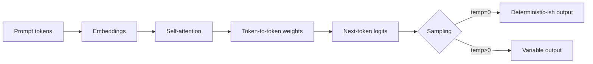
```mermaid
flowchart LR
    P[Prompt tokens] --> E[Embeddings]
    E --> A[Self-attention]
    A --> W[Token-to-token weights]
    W --> N[Next-token logits]
    N --> S{Sampling}
    S -->|temp=0| D[Deterministic-ish output]
    S -->|temp>0| V[Variable output]
```

**Quick demo — try it locally:**

```bash
# clone, then just open the HTML files in a browser - no build, no install
open chapter_01_LLM_Basics/attention_interactive.html
open chapter_01_LLM_Basics/attention_is_all_you_need.html
```

Hover over tokens in `attention_interactive.html` to see the live attention matrix. Edit the input sentence to see weights shift in real time — that's the same mechanism that makes your prompt wording matter.

---

## Chapter 02 — Prompt Engineering for QA

This chapter turns prompt engineering into a repeatable QA skill. Three pillars:

1. **Anti-hallucination rules** — guardrails so the model only uses provided input.
2. **RICE-POT framework** — a structured prompt template (Role, Instructions, Context, Example, Parameters, Output, Tone).
3. **Two projects + six templates** — applied on real artifacts (a PRD-style API doc and a Selenium framework build).

**Q&A — RICE-POT vs free-form prompting:**
- **Q: I already get OK results from "write test cases for this PRD." Why bother with a framework?** A: "OK" is the ceiling. RICE-POT forces you to declare the persona, format, and constraints, which is what turns a 60% useful answer into a 95% useful one — every time, not just on lucky runs.
- **Q: Isn't this just over-engineering a chat message?** A: For one-offs, yes. For repeatable QA tasks (regression suites, security checklists, daily test-case generation), the template pays for itself within three uses.
- **Q: Which letter is most often skipped — and what breaks?** A: `P` (Parameters). Without the anti-hallucination block, the model invents fields, IDs, and error codes that don't exist in your PRD. Output looks plausible but ships bugs.

**RICE-POT prompt flow — from goal to copy-pasteable prompt:**

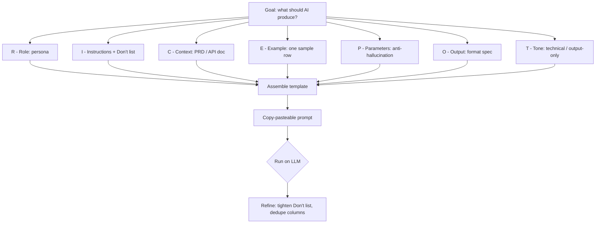
```mermaid
flowchart TD
    G[Goal: what should AI produce?] --> R[R - Role: persona]
    G --> I[I - Instructions + Don't list]
    G --> C[C - Context: PRD / API doc]
    G --> E[E - Example: one sample row]
    G --> P[P - Parameters: anti-hallucination]
    G --> O[O - Output: format spec]
    G --> T[T - Tone: technical / output-only]
    R --> A[Assemble template]
    I --> A
    C --> A
    E --> A
    P --> A
    O --> A
    T --> A
    A --> X[Copy-pasteable prompt]
    X --> Y{Run on LLM}
    Y --> Z[Refine: tighten Don't list, dedupe columns]
```

### Anti-Hallucination Rules (`Anti_Hallucinations_Rules.md`)

A drop-in `ROLE` block you prepend to any QA prompt. Forces the model to:
- Use only the inputs you provide (PRD, screenshots, API docs).
- Refuse to assume "typical" system behaviour.
- Output exactly `"Insufficient information to determine."` when an input is missing.
- Label inferred details as `"Inference (low confidence)"`.
- Produce a Verified Facts / Missing Info / Output / Self-Validation block.

Use this on every factual-generation prompt in this repo.

### Project 1 — Test Case Generation with RICE-POT

Goal: turn an API PDF (`Restful-booker.pdf`) into a CSV of enterprise-grade test cases.

- `RICE-POT-TestCase-Prompt.md` — the worked prompt. Targets `app.vwo.com` as the example product, but the structure transfers to any PRD/API doc.
- `RICE_POT_FRAMEWORK/RICE_POT.md` — explanation of each letter of the framework.
- `Restful-booker.pdf` + `Restful_Booker_API_Test_Cases.md` — input PDF and the generated test-case set.
- `output/deepseek_csv_20260524_0d9b7c.csv` — actual model output produced from the prompt.

**Q&A — Project 1 design choices:**
- **Q: Why a PDF input and not just pasted text?** A: PDFs mirror how QA actually receives PRDs and API specs. Forcing the model to extract from the document tests whether the prompt's anti-hallucination block holds under realistic input noise.
- **Q: Why CSV output instead of Markdown?** A: CSV imports cleanly into Jira, TestRail, qTest, and Zephyr. The model is told the exact column order so the file drops straight into a test-management tool.
- **Q: How do I trust the output?** A: Cross-check the `Traceability` column — every test case row must cite a section of the source PDF. Rows without traceability fail review.

**Sample output row (from `deepseek_csv_20260524_0d9b7c.csv`):**

```csv
TC_ID,Title,Preconditions,Steps,Test Data,Expected Result,Type,Priority,Traceability
TC_API_007,Create booking with valid payload,"Auth token obtained","POST /booking with required fields","firstname=Jim, lastname=Brown, totalprice=111, depositpaid=true","HTTP 200 + bookingid + booking object echoed back",Positive,High,"Restful-booker.pdf §Booking → CreateBooking"
```

**How to exercise it:**
1. Open `RICE-POT-TestCase-Prompt.md` in any AI tool (ChatGPT, Claude, Gemini, DeepSeek).
2. Attach `Restful-booker.pdf` (or your own PRD).
3. Confirm the output is CSV only, columns match the spec, and every test case traces back to the PDF.

### Project 2 — Selenium Framework from a Prompt

Goal: prove RICE-POT can build production code, not just test cases.

- `Problem.md` — the brief: "generate a Selenium framework from scratch with two page objects, production ready."
- `SKILL.md` — the RICE-POT prompt-builder skill definition. Tells the AI how to interview you, assemble the prompt, and deliver it copy-pasteable.
- `blank-template-rice-pot.md` — fill-in template with the recommended anti-hallucination Parameters block.
- `AdvanceSeleniumFramework/` — the actual output the framework generates:
  - Maven project, Java 11, Selenium 4.25, TestNG 7.10.
  - `LoginPage.java` — PageFactory POM with explicit waits, fluent API, no Thread.sleep.
  - `BaseTest.java` — driver lifecycle.
  - `ConfigReader.java` — `config.properties` loader.
  - `ValidLoginTest.java` / `InvalidLoginTest.java` — positive + negative TestNG cases.
  - `testng.xml` / `testng-smoke.xml` — full and smoke suites.

**Q&A — Project 2 design choices:**
- **Q: Why XPath only?** A: The prompt locked it to one locator strategy on purpose — consistency makes generated code reviewable. In production you'd mix CSS + XPath, but the discipline of "one strategy" is what the prompt enforces.
- **Q: Where do real credentials go?** A: `src/main/resources/config.properties`. Placeholders `REPLACE_WITH_...` fail fast in `@BeforeTest` so a forgotten config never silently passes a test.
- **Q: Why headless Chrome by default?** A: macOS 26.1 + Chrome 148 dropped windowed sessions mid-test in this repo. Headless avoids the focus/sandbox issue and is what CI uses anyway.

**Framework architecture — what the prompt generated:**

```mermaid
flowchart TD
    CFG[config.properties] --> CR[ConfigReader]
    CR --> BT[BaseTest]
    BT -->|@BeforeMethod| D[ChromeDriver headless]
    BT -->|@AfterMethod| Q[driver.quit]
    LP[LoginPage - POM + PageFactory] --> XP["@FindBy xpath only"]
    VT[ValidLoginTest] --> LP
    IT[InvalidLoginTest + @DataProvider] --> LP
    VT -.extends.-> BT
    IT -.extends.-> BT
    SUITE[testng.xml] --> VT
    SUITE --> IT
    SMOKE[testng-smoke.xml] --> IT
```

**LoginPage snippet (XPath + explicit waits, no Thread.sleep):**

```java
public class LoginPage {
    @FindBy(xpath = "//input[@id='username']") private WebElement usernameField;
    @FindBy(xpath = "//input[@id='password']") private WebElement passwordField;
    @FindBy(xpath = "//input[@id='Login']")    private WebElement loginButton;
    @FindBy(xpath = "//div[@id='error']")      private WebElement errorMessage;

    public LoginPage(WebDriver driver) {
        this.wait = new WebDriverWait(driver,
            Duration.ofSeconds(ConfigReader.getInt("timeout.explicit")));
        PageFactory.initElements(driver, this);
    }

    public void loginAs(String user, String pass) {
        wait.until(ExpectedConditions.visibilityOf(usernameField)).sendKeys(user);
        passwordField.sendKeys(pass);
        wait.until(ExpectedConditions.elementToBeClickable(loginButton)).click();
    }
}
```

**Run it:**
```bash
cd chapter_02_Prompt_Eng/Project2_Selenium_Framework/AdvanceSeleniumFramework
mvn -q clean test-compile
mvn test                       # full suite
mvn test -DsuiteXmlFile=testng-smoke.xml   # smoke only
```

### Templates — RTCFR + RICE-POT (`templates/`)

Six copy-paste prompt templates for the most common QA tasks. Each follows the **RTCFR** shape — Role, Task, Constraints, Format, Requirements — which is the lightweight cousin of RICE-POT.

| # | File | Purpose |
|---|------|---------|
| 01 | `01_TestCaseGeneration_Prompt.md` | Basic test-case generation from free-form requirements. |
| 02 | `02_TestCases_from_prd` | Comprehensive PRD → test cases (functional, negative, boundary, edge). |
| 03 | `03_API_Test_Generation.md` | API endpoint test cases from API docs. |
| 04 | `04_Negative_TC_Only.md` | Negative-only suite — invalid inputs, auth violations, malformed data. |
| 05 | `05_Secuirty_Test.md` | OWASP-top-10-aligned security test cases. |
| 06 | `06_Regression_Suite.md` | Regression suite for a module with execution-time estimates. |

**Use any template:**
1. Open the file and copy the fenced block.
2. Replace `[FEATURE]` / `[PASTE REQUIREMENTS]` / `[PASTE PRD]` etc. with your input.
3. Paste into your AI tool. Keep the `CONSTRAINTS` block intact — that's what stops hallucination.

---

## Chapter 03 — B.L.A.S.T. Jira Test Plan Generator

This chapter turns a Jira ticket into a formal QA test plan through a lightweight **React + Express** app. It uses the **B.L.A.S.T.** protocol (Blueprint, Link, Architect, Stylize, Trigger) and an **A.N.T.** 3-layer architecture.

**What's here:**
- `README.md` — setup, local run, production run, and Vercel deployment notes.
- `src/` — React UI for Settings, Generate, and Test Plan views.
- `server.js` + `tools/` — local Express proxy, Jira fetcher, GROQ client, and deterministic Markdown renderer.
- `api/` + `vercel.json` — serverless production deployment path.
- `architecture/` — SOPs for Jira fetch, GROQ generation, and the 13-section test-plan template.

**Why a QA engineer should care:** Jira tickets are often the real source of truth. This project shows how to keep credentials out of the browser, fetch ticket context safely, ask an LLM for structured JSON, and render a repeatable test plan without relying on free-form chat output.

**Run it locally:**
```bash
cd chapter_03_BLAST_FW_JIRA_AI_AGENT
npm install
npm run dev
```

Open `http://localhost:5173`, add Jira + GROQ credentials in the Settings tab, then generate a plan from a Jira ID.

---

## Chapter 04 — n8n and Local AI Agents for QA

This chapter adds importable **n8n** workflows and local AI-agent projects for practical QA and content automation. It shows how to connect chat triggers, LLM nodes, Jira tools, Google Sheets output, Slack/Teams triggers, CSV-driven batch processing, a local Next.js dashboard, local Excel persistence, and content-generation skill files.

**What's here:**
- `AI_3X_01_QA_Buddy.json` — chat-triggered QA assistant using a GROQ-backed LLM node.
- `AI_3X_02_JIRA_Agent.json` — chat agent that can create Jira tickets.
- `AI_3X_03_Read_PRD_TestCases_Excel.json` — fetches PRD/ticket context and writes generated test cases into Google Sheets.
- `AI_3X_04_Read_PRD_TestCases_Excel_v2.json` — extends the PRD-to-test-cases flow with CSV upload and batch Jira processing.
- `social_ai_agent/contentforge/` — local Next.js + TypeScript dashboard for a daily content-generation pipeline.
- `skillfile_content_generation/SKILL.md` — content engine skill for The Testing Academy publish-ready content packs.
- `skillfile_content_generation/output/2026-06-14/` — generated content pack for "Your AI Agent Needs a QA Contract, Not More Prompts."

**How to use the n8n workflows:**
1. Open n8n Cloud or a self-hosted n8n instance.
2. Import the JSON workflow from `chapter_04_AI_Agents_n8n/n8n_AIAgent/`.
3. Reconnect credentials for the nodes you use: GROQ, DeepSeek, Jira, Google Sheets, Slack, or Microsoft Teams.
4. Run the chat trigger, form trigger, schedule trigger, or team-channel trigger depending on the workflow.

**Run ContentForge locally:**
```bash
cd chapter_04_AI_Agents_n8n/social_ai_agent/contentforge
npm install
cp .env.example .env.local
npm run dev
```

Add your local keys to `.env.local` or `.env`:

```bash
GROQ_API_KEY=...
GEMINI_API_KEY=...
```

ContentForge keeps generated data local:

- `content_calendar.xlsx` in the app root.
- Generated runtime images under `public/images/`.
- API keys in `.env.local` or `.env`.

Those local files are ignored and should not be committed.

**Use the content skill output:**

Open `chapter_04_AI_Agents_n8n/skillfile_content_generation/output/2026-06-14/` for separate Markdown files covering the topic, LinkedIn post, Medium article, YouTube script, Instagram carousel copy, and image prompts.

### Social Media AI Agent (`n8n_AIAgent/AI_3X_05_Social_media_AI agent.json`)

**Concept:** A scheduled n8n agent that wakes on a timer, asks an LLM agent node to draft social posts, parses them into a fixed structure, and writes the result to Google Sheets and Google Drive — fully unattended.

**Why:** Manual daily posting does not scale. This workflow turns "post every day" into a cron-driven pipeline that produces consistent, on-brand content while you sleep.

**Q&A — running an autonomous content agent:**
- **Q: Why three model nodes (DeepSeek, Gemini, OpenAI)?** A: They are swappable backends on the same agent — pick the one with the best price/quality for your account, or fall back when one rate-limits.
- **Q: Why a structured output parser?** A: Free-form text breaks the Sheets/Drive write. The parser forces the agent into a typed shape (e.g. platform, caption, hashtags) so downstream nodes get clean columns.
- **Q: Where do drafts land?** A: Rows in Google Sheets for review and assets in Google Drive — so a human approves before anything publishes.

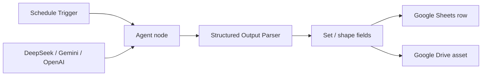
```mermaid
flowchart LR
    T[Schedule Trigger] --> AG[Agent node]
    M["DeepSeek / Gemini / OpenAI"] --> AG
    AG --> P[Structured Output Parser]
    P --> S[Set / shape fields]
    S --> GS[Google Sheets row]
    S --> GD[Google Drive asset]
```

**Import + run:**
1. Import `AI_3X_05_Social_media_AI agent.json` into n8n.
2. Reconnect credentials for one chat model (DeepSeek / Gemini / OpenAI), Google Sheets, and Google Drive.
3. Set the Schedule Trigger cadence, then activate the workflow.

### Resume Tailor Skill (`resume-tailor/`)

**Concept:** A reusable skill that scores a resume, runs an ATS keyword gap analysis against a target job description, and rebuilds a clean, ATS-parseable `.docx` — without ever inventing experience.

**Why:** Generic resumes get filtered out by ATS keyword matching; fabricated ones get the candidate caught in the interview. This skill tailors honestly: it only adds skills the candidate confirms they actually have.

**Q&A — tailoring without lying:**
- **Q: What stops it from stuffing keywords?** A: A hard confirmation gate (Phase 3). Any skill not already evidenced on the resume is held back until the candidate explicitly confirms they have it.
- **Q: What does it output?** A: A 6-point scored review, an ATS table with a match %, and a rebuilt single-column `.docx` (`scripts/build_resume.js`) with no leftover `[ ]` placeholders.
- **Q: Can I re-run it for a new JD?** A: Yes — it rebuilds incrementally and re-confirms only what is newly uncertain.

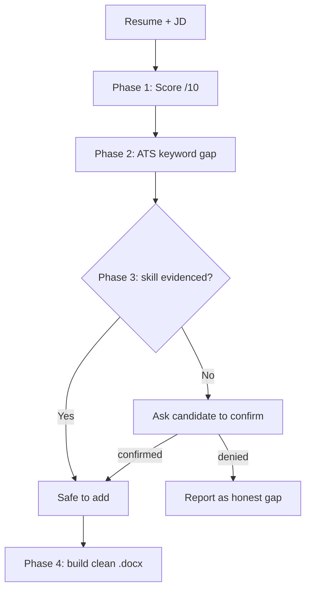
```mermaid
flowchart TD
    R[Resume + JD] --> SC[Phase 1: Score /10]
    SC --> ATS[Phase 2: ATS keyword gap]
    ATS --> G{Phase 3: skill evidenced?}
    G -->|Yes| ADD[Safe to add]
    G -->|No| ASK[Ask candidate to confirm]
    ASK -->|confirmed| ADD
    ASK -->|denied| GAP[Report as honest gap]
    ADD --> BUILD[Phase 4: build clean .docx]
```

Read `resume-tailor/SKILL.md` for the full 4-phase workflow and the no-fabrication rule.

### Brand Voice + Video Script Guide (`skillfile_content_generation/brand-voice.md`)

**Concept:** A reverse-engineered brand-voice template plus an 8-beat YouTube video skeleton — a repeatable structure for scripting videos that hook, teach, and convert.

**Why:** Consistency is what makes a channel recognisable. This guide encodes the tone (plain-spoken practitioner, honest trade-offs, household analogies) and a beat-by-beat structure so every script follows the same proven shape.

**Q&A — using the voice guide:**
- **Q: What are the 8 beats?** A: Personal Hook → Promise/Roadmap → Why Now → Plain-English Definition → Practical How-To → Payoff/Ideas → Reframe/Lesson → Empowering CTA.
- **Q: What is the one-line voice summary?** A: "Talk like a smart friend who's figuring it out in real time — dead-simple ideas, household analogies, honest pros and cons, numbered steps, and a send-off that leaves people feeling capable."
- **Q: How do I use it?** A: Feed it to a content skill or LLM as the style contract, then check your draft against the Part 3 scripting checklist before recording.

---

## Chapter 05 — AI Agents with LangFlow

LangFlow is a **visual, low-code builder** for LLM apps and AI agents. You wire components (models, prompts, tools, file loaders, parsers) on a canvas, test the flow live, then publish it as an HTTP API — every flow gets `POST /api/v1/run/{flowId}`, so any front-end or CI job can call it.

This chapter builds real QA agents on top of that API and contrasts LangFlow with LangGraph and LangSmith (`LangFlow vs LangGraph vs LangSmith.md`).

**What's here:**
- `Project/AI3X_001_HelloWorld.json` — the minimal "first flow" to confirm the canvas and API work.
- `Project/AI3X_002_Flaky_Test_AIAgent.json` — the Flaky Test Analyzer flow.
- `Project/AI3X_003_Bug_Triage_AI_Agent.json` — a bug-triage flow (API Request → Prompt → OpenRouter → Parser → Chat output).
- `Project/AI3X_004_API_Contract_Validator.md` — the GET request + JSON Schema spec the validator flow runs on.
- `flaky_test_analyzer_ai_Agent/ui/` — a React UI that drives the Flaky Test Analyzer through a Vite proxy.
- `langflow-up.sh` / `langflow-down.sh` — one-command local LangFlow lifecycle (macOS + Docker Desktop).

**Start and stop LangFlow locally:**
```bash
./chapter_05_AI_Agents_LangFlow/langflow-up.sh     # Docker up -> container -> poll /health -> prints http://localhost:7860
./chapter_05_AI_Agents_LangFlow/langflow-down.sh   # stop container, quit Docker Desktop
```

`langflow-up.sh` creates the container on first run with `LANGFLOW_SAVE_DB_IN_CONFIG_DIR=true` and a bind mount to `langflow-data/`, so your flows survive a container prune. That directory is gitignored — it is ~90MB of local SQLite and cache, not source.

**Why a QA engineer should care:** LangFlow turns an agent into a callable endpoint without backend boilerplate. The same flow you prototype on the canvas becomes the API your test harness, CI pipeline, or internal tool calls — no rewrite.

**Q&A — LangFlow for QA agents:**
- **Q: Why proxy the UI through Vite instead of calling LangFlow directly?** A: LangFlow's file-upload endpoint does not answer the browser's CORS preflight, so a direct cross-origin upload fails with *"Failed to fetch."* Routing through Vite makes every request same-origin.
- **Q: How does a file actually reach the flow?** A: Two calls — upload each file to `POST /api/v1/files/upload/{flowId}` to get a server `file_path`, then run the flow with those paths injected as `tweaks` on the flow's File components.
- **Q: LangFlow vs LangGraph vs LangSmith?** A: LangFlow = visual flow builder + API; LangGraph = code-first stateful agent graphs; LangSmith = tracing/eval/observability. They compose; they don't compete.

**How a published flow is called:**

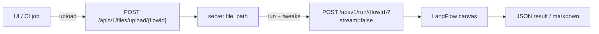
```mermaid
flowchart LR
    C[UI / CI job] -->|upload| U["POST /api/v1/files/upload/{flowId}"]
    U --> FP[server file_path]
    FP -->|run + tweaks| RUN["POST /api/v1/run/{flowId}?stream=false"]
    RUN --> FLOW[LangFlow canvas]
    FLOW --> OUT[JSON result / markdown]
```

### Flaky Test Analyzer (`AI3X_002` + `ui/`)

**Concept:** A LangFlow agent that ingests two Playwright `results.json` files (baseline vs. candidate build) and reports which build is flakier — separating genuine flaky tests from consistent failures, with rerun / send-to-engineering recommendations. A React UI renders the diagnosis as markdown.

**Why:** "Re-run until green" hides real regressions. This agent distinguishes a non-deterministic flake from a reproducible failure so you quarantine the former and escalate the latter.

**Q&A — flaky vs. consistent:**
- **Q: How does it decide something is flaky?** A: If a test fails in one build but passes in the other with no code change, it is flagged as a flake hypothesis (e.g. navigation timeout, parallel-worker contention).
- **Q: What is a consistent failure?** A: The same assertion failing in both builds (e.g. expected 401, got 500) — reproducible, so it goes to engineering, not the rerun queue.
- **Q: Do I need to write assertion code?** A: No. You drag in two result files; the agent does the comparison and writes the report.

**Run the UI:**
```bash
cd chapter_05_AI_Agents_LangFlow/flaky_test_analyzer_ai_Agent/ui
npm install
npm run dev          # http://localhost:5173
```

LangFlow must be running at `http://localhost:7861` with the agent flow imported. Connection settings (base URL, `x-api-key`, flow ID, File component IDs) are prefilled and editable in the **Connection** panel; sample inputs live in `ui/samples/`.

### API Contract Validator (`AI3X_004`)

**Concept:** A LangFlow agent that checks whether a live API response still matches its agreed contract. Give it a GET request and a JSON Schema; the flow uses the **API Request** component to call the endpoint, then asks an **OpenRouter** model (**DeepSeek V4 Flash**) to validate the real response against the schema and report drift — missing fields, wrong types, extra keys.

**Why:** Breaking API changes slip silently past tests. This catches contract drift without writing or maintaining per-endpoint assertion code.

**Q&A — contract validation by LLM:**
- **Q: Why an LLM instead of a schema validator library?** A: The LLM gives a human-readable diff ("`status` is now a number, was a string") alongside PASS/FAIL — useful in a triage channel, no per-endpoint code to maintain.
- **Q: What does PASS look like?** A: A verdict that every array item conforms — all required fields present, types correct, no drift.
- **Q: Where's the spec?** A: `Project/AI3X_004_API_Contract_Validator.md` holds the GET URL, sample response, and full JSON Schema.

```
[ GET URL ] ──► API Request component ──► response JSON ─┐
                                                         ├─► OpenRouter (deepseek v4 flash) ──► PASS / FAIL + diff
[ JSON Schema ] ─────────────────────────────────────────┘
```

```json
{
  "$schema": "http://json-schema.org/draft-04/schema#",
  "type": "array",
  "items": {
    "type": "object",
    "properties": {
      "id":     { "type": "integer" },
      "name":   { "type": "string" },
      "email":  { "type": "string" },
      "gender": { "type": "string" },
      "status": { "type": "string" }
    },
    "required": ["id", "name", "email", "gender", "status"]
  }
}
```

See `chapter_05_AI_Agents_LangFlow/README.md` for the full walkthrough, screenshots, and example agent output. The prompts used to build the agent and its UI — both the run-time agent prompt and the full UI-build prompt — are captured in `flaky_test_analyzer_ai_Agent/PROMPTS.md` so students can reproduce or remix them.

---

## Chapter 06 — AI Social Media Content Creation

**Concept:** A set of fill-in-the-blank Markdown templates that turn **one idea** into a full, publish-ready content pack — YouTube video, Instagram Reel, Instagram post, carousel, Medium article, blog post, and LinkedIn post — all in The Testing Academy voice.

**Why:** Creators burn out writing seven separate things per idea. The fix is *plan once, repurpose everywhere*: you write a single Hook · Story · Offer, then bend it into every platform format. The templates encode the voice rules (no banned phrases, real numbers only, senior-colleague-over-chai tone) so quality stays constant across channels.

**Q&A — using the content templates:**
- **Q: Where do I start?** A: Always `00_Hook_Story_Offer_Planning.md`. It is the source of truth — every platform template pulls its hook, proof, and CTA from that one plan.
- **Q: What's in each platform template?** A: The format, the voice rules, the hook patterns, a copy-paste skeleton, and a pre-publish checklist. Fill the skeleton, run the checklist, ship.
- **Q: How do I use these with an AI assistant?** A: Paste the filled-in Hook · Story · Offer plus the platform template and say "write the [platform] piece using this plan and these rules — no banned phrases." The plan is the content; the template is the spec.

**Plan once, repurpose everywhere:**

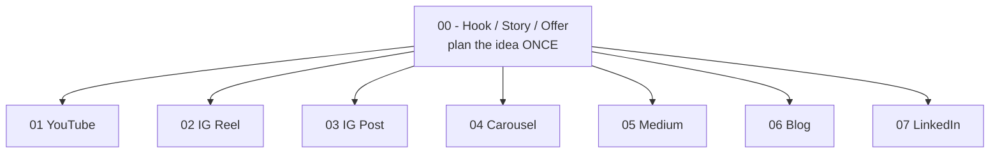
```mermaid
flowchart TD
    P[00 - Hook / Story / Offer<br/>plan the idea ONCE] --> YT[01 YouTube]
    P --> RE[02 IG Reel]
    P --> PO[03 IG Post]
    P --> CA[04 Carousel]
    P --> ME[05 Medium]
    P --> BL[06 Blog]
    P --> LI[07 LinkedIn]
```

**The planning skeleton (from `00_Hook_Story_Offer_Planning.md`):**

```markdown
IDEA: __________________________________  (one sentence — if you can't, it's not ready)

HOOK   (stop the scroll in 3s — never a stat):  ____________________
STORY  (Problem -> Tension -> Turn -> Proof):   ____________________
OFFER  (exactly ONE ask):                       ____________________

SCREENSHOT LINE (the quotable truth): _______________________________
HONEST CAVEAT  (cuts against you):    _______________________________
```

Open `chapter_06_AI_Social_Media_Content_Creation/README.md` for the workflow, the universal voice rules, and the full template index.

---

## Chapter 07 — RAG (Retrieval-Augmented Generation)

**Concept:** **RAG Explorer** is a React + Express app that runs a full RAG pipeline end to end and *shows every stage*: a PDF is read, split into chunks, embedded with **Nomic Embed** (local Ollama), stored in a **local ChromaDB**, and — for each question — the top-k chunks are retrieved and handed to **Groq (`openai/gpt-oss-120b`)** to generate a grounded answer.

**Why:** RAG is usually a black box — you type a question and an answer appears. This app opens the box so a QA engineer can *see* the chunking, the actual embedding vectors, the similarity scores of retrieved chunks, and the exact augmented prompt sent to the LLM. Understanding each seam is what lets you test and debug a RAG system instead of trusting it blindly.

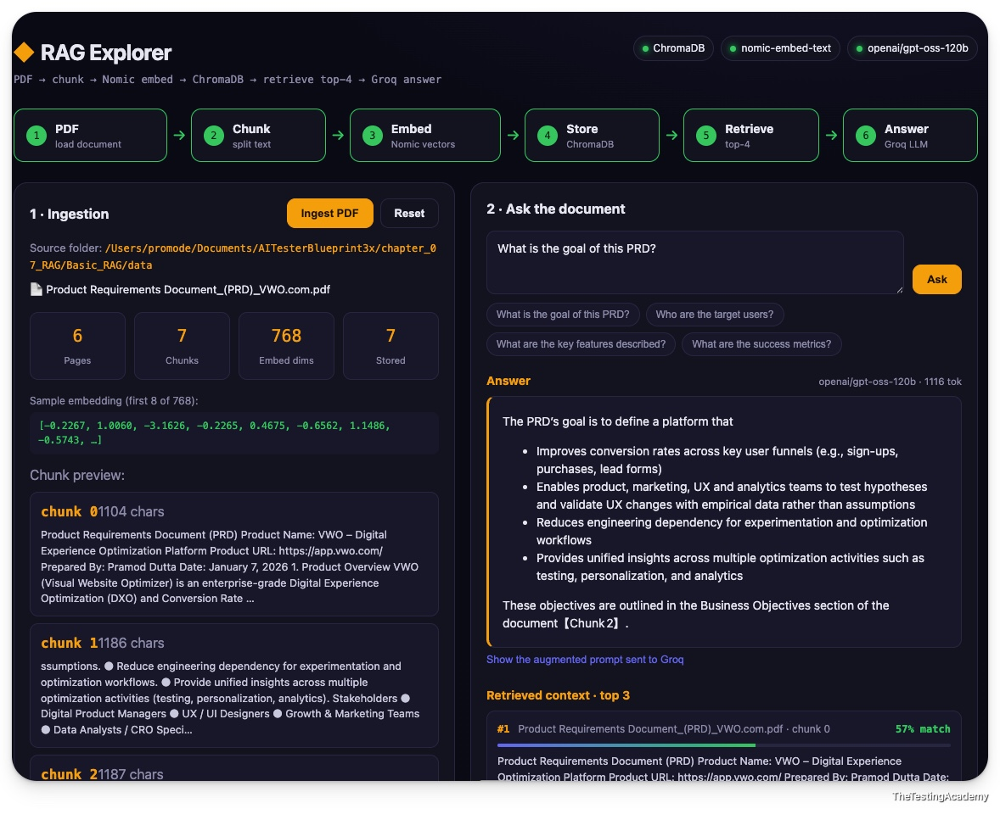

**Q&A — building a basic RAG pipeline:**
- **Q: Why a Node backend — can't this run in the browser?** A: No. The vector DB (ChromaDB), the embedder (Ollama), and PDF parsing are all server-side. The React UI only talks to the Express backend over same-origin `/api` (proxied by Vite).
- **Q: Why local Nomic Embed + local ChromaDB?** A: Zero cost, fully offline, and nothing leaves the machine. `nomic-embed-text` via Ollama produces 768-dim vectors; ChromaDB stores them and does cosine similarity search. Only the final answer step calls out (to Groq).
- **Q: How does retrieval actually work?** A: The question is embedded with the *same* model as the chunks, then ChromaDB returns the nearest `top-k` by cosine distance. Those chunks — and only those — become the LLM's context, so the answer is grounded in the document.

**The RAG flow:**

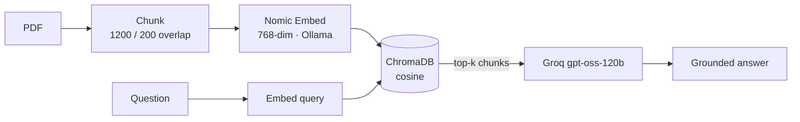
```mermaid
flowchart LR
    PDF[PDF] --> CH[Chunk<br/>1200 / 200 overlap]
    CH --> EM[Nomic Embed<br/>768-dim · Ollama]
    EM --> DB[(ChromaDB<br/>cosine)]
    Q[Question] --> QE[Embed query]
    QE --> DB
    DB -->|top-k chunks| LLM[Groq gpt-oss-120b]
    LLM --> A[Grounded answer]
```

**The retrieval core (`server/lib/chroma.js`):**

```js
// Embed the query with the SAME model as the chunks, then pull top-k by cosine.
export async function retrieve(collection, queryText, k = 4) {
  const queryEmbedding = await embedQuery(queryText)          // Ollama nomic-embed-text
  const res = await collection.query({
    queryEmbeddings: [queryEmbedding],
    nResults: k,
    include: ['documents', 'metadatas', 'distances'],
  })
  return res.documents[0].map((text, i) => ({
    text,
    distance: res.distances[0][i],
    similarity: Math.max(0, 1 - res.distances[0][i]),         // cosine dist -> 0..1 for display
  }))
}
```

**Run it:**
```bash
cd chapter_07_RAG/Basic_RAG/rag-explorer
npm install
cp .env.example .env      # paste your GROQ_API_KEY
ollama pull nomic-embed-text
npm run dev               # starts ChromaDB + Express API + Vite UI
```

Open the Vite URL (default `http://localhost:5175`), click **Ingest folder** (or **upload your own** PDF / `.txt` / `.md`), then ask a question. Two tabs:

- **Explorer** — the pipeline view: ingestion stats, a sample embedding, retrieved chunks with similarity scores, and the augmented prompt sent to Groq.
- **Vector Store** — shows exactly what ChromaDB holds per chunk: each stored `id → 768-dim vector` rendered as a heatmap, plus its L2 norm / min / max and a raw-values view.

See `chapter_07_RAG/Basic_RAG/rag-explorer/README.md` for the full walkthrough and troubleshooting.

### Basic RAG in n8n (no-code)

`chapter_07_RAG/n8n_BASIC_RAG/AI3X_Basic_RAG.json` is the same RAG idea built as a **no-code n8n workflow** — the pipeline without writing a backend.

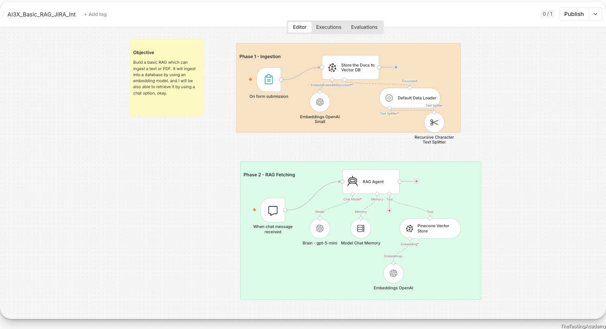

**Two phases:**
- **Phase 1 - Ingestion:** a form-submission trigger loads a text/PDF, a Recursive Character Text Splitter chunks it, OpenAI embeddings vectorise it, and the vectors land in a Pinecone vector store.
- **Phase 2 - RAG Fetching:** a chat-message trigger drives a RAG Agent (gpt-5-mini brain + chat memory) that retrieves from Pinecone (via OpenAI embeddings) and answers grounded in the ingested docs.

**Import + run:** open n8n, import `AI3X_Basic_RAG.json`, reconnect the OpenAI + Pinecone credentials, submit a document, then chat.

### RAG in LangFlow (visual)

`chapter_07_RAG/LangFlow_RAG/` builds the same retrieval idea on the LangFlow canvas, over a real QA dataset (`data/VWO_500_Test_Cases.csv` — 500 VWO test cases):

- `AI_3X_Naive RAG.json` — a naive RAG flow: load the CSV, embed, store, retrieve, answer.
- `AI_3X_Naive RAG_Imporve_Chunk.json` — the same flow with an **improved chunking** strategy, to show how chunk size/overlap changes retrieval quality.

**Why two flows:** chunking is the single biggest lever on RAG quality. Running a naive split next to a tuned one on the same 500-row dataset makes the difference visible — the retrieved rows get more relevant without touching the model.

**Import + run:** open LangFlow, import either JSON, reconnect your embedding + LLM credentials, and run the flow against the CSV.

### Advanced RAG — hybrid retrieval + reranking

`chapter_07_RAG/Advance_RAG/` upgrades Basic RAG into a production-shaped pipeline over **5,000 VWO test cases** (`testcase/vwo_5000_test_cases.csv`, Jira format). A Flask app with a two-pane UI shows every stage of a real hybrid pipeline.

**Concept:** `bge-m3` emits **dense + sparse** vectors from one model; **Qdrant** (embedded, no Docker) stores them; results are merged with **Reciprocal Rank Fusion**, re-scored by the **`bge-reranker-v2-m3`** cross-encoder, and answered by Groq — with **query rewriting** before retrieval.

**Why:** A single dense embedding + top-k misses exact IDs/keywords and ranks coarsely. Hybrid search + RRF + a cross-encoder reranker is what makes retrieval accurate on a real corpus, and the UI shows *why* an answer was grounded the way it was.

**Q&A — the advanced techniques:**
- **Q: What does the two-pane UI show?** A: Left = a live pipeline tracker (Read -> Build -> Chunk -> Embed -> Index, then Rewrite -> Dense -> Sparse -> RRF -> Rerank -> Generate). Right = Upload / Ingest (live SSE) / Chunks / Chat, with dense vs sparse vs fused vs reranked tables per query.
- **Q: Where do the models run?** A: `bge-m3` + the reranker run locally (downloaded once, ~2.3 GB + ~570 MB); only generation and query rewriting call out to Groq. Qdrant is an embedded file store.
- **Q: What's "Generate" mode?** A: A query like *"create a test case for VWO-3400 heatmap privacy masking"* auto-switches to producing a structured test case from the retrieved similar cases as templates.

**The pipeline:**

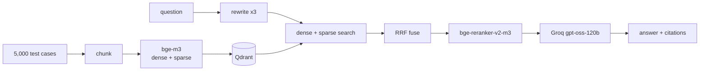
```mermaid
flowchart LR
    CSV[5,000 test cases] --> CK[chunk] --> M[bge-m3<br/>dense + sparse] --> Q[(Qdrant)]
    QN[question] --> RW[rewrite x3] --> SR[dense + sparse search]
    Q --> SR --> RRF[RRF fuse] --> RR[bge-reranker-v2-m3] --> L[Groq gpt-oss-120b] --> A[answer + citations]
```

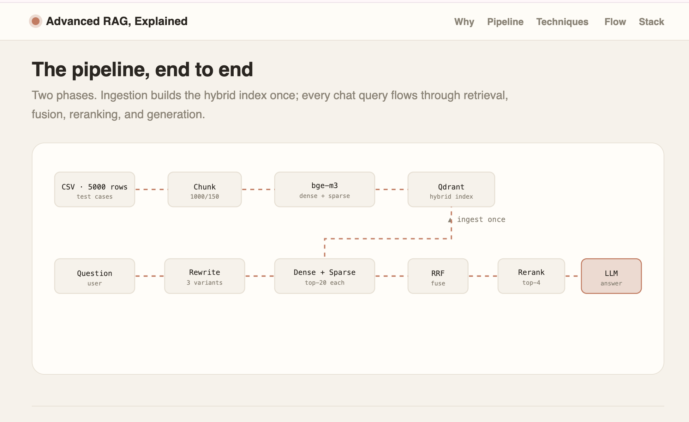

A standalone, animated **`Advanced_RAG_Explained.html`** teaches the whole concept (hybrid embeddings, RRF, reranking, rewriting) with diagrams — open it in any browser or upload it anywhere.

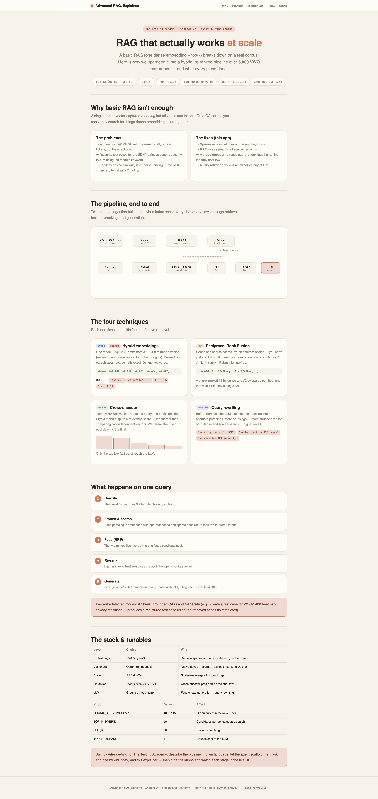

**Run it:**
```bash
cd chapter_07_RAG/Advance_RAG
python3 -m venv .venv && source .venv/bin/activate
pip install -r requirements.txt
cp .env.example .env      # paste your GROQ_API_KEY
python app.py             # http://127.0.0.1:5050
```

See `chapter_07_RAG/Advance_RAG/README.md` for the full walkthrough and tunables.

---

## Chapter 08 — QABuddy.ai (Multi-source Hybrid RAG)

`chapter_08_QABuddyAI/` is the capstone: a self-hosted **QA knowledge brain** that answers one question with one **cited** answer, grounded in 10 real sources — the Selenium and Playwright framework repos, **5,000 test cases**, JIRA tickets, company docs, meeting transcripts, Lucid flow exports, PRDs, and Jenkins logs. It productionizes the ch07 Advanced RAG stack into a team tool with a chat UI, an eval harness, and a one-command VPS deployment.

**Concept:** every source gets its own loader and its own chunking (1 method per chunk for code with line numbers, 1 row per test case, 1 ticket per chunk, failure blocks for logs, heading-aware splits for docs). One `bge-m3` pass emits **dense + lexical sparse** vectors into a single **Qdrant** collection with `source_type` filters; queries are rewritten, searched both ways, **RRF-fused**, cut to 6 chunks by **`bge-reranker-v2-m3`**, and answered by Groq's open-weight **`gpt-oss-120b`** — with `[n]` citations mapping back to `file:line`, ticket key, PDF page, or build number.

**Why:** QA questions mix exact identifiers (`VWO-2002`, `NoSuchElementException`, `doLogin()`) with fuzzy intent ("why is checkout flaky?"). Dense-only search misses the identifiers, keyword-only misses the intent — and answers without citations cannot be trusted in a QA workflow. Hybrid retrieval + reranking + a confidence threshold ("not in KB" instead of guessing) fixes all three.

**Q&A — the production upgrades over ch07:**
- **Q: How do 10 sources live in one index?** A: One collection + a `source_type` payload filter per chunk. Cross-source answers come free (an RCA can cite a meeting note, a JIRA ticket, and repo code together), and the UI's source checkboxes just add a query filter.
- **Q: What makes re-ingestion cheap enough for hourly sync?** A: Stable chunk ids (`uuid5` of source|path|content) plus a per-file signature manifest — unchanged files are skipped, changed files delete+reinsert, removed files are deleted. Phase 2's hourly cron is just scheduling.
- **Q: How is answer quality measured?** A: `eval/golden_questions.yaml` + `scripts/eval.py` check that the right source appears in the top-6 chunks per question (13/13 = 100% on the seeded corpus of 5,531 chunks) — retrieval-only, no LLM cost.

**The pipeline:**

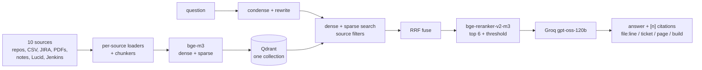
```mermaid
flowchart LR
    S[10 sources<br/>repos, CSV, JIRA, PDFs,<br/>notes, Lucid, Jenkins] --> L[per-source loaders<br/>+ chunkers] --> M[bge-m3<br/>dense + sparse] --> Q[(Qdrant<br/>one collection)]
    QN[question] --> CW[condense + rewrite] --> H[dense + sparse search<br/>source filters]
    Q --> H --> F[RRF fuse] --> R[bge-reranker-v2-m3<br/>top 6 + threshold] --> G[Groq gpt-oss-120b] --> A["answer + [n] citations<br/>file:line / ticket / page / build"]
```


**Feature checklist (what's in the box):**
- **10-source knowledge base** with source-appropriate chunking: 1 method/class per chunk for code (with line numbers), 1 row per test case, 1 ticket per JIRA chunk, failure blocks for Jenkins logs, heading-aware splits for PDFs/docs, speaker-turn windows for transcripts.
- **Hybrid retrieval**: one `bge-m3` pass emits dense + lexical sparse vectors; RRF fusion; `bge-reranker-v2-m3` cross-encoder keeps the best 6 chunks (the token-efficiency lever: ~3k tokens per answer).
- **Trust-first answers**: clickable `[n]` citations resolving to `file:line`, ticket key, PDF page, or build number, with expandable source snippets and rerank scores; a confidence gate answers "not in the KB" instead of hallucinating.
- **4 modes, auto-detected**: answer, generate test cases (team template), review coverage gaps, root cause analysis.
- **Conversational retrieval**: follow-up questions are condensed into standalone queries; LLM query rewriting widens recall (3 variants).
- **Live chat UI** (cream, claude.ai-style): streaming SSE answers, per-source filter checkboxes, live chunk counts, in-UI ingest panel with progress bar, "how your answer is fetched" explainer.
- **Idempotent ingestion**: stable chunk ids + per-file manifest diff — unchanged files skip, changed files re-embed, removed files delete; CLI (`ingest --all/--source NN`) and UI both.
- **Company glossary injection** (`glossary.yaml`) and all tunables (chunk sizes, thresholds, top-k) in `config.yaml`, no code changes needed.
- **Quality harness**: 12 unit tests + golden-question retrieval eval (`scripts/eval.py`, 13/13 = 100% on the seeded corpus).
- **JIRA two ways**: interactive MCP pulls or headless REST + JQL (`scripts/jira_fetch.py`), same JSON schema.
- **Ops ready**: docker-compose (Qdrant server + app + Caddy TLS/basic-auth), nightly backup script, health/stats endpoints, ~$0.001 per question on Groq.

**A real cross-source answer** — one RCA question cites a meeting note, a JIRA ticket, a Lucid flow, and repo code with line numbers:


**Modes:** the ask pipeline auto-detects intent — plain **answer**, **generate** (new test cases in the team template, grounded in similar cases + PRD), **review** (coverage gaps vs requirements), and **RCA** (root cause from logs + tickets + code).

**Run it:**
```bash
cd chapter_08_QABuddyAI
uv venv .venv --python 3.13 && uv pip install -p .venv/bin/python -r requirements.txt
cp .env.example .env               # paste your GROQ_API_KEY
./scripts/fetch_repos.sh && ./scripts/setup_fixtures.sh
.venv/bin/python -m app.ingestion.cli ingest --all
./scripts/dev.sh                   # cream chat UI on http://127.0.0.1:5080
```

**Deploy 24x7:** `docker-compose.yml` (Qdrant server + app + Caddy TLS/basic-auth) with the step-by-step runbook in **`deploy to VPS information.md`** — roughly **$55-75/month** total: an 8GB droplet plus ~$0.001 per question on Groq (embeddings, reranking, and the vector DB run locally and cost nothing).

Full design rationale (embedding model, vector DB, chunk sizes, preprocessing — each with alternatives rejected) lives in `chapter_08_QABuddyAI/Plan.md`; Phase 2 (hourly auto-ingest, Figma, QABuddy MCP server for IDE copilots) is designed in `docs/phase2.md`.

---

## Chapter 09 — MCP Basics

`chapter_09_MCP_Basics/MCP.md` is the concepts chapter that chapter 10 builds on. It answers *what MCP is and why it exists* before you write a line of server code — the protocol, the three roles, the three primitives, the two transports, and the security model, written against spec revision **`2026-07-28`**.

**Concept:** MCP (Model Context Protocol) is an open protocol that standardises how an LLM application connects to an external data source or tool, using **JSON-RPC 2.0** over a **client-host-server** architecture. It takes explicit inspiration from the Language Server Protocol: LSP standardised "add language support to any editor", MCP standardises "add context and tools to any AI application".

**Why:** Pasting your data into the chat window fails three ways — it burns the context window, it goes stale the moment someone edits the source, and it makes every AI client × every data source a bespoke integration. Write one MCP server and every client can use it: **N×M collapses to N+M**.

**Q&A — the concepts that matter:**
- **Q: Tool, resource, or prompt?** A: Ask who triggers it. **Tools** the *model* decides to call mid-conversation (they take arguments it computes). **Resources** the *app* fetches by URI, like a file read. **Prompts** the *user* picks from a menu, like a slash command.
- **Q: Why can't a server just call the client?** A: Only two message directions exist — client sends requests/notifications, server sends responses/notifications. When a server needs something back (user input, an LLM completion), it answers with an `InputRequiredResult`, the client fetches it, and re-sends the original request with the input attached.
- **Q: What's the gotcha that bites everyone?** A: **Never write to `stdout`** in a stdio server — `stdout` *is* the JSON-RPC channel, so one stray `print()` corrupts the stream and the client disconnects with a parse error. The spec explicitly permits `stderr` for logging; use it.

**The three primitives, one question:**

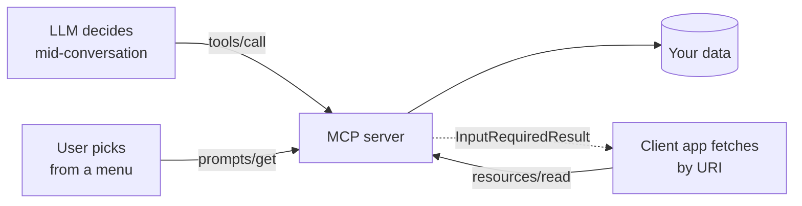
```mermaid
flowchart LR
    M["LLM decides<br/>mid-conversation"] -->|tools/call| S["MCP server"]
    A["Client app fetches<br/>by URI"] -->|resources/read| S
    U["User picks<br/>from a menu"] -->|prompts/get| S
    S --> D[("Your data")]
    S -.->|"InputRequiredResult"| A
```

**What a tool call actually looks like on the wire** — JSON-RPC 2.0, correlated by `id`:

```json
{
  "jsonrpc": "2.0",
  "id": 7,
  "method": "tools/call",
  "params": {
    "name": "search_test_cases",
    "arguments": { "query": "invite user", "limit": 3 }
  }
}
```

**Transports:** semantics are identical on both — a transport is only a *binding* that says how messages are framed. **stdio** (client launches the server as a subprocess; newline-delimited JSON-RPC over `stdin`/`stdout`) is what chapter 10 uses. **Streamable HTTP** (each message is an HTTP POST to one endpoint; the reply is JSON or a request-scoped SSE stream) is for remote and multi-user servers.

**Era note worth knowing:** revision `2026-07-28` is **stateless** — every request carries its own protocol version and capabilities, and discovery happens via `server/discover`. Earlier revisions were session-based, opening with an `initialize` handshake. Both exist in the wild, and many SDKs (including the FastMCP version pinned in chapter 10) still implement the session-based model.

**Security is an implementation obligation, not a protocol guarantee** — which makes it testable. The spec requires explicit user consent before exposing data or invoking any tool, and says tool descriptions from an untrusted server must themselves be treated as untrusted input. "Does the host actually ask before running this tool?" is a legitimate test case.

The chapter closes with a glossary and a common-failure-modes table (silent stdout corruption, a tool the model never calls, templated resources the client has to guess at, era mismatches).

---

## Chapter 10 — Build Your Own MCP Server

`chapter_10_MCP_Creation_VIBE/testcase-creator-mcp/` is the flip side of every other chapter: instead of *consuming* AI tooling, you *build* the thing the AI plugs into. One ~250-line FastMCP server turns a flat 5,000-row test-case CSV into a live capability that Claude Desktop, Claude Code, Cursor, or any MCP client can call.

**Concept:** MCP (Model Context Protocol) is a standard wire format that lets an LLM client talk to your data through three distinct primitives — **tools** (the model decides to call them), **resources** (the app fetches them by URI), and **prompts** (the user picks them from a menu). This server exposes all three over the same CSV so the difference is impossible to miss.

**Why:** Pasting a 5,000-row CSV into a chat window burns the context window and goes stale the moment the file changes. An MCP server lets the model *query* the data on demand — 3 rows instead of 5,000 — and the same server works in every MCP client without rewriting anything.

**Q&A — tools vs resources vs prompts:**
- **Q: When is it a tool and not a resource?** A: Tools are for actions the **model** chooses mid-conversation and that take arguments — `search_test_cases("checkout", limit=5)`. Resources are for context the **app** pulls by URI before the model runs, like a file. Rule of thumb: if it needs arguments the model computes, it is a tool.
- **Q: What is a templated resource for?** A: One URI pattern serving many documents. `testcases://module/{name}` covers all 17 modules without declaring 17 resources. Pair it with a plain resource listing the valid names, or clients have to guess.
- **Q: What is the gotcha that bites everyone?** A: **Never write to stdout.** stdio transport uses stdout for the JSON-RPC stream, so one stray `print()` corrupts the session and the client disconnects with a parse error. Log to stderr via `logging` only.

**The three primitives, one dataset:**

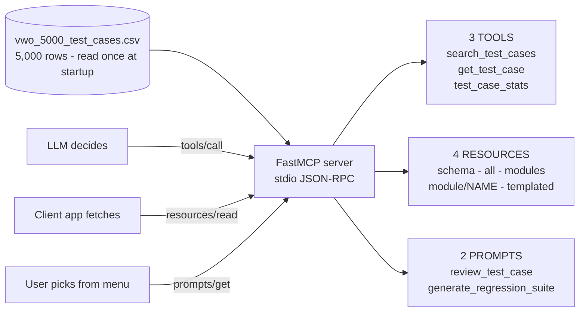
```mermaid
flowchart LR
    CSV[("vwo_5000_test_cases.csv<br/>5,000 rows - read once at startup")] --> S["FastMCP server<br/>stdio JSON-RPC"]
    M["LLM decides"] -->|"tools/call"| S
    A["Client app fetches"] -->|"resources/read"| S
    U["User picks from menu"] -->|"prompts/get"| S
    S --> T["3 TOOLS<br/>search_test_cases<br/>get_test_case<br/>test_case_stats"]
    S --> R["4 RESOURCES<br/>schema - all - modules<br/>module/NAME - templated"]
    S --> P["2 PROMPTS<br/>review_test_case<br/>generate_regression_suite"]
```

**One decorator per primitive** — the docstring and type hints are functional code here, not commentary: FastMCP derives the JSON schema and the description the client LLM sees directly from them.

```python
from fastmcp import FastMCP
from fastmcp.resources import ResourceContent

mcp = FastMCP("vwo-testcases")

@mcp.tool                                    # model-invoked
def get_test_case(test_id: str) -> dict[str, Any]:
    """Return one test case by its issue key, for example VWO-1001."""
    row = _lookup(test_id)
    if row is None:
        raise ToolError(f"unknown test_id {test_id!r}; expected a key such as VWO-1001")
    return _expand(row)

@mcp.resource("testcases://module/{name}", mime_type="application/json")
def module_resource(name: str) -> list[ResourceContent]:   # app-fetched, templated
    """All test cases belonging to one module, matched case-insensitively."""
    hits = _module_rows(name)
    if not hits:
        raise ResourceError(f"unknown module {name!r}; read testcases://modules first")
    return _json_resource([_expand(row) for row in hits])

@mcp.prompt                                  # user-invoked
def review_test_case(test_id: str) -> str:
    """Ask the model to critique one test case for coverage, clarity, and edge cases."""
    return f"You are a senior QA lead...\n\n{_as_json(_expand(_lookup(test_id)))}\n\n..."

if __name__ == "__main__":
    mcp.run(show_banner=False)               # stdio transport
```

**Run and inspect:**
```bash
cd chapter_10_MCP_Creation_VIBE/testcase-creator-mcp
uv sync
npx -y @modelcontextprotocol/inspector uv run --directory "$(pwd)" python server.py
```

Open the printed `localhost:6274` URL, hit **Connect**, then walk the Tools / Resources / Prompts tabs. The chapter README carries an 11-step click checklist that exercises every primitive plus its error path.

**Register it with Claude Code** (one line), or paste the `claude_desktop_config.json` snippet from the chapter README:
```bash
claude mcp add vwo-testcases -- uv run --directory "$(pwd)" python server.py
```

**Two FastMCP 3.x traps worth knowing** (both cost real debugging time):
- A resource returning `list[dict]` is valid in FastMCP 2.x and **raises** on 3.x — `TypeError: contents[0] must be ResourceContent, got dict`. 3.x reads a returned list as a list of *content blocks*.
- A resource returning a bare `str` works but **silently forces `mimeType: text/plain`**, overriding the `mime_type` declared on the decorator. Silent, so nothing ever surfaces it. Wrap in `ResourceContent(payload, mime_type="application/json")` — note the outer list.

**Error handling is a feature, not boilerplate:** unknown IDs, unknown modules, bad `group_by`, and empty result sets all raise typed `ToolError` / `ResourceError` / `PromptError`. The client receives a readable message that names the valid values, so a wrong guess self-corrects in one round trip. The traceback stays on stderr where it belongs.

---

## Chapter 11 — Python for Testers

`chapter_11_Python_Learning/` is the ground floor. Its 173 Python source files take a manual tester from `print("Hello")` to decorators, collections, object-oriented programming, exception handling, modules, and packages without a framework in the way.

**Concept:** Nineteen focused exercise folders build the language one idea at a time. The path starts with output, variables, types, operators, conditions, loops, and functions; then moves through scope, decorators, conversion, lambdas, and Python's core collections. The final folders cover sets and `frozenset`, functional transformations with `map()` / `filter()`, dictionaries for realistic nested test data, OOP, polymorphism, abstraction, static and class methods, exceptions, modules, and packages. Each file stays small enough to run, inspect, change, and re-run in a few minutes.

**Why:** Most "learn Python" material teaches a language. A tester needs a *runnable mental model* fast — why `"PRAMOD" + 10` throws, why `age` and `Age` are two variables, why `input()` always hands back a string. Each lab is small enough to run, break, and re-run in under a minute.

**Q&A — how to work through it:**
- **Q: In what order do I run these?** A: Follow the exercise folders from `ex_01` to `ex_19`, and the numbered examples from `001` through `170`. Some numbers are absent or reused in separate OOP topic folders, so follow the folder order first and filenames second. The package exercise also uses supporting files without numeric prefixes.
- **Q: Do I need a virtualenv or any install?** A: Almost every lab is stdlib-only. `04_Encapsulation/132_Ecap_NICE.py` uses `python-dotenv`, while `09_Exceptions/164.py` uses `requests`; install both with `python3 -m pip install python-dotenv requests`. Provide `USERNAME` / `PASSWORD` in your environment or a local ignored `.env` file for the encapsulation example.
- **Q: What's the single most common beginner error here?** A: `TypeError: can only concatenate str (not "int") to str` — Lab013 triggers it deliberately and Lab015 fixes it with `str()`. The same class of bug shows up later as `int(input(...))` in Lab022.

**Learning path:**


```mermaid
flowchart TD
    A["ex_01 — Basics<br/>Lab001-003"] --> A1["print&#40;&#41; with many args<br/>sep= and end=<br/># comments"]
    A1 --> B["ex_02 — Keywords, Identifiers, Variables<br/>Lab004-015"]
    B --> B1["35 reserved keywords<br/>identifier naming rules<br/>dynamic typing + type&#40;&#41;"]
    B1 --> B2["arithmetic + BODMAS<br/>multiple assignment<br/>str + int TypeError -> str&#40;&#41;"]
    B2 --> C["ex_03 — Literals and I/O<br/>Lab016-030"]
    C --> C1["multi-line comments<br/>data types + built-ins<br/>input&#40;&#41; returns str -> int&#40;&#41;<br/>escape seq + raw strings"]
    C1 --> E["ex_04 — Operators<br/>Lab031-042"]
    E --> E1["arithmetic // % **<br/>comparison + logical<br/>membership + ternary"]
    E1 --> F["ex_05 — if / elif / else<br/>Lab043-046"]
    F --> G["ex_06 — match-case<br/>LabSwitch01-02"]
    G --> H["ex_07 — Loops<br/>Lab048-059"]
    H --> H1["for + range&#40;&#41;, while<br/>break / continue / pass"]
    H1 --> I["ex_08 — Functions<br/>Lab060-069"]
    I --> I1["4 function types<br/>default + keyword args<br/>multiple return values"]
    I1 --> J["ex_09 — Scopes<br/>Lab075-078"]
    J --> J1["local vs global<br/>shadowing<br/>inner functions"]
    J1 --> K["ex_10 — Decorators<br/>Lab079-083"]
    K --> K1["wrapper before/after<br/>@time_decorator<br/>stacked = bottom-up"]
    K1 --> L["ex_11 — Type Conversion<br/>Lab087"]
    L --> M["ex_12 — Lambda<br/>Lab090-094"]
    M --> M1["lambda a, b: a * b<br/>ternary inside lambda"]
    M1 --> N["ex_13 — List<br/>Lab096-098"]
    N --> N1["mutable, indexed<br/>append/extend/insert<br/>pop/sort/slice"]
    N1 --> O["ex_14 — Tuple<br/>Lab099-101"]
    O --> O1["immutable<br/>&#40;3,&#41; trailing comma<br/>tuple&#40;&#41; &lt;-&gt; list&#40;&#41;"]
    O1 --> P["ex_15 — Set + Frozenset<br/>Lab102-105"]
    P --> P1["unique values<br/>union / intersection / difference<br/>set comprehensions"]
    P1 --> Q["ex_16 — Map + Filter<br/>Lab106-111"]
    Q --> Q1["select with filter&#40;&#41;<br/>transform with map&#40;&#41;<br/>functions + lambdas"]
    Q1 --> R["ex_17 — Dictionary<br/>Lab112-119"]
    R --> R1["key-value CRUD<br/>nested test data<br/>zip / merge / frequency count"]
    R1 --> S["ex_18 — OOP and errors<br/>120-170"]
    S --> S1["class + object + self<br/>constructors<br/>class vs instance variables"]
    S1 --> S2["encapsulation<br/>public / protected / private<br/>env-backed credentials"]
    S2 --> S3["single / multiple / multilevel<br/>hierarchical / hybrid inheritance<br/>MRO + BaseTest patterns"]
    S3 --> S4["polymorphism<br/>default-argument overload pattern<br/>method overriding"]
    S4 --> S5["abstract base classes<br/>static + class methods"]
    S5 --> S6["built-in + custom exceptions<br/>try / except / else / finally<br/>ExceptionGroup"]
    S6 --> S7["ex_18 modules<br/>os + environment"]
    S7 --> T["ex_19 — Packages<br/>local imports + __init__.py"]
    T --> D["Ready for Chapters 07-10<br/>RAG scripts, Flask apps, MCP servers"]
```

**The lab that teaches the most in four lines** — `ex_03_Literals/Lab023_Strings.py`:

```python
value = input("Enter the value")
print(value)
print(type(value))   # <class 'str'> — ALWAYS str, even if you typed 42

a_int = int(value)   # explicit cast; ValueError if the input wasn't numeric
```

Same trap, applied — `ex_03_Literals/Lab022_User_Input_Sum_Of_Two_numbers.py`:

```python
num1 = int(input("Enter a number: "))
num2 = int(input("Enter another number: "))
print(num1 + num2)   # without int(), "2" + "3" would print 23, not 5
```

**Identifier rules** live in `ex_02_Keywords_Identifier_Variables/rules_for_identifier.md` — 7 rules with valid/invalid examples, a PEP 8 naming table (`snake_case` / `UPPER_SNAKE` / `PascalCase`), and a cheat-sheet table of what passes and what raises:

| Identifier | Valid? | Reason |
|:-----------|:------:|:-------|
| `_age`, `abc123`, `first_name` | Yes | letter or `_` start, no keyword |
| `123abc` | No | starts with a digit |
| `first-name` | No | hyphen is the minus operator |
| `class` | No | one of the 35 reserved keywords |
| `age` vs `Age` | Both | case sensitive — two different variables |

### ex_03 (cont.) — Literals, Escape Sequences, Raw Strings

**Concept:** A literal is a value written directly in source. Python reads the same integer four ways — decimal `89`, binary `0b1010`, octal `0o130`, hex `0x12c` — plus `float`, `str`, `bool`, and `complex` (`1 + 7j`).

**Why:** Testers hit non-decimal literals in API payloads, permission bits, and colour codes, and hit escape sequences the moment a Windows file path lands in a test fixture.

**Q&A — why use this?**
- **Q: When do I need `r""`?** A: Any Windows path or regex. `'C:\pramod\n.txt'` silently becomes a newline; `r"C:\pramod\n.txt"` stays literal.
- **Q: Single or double quotes?** A: No difference in Python — `'C'` and `"C"` are identical `str`. Pick one and be consistent (PEP 8 has no preference).
- **Q: How do I convert `"90"` to a number?** A: `int()`, `float()`, `str()` are the three casts. `int("90")` works; `int("90.5")` raises `ValueError`.


```mermaid
flowchart LR
    L["Literal in source"] --> D["0b1010 -> binary"]
    L --> O["0o130 -> octal"]
    L --> H["0x12c -> hex"]
    L --> S["'text' -> str"]
    S --> ESC{"Has backslash?"}
    ESC -->|"escape wanted"| E1["\\n \\t \\b interpreted"]
    ESC -->|"literal wanted"| E2["r&#40;&#41; raw string prefix"]
```

`ex_03_Literals/Lab028_String_Double_Single_Diff.py`:

```python
c  = 'C'
c1 = "C"
print(c, c1)          # identical — Python has no char type

# dir = 'C:\pramod\n.txt'   # \n becomes a NEWLINE — path is broken
dir = r"C:\pramod\n.txt"    # raw: prints exactly as written
print(dir)
```

---

### ex_04 — Operators

**Concept:** `ex_04_Operators/` walks all five operator families — arithmetic (`+ - * / // % **`), comparison (`== != > <`), logical (`and or not`), assignment (`+= -= *=`), and membership (`in` / `not in`) — plus the ternary one-liner.

**Why:** Every assertion you will ever write is a comparison or a logical expression. Getting `/` vs `//`, and `=` vs `==`, wrong is the top source of silent wrong-result bugs in test code.

**Q&A — why use this?**
- **Q: What's the difference between `/` and `//`?** A: `/` always returns a `float` (`5/2 -> 2.5`); `//` is floor division and returns the quotient (`5//2 -> 2`). `%` gives the remainder. `divmod(5, 2)` returns both at once.
- **Q: Does Python have `++` / `--`?** A: No. Use `x += 1` and `x -= 1`. `Lab040_Operators_P9.py` says this out loud because it trips up Java and JS testers.
- **Q: When do I use the ternary?** A: One-line assignment or print where a full `if/else` block adds noise — `print("pass" if code == 200 else "fail")`. Anything with two statements per branch stays a real `if`.

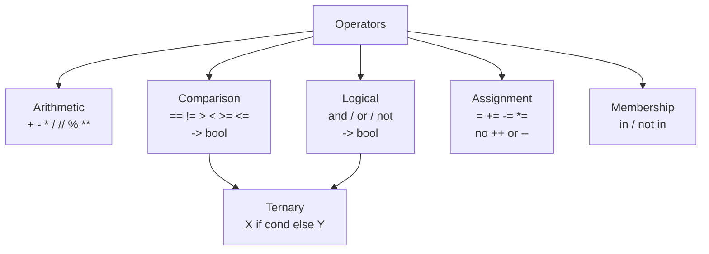
```mermaid
flowchart TD
    OP["Operators"] --> A["Arithmetic<br/>+ - * / // % **"]
    OP --> C["Comparison<br/>== != > < >= <=<br/>-> bool"]
    OP --> L["Logical<br/>and / or / not<br/>-> bool"]
    OP --> AS["Assignment<br/>= += -= *=<br/>no ++ or --"]
    OP --> M["Membership<br/>in / not in"]
    C --> T["Ternary<br/>X if cond else Y"]
    L --> T
```

`ex_04_Operators/Lab041_User_Input_Ternary_Operators.py` — the same rule written twice:

```python
user_age = int(input("Enter your age\n"))

if user_age >= 18:
    print("Yes You can go to GOA and vote")
else:
    print("Not you can't go and can't vote")

# identical logic, one line
print("Yes You can go to GOA and vote" if user_age >= 18 else "Not you can't go and can't vote")
```

| Operator | Result for `5 ? 2` | Type |
|:---------|:-------------------|:-----|
| `5 / 2` | `2.5` | always `float` |
| `5 // 2` | `2` | floor quotient |
| `5 % 2` | `1` | remainder |
| `5 ** 2` | `25` | power |
| `divmod(5, 2)` | `(2, 1)` | quotient + remainder tuple |

---

### ex_05 — Conditions (if / elif / else)

**Concept:** `ex_05_Condition_Loops/` builds decision logic in three steps: a flat `if/else`, a nested `if` inside an `if`, then an `if / elif / else` chain that finds the max of three numbers.

**Why:** A test is a decision. Every assertion, every skip rule, every environment switch in a framework is this construct — and nesting depth is where readability dies first.

**Q&A — why use this?**
- **Q: `elif` or a second `if`?** A: `elif` when the branches are mutually exclusive — Python stops at the first `True`. Separate `if`s all evaluate, which is slower and lets two branches both fire.
- **Q: Why `.strip()` on `input()`?** A: A stray space makes `int(" 21 ")` fragile in real terminals. `Lab043_IF_Condition_Optimized.py` strips first, then validates the range before deciding.
- **Q: How do I validate before branching?** A: Guard clause first. The optimized lab rejects `age <= 0 or age > 130` up front, so the business logic below never sees garbage.


```mermaid
flowchart TD
    IN["int&#40;input&#40;&#41;.strip&#40;&#41;&#41;"] --> G{"age <= 0 or age > 130?"}
    G -->|Yes| BAD["Enter a valid age"]
    G -->|No| C{"age >= 21?"}
    C -->|Yes| Y["Yes, can go club"]
    C -->|No| N["No, can't go club"]
```

`ex_05_Condition_Loops/src/ex_05_Condition_Loops/Lab043_IF_Condition_Optimized.py`:

```python
age = int(input("Enter the age\n").strip())

if age <= 0 or age > 130:
    print("Enter a valid age")
else:
    if age >= 21:
        print("Yes, can go club")
    else:
        print("No, can't go club")
```

---

### ex_06 — match-case (Python's switch)

**Concept:** `match-case` (Python 3.10+) matches a value against patterns top-down and runs the first hit. `case _` is the wildcard default.

**Why:** A long `elif` chain that only ever compares one variable to constants reads better as a `match` — and in test code that shape appears constantly (test type, environment, browser, status code).

**Q&A — why use this?**
- **Q: Does it need `break` like Java/JS?** A: No. Python does not fall through — the matched case runs and the block exits.
- **Q: What if nothing matches and there is no `case _`?** A: Nothing happens, silently. Always write `case _` as the invalid-input branch.
- **Q: Which Python version?** A: 3.10 or newer. On 3.9 and below `match` is a `SyntaxError` — fall back to `elif` or a dict lookup.


```mermaid
flowchart TD
    IN["test_type = input&#40;&#41;"] --> M{"match test_type"}
    M -->|API| A["Run POSTMAN API testcase"]
    M -->|UI| U["Run Selenium testcase"]
    M -->|Performance| P["Run Performance testcase"]
    M -->|Security| S["Run Security testcase"]
    M -->|"case _"| D["Invalid Type."]
```

`ex_06_Switch_Match/LabSwitch02.py`:

```python
test_type = input("Enter the Test Type : API, UI, Performance, Security ")

match test_type:
    case "API":
        print("We are running a POSTMAN API Testcase.")
    case "UI":
        print("We are running a Selenium Testcase.")
    case "Performance":
        print("We are running a  Performance Testcase.")
    case "Security":
        print("We are running a  Security Testcase.")
    case _:
        print("Invalid Type.")
```

---

### ex_07 — Loops

**Concept:** `ex_07_Loops/` covers `for i in range(start, stop, step)` (stop is exclusive), `while` with the I-C-U pattern (Initialize, Condition, Update), and the three loop-control keywords `break`, `continue`, `pass`.

**Why:** Data-driven testing *is* a loop — one test body, many test IDs. Off-by-one on `range()` and a forgotten update line in `while` (infinite loop) are the two classic beginner failures, and both labs trigger them on purpose.

**Q&A — why use this?**
- **Q: `for` or `while`?** A: `for` when the count is known (`range(1, 6)` — 5 test cases). `while` when the exit depends on a condition (retry until pass, poll until ready).
- **Q: `break` vs `continue` vs `pass`?** A: `break` exits the loop entirely, `continue` skips to the next iteration, `pass` does literally nothing (a syntactic placeholder so an empty block still parses).
- **Q: Why does `range(1, 10)` stop at 9?** A: `stop` is exclusive. `range(10)` is 0-9, ten iterations — that's why `Lab050` uses `range(1, 6)` to get test IDs 1 through 5.

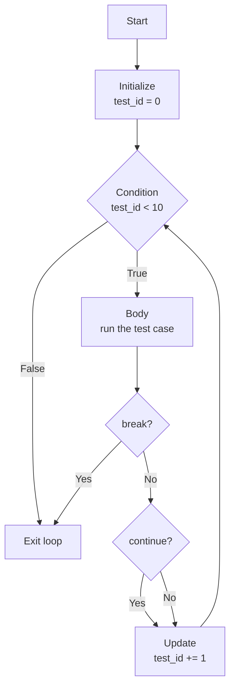
```mermaid
flowchart TD
    S["Start"] --> I["Initialize<br/>test_id = 0"]
    I --> C{"Condition<br/>test_id < 10"}
    C -->|False| E["Exit loop"]
    C -->|True| B["Body<br/>run the test case"]
    B --> K{"break?"}
    K -->|Yes| E
    K -->|No| N{"continue?"}
    N -->|Yes| U
    N -->|No| U["Update<br/>test_id += 1"]
    U --> C
```

`ex_07_Loops/Lab051_For_While.py` — the I-C-U pattern applied to test IDs:

```python
test_id = 0
while test_id < 10:          # Condition
    print("Running the testcase -> ", test_id)
    test_id = test_id + 1    # Update — drop this line and it loops forever
```

`ex_07_Loops/Lab059.py` — `continue` as an odd-number filter:

```python
for number in range(10):
    if number % 2 == 0:
        continue          # skip evens, jump to next iteration
    else:
        print(number)     # 1 3 5 7 9
```

---

### ex_08 — Functions

**Concept:** A function is a named, reusable block. `ex_08_Functions/` builds all four shapes in order: no-param/no-return, param/no-return, param + default, and param + `return`.

**Why:** Every fixture, helper, and page-object method you write later is one of these four. Defaults and keyword arguments are what make a test helper readable at the call site.

**Q&A — why use this?**
- **Q: Can a Python function return more than one value?** A: Yes — `return a + b, a - b, a * b` returns a tuple, unpacked at the call site into three variables.
- **Q: Why keyword arguments?** A: They kill positional-order bugs. `display_information(role="QA", name="Pramod")` is order-independent and self-documenting at the call site.
- **Q: What's the gotcha with default parameters?** A: They must come after non-default ones, and a *mutable* default (`def f(items=[])`) is shared across calls — use `None` and build inside. The labs stick to immutable defaults like `name="QA"`.


```mermaid
flowchart TD
    F["def function"] --> T1["Type 1 — NRNP<br/>no param, no return<br/>greet&#40;&#41;"]
    F --> T2["Type 2 — param, no return<br/>greet&#40;name&#41;"]
    F --> T3["Type 3 — default param<br/>greet&#40;name='QA'&#41;"]
    F --> T4["Type 4 — param + return<br/>sum_of_two&#40;a, b&#41; -> a + b"]
    T4 --> MR["Multiple returns<br/>return a+b, a-b, a*b<br/>-> tuple unpack"]
    T3 --> KW["Keyword args<br/>f&#40;role='QA', name='Pramod'&#41;"]
```

`ex_08_Functions/Lab066_Functions_Return_Multiple_Values.py` and `Lab067_Functions_Keyword_Arg.py`:

```python
def math_operations(a, b):
    return a + b, a - b, a * b          # returns a tuple

sum_result, diff_result, mul_result = math_operations(3, 4)
print(sum_result, diff_result, mul_result)   # 7 -1 12


def display_information(name, role):
    print(f"Name : {name}, role is {role}")

display_information(name="Pramod2", role="QA2")
display_information(role="QA3", name="Pramod3")   # order does not matter
```

| Function type | Signature | Returns |
|:--------------|:----------|:--------|
| NRNP | `def greet():` | `None` |
| Param, no return | `def greet(name):` | `None` |
| Default param | `def greet(name="QA"):` | `None` |
| Param + return | `def sum_of_two(a, b):` | value or tuple |

**`*args` — infinite arguments** (`Lab072_Infinite_Args.py`, `Lab073_Real_Args.py`): when the caller decides how many values to pass, prefix the parameter with `*`. Python packs everything positional into a tuple.

```python
def print_mul_arg(*pramod_list):
    for i in pramod_list:
        print(i)

print_mul_arg("pramod")
print_mul_arg(2, 3, 1, 4)
print_mul_arg("pramod", "dutta", "third", 3.14, True)   # mixed types are fine


def make_pizza(*toppings):
    print(toppings)                  # ('cheese', 'corn')

make_pizza("cheese", "corn")
make_pizza("tomato")
```

`Lab071_IQ.py` is the argument-resolution drill — one function with three defaults, called five ways (`sum_three()`, `sum_three(1, 2)`, `sum_three(b=67, a=10, c=45)`). `LabIQ02.py` shows a `def` inside a `def`: the inner name only exists during the outer call, so `f2()` at module level is a `NameError`.

---

### ex_09 — Scopes

**Concept:** A variable created inside a function is *local* — it dies when the function returns. A variable created at module level is *global* — readable from inside any function. `ex_09_Functions_Scopes/` proves both directions with four labs.

**Why:** Half of "why is my variable `None`?" in a test framework is a scope mistake — a helper set a local that the caller never sees, or a fixture reassigned a module constant and only shadowed it.

**Q&A — why use this?**
- **Q: Can a function read a global variable?** A: Yes, reading is free. `Lab075_Local_Variable.py` prints `pb_global_b` from inside `my_function()` with no declaration.
- **Q: Can a function *change* a global?** A: Not by plain assignment. `Lab077_Local_Var.py` writes `public_toilet = "LPB"` inside `home()` and that creates a new local; the module-level value is untouched. You need the `global` keyword to actually rebind it.
- **Q: What can an inner function see?** A: Its own locals plus the enclosing function's locals. `Lab078_Inner_Functions.py` has `inner_function()` read `var1 = 30` from the outer scope, while sibling `inner_function2()` defines its own `var1 = 100` and prints that instead. Neither can see the other's `var2`.

```mermaid
flowchart TD
    G["Global scope<br/>public_toilet = 'PB'"] --> H["def home&#40;&#41;"]
    G --> S["def stranger&#40;&#41;"]
    H --> HL["local: private_toilet = 'PT'<br/>reads public_toilet ✅"]
    S --> SL["reads public_toilet ✅<br/>private_toilet ❌ NameError"]
    HL --> SH["public_toilet = 'LPB' inside home&#40;&#41;<br/>creates a NEW local<br/>global stays 'PB'"]
```

```python
public_toilet = "PB"          # global

def home():
    private_toilet = "PT"     # local — only home() sees this
    print(public_toilet)      # 'PB' — reading a global is fine

def stranger():
    print(public_toilet)      # 'PB'
    # print(private_toilet)   # NameError: name 'private_toilet' is not defined
```

---

### ex_10 — Decorators

**Concept:** A decorator is a function that takes another function, wraps extra behaviour around it, and returns the wrapped version. `@add_security` above a `def` is shorthand for `drive = add_security(drive)`.

**Why:** This is the exact machinery behind `@pytest.fixture`, `@pytest.mark.parametrize`, `@app.route`, and `@mcp.tool`. Once the wrapper pattern clicks, every framework annotation you will meet stops being magic. `Lab081.py` deliberately writes the same thing *without* a decorator (`start(); test_ui(); end()`) so the manual version and the decorated version sit side by side.

**Q&A — why use this?**
- **Q: What does the wrapper actually do?** A: Runs your "before" code, calls `func()`, runs your "after" code. That is setup/teardown around a test with zero edits to the test body.
- **Q: `return wrapper` or `return wrapper()`?** A: `return wrapper` — no parentheses. Returning `wrapper()` calls it at decoration time (import time), so the "test" runs the moment the module loads and the decorated name becomes `None`. `Lab082.py` and `Lab083.py` show the correct form.
- **Q: In what order do stacked decorators run?** A: Bottom-up at wrap time, top-down at call time. In `Lab082.py`, `@print_logs` is closest to the function so it wraps first, then `@time_decorator` wraps that — the timer therefore measures the logging too.

```mermaid
flowchart TD
    A["@time_decorator"] --> B["@print_logs"]
    B --> C["def test_ui_1&#40;&#41;"]
    C --> D["Call test_ui_1&#40;&#41;"]
    D --> E["time start"]
    E --> F["'Start the logs'"]
    F --> G["real test body<br/>time.sleep&#40;2&#41;"]
    G --> H["'End of the log'"]
    H --> I["time end -> print elapsed"]
```

```python
import time

def print_logs(func):
    def wrapper():
        print("Start the logs")
        func()
        print("End of the log")
    return wrapper                       # no () here

def time_decorator(func):
    def wrapper():
        start_time = time.time()
        func()
        end_time = time.time()
        print("Total Time Take by Func -> ", end_time - start_time)
    return wrapper

@time_decorator
@print_logs
def test_ui_1():
    print("Add a function, time taken by this function 1")
    time.sleep(2)

test_ui_1()
```

---

### ex_11 — Type Conversion

**Concept:** Explicit casting between built-in types with `int()`, `str()`, `float()`, `bool()`, `list()`, `tuple()`, `set()`, `dict()`, `complex()`.

**Why:** `input()` always returns `str`, JSON numbers arrive as `str` from CSV exports, and API assertions compare `"200"` to `200` and fail. Casting is the fix, and `type()` is how you prove which one you are holding.

**Q&A — why use this?**
- **Q: How do I check what I actually have?** A: `print(type(a))` — `<class 'str'>` vs `<class 'int'>`. Do this before every "why did my assert fail" hunt.
- **Q: Does `int("10.5")` work?** A: No — `ValueError`. Go through `float()` first: `int(float("10.5"))` gives `10`.
- **Q: What is falsy when cast with `bool()`?** A: `0`, `""`, `[]`, `()`, `{}`, and `None`. Everything else is `True` — including the string `"False"`.

```mermaid
flowchart LR
    S["'10' — str"] -->|int&#40;&#41;| I["10 — int"]
    I -->|str&#40;&#41;| S
    I -->|float&#40;&#41;| F["10.0 — float"]
    L["[1, 2, 3] — list"] -->|tuple&#40;&#41;| T["&#40;1, 2, 3&#41; — tuple"]
    T -->|list&#40;&#41;| L
    I -->|bool&#40;&#41;| B["True — bool<br/>0 is the only falsy int"]
```

```python
a = "10"
print(type(a))     # <class 'str'>
a = int(a)
print(type(a))     # <class 'int'>

# int(), str(), float(), bool(), list(), tuple(), set(), dict(), complex()
```

---

### ex_12 — Lambda Expressions

**Concept:** `lambda` builds an anonymous single-expression function inline. `lambda num: num * 3` is the same thing as a three-line `def triple_number(num)` with a `return`.

**Why:** Lambdas are what you pass to `sorted(key=...)`, `filter()`, `map()`, and Playwright/pytest predicate arguments. Being able to read one is non-optional once you touch real test code.

**Q&A — why use this?**
- **Q: When do I use `lambda` over `def`?** A: When the function is one expression and used once, right where it is written. Anything with a branch, a loop, or a docstring stays a `def`.
- **Q: Can a lambda take multiple arguments?** A: Yes — `lambda a, b: a * b` and `lambda a, b, c: a + b + c` (`Lab091_Lambda.py`). It can also take zero: `lambda: math.pow(...)`.
- **Q: Can it have an `if`?** A: Only the ternary form — `lambda num: "Even" if num % 2 == 0 else "Odd"`. No statements, no `return` keyword; the expression *is* the return value.

```mermaid
flowchart TD
    A["def triple_number&#40;num&#41;:<br/>&nbsp;&nbsp;&nbsp;&nbsp;return num*3"] -->|same behaviour| B["lambda num: num*3"]
    B --> C["assign it<br/>f = lambda num: num*3"]
    B --> D["call it inline — IIFE<br/>&#40;lambda n: ...&#41;&#40;value&#41;"]
    B --> E["ternary inside<br/>'Even' if n%2==0 else 'Odd'"]
```

```python
result_l_format = lambda num: num * 3
print(result_l_format(3))                 # 9

mul_l = lambda a, b: a * b
print(mul_l(3, 4))                        # 12

user_input = int(input("Enter the number"))
check_even_odd_f = lambda num: "Even" if num % 2 == 0 else "Odd"
print(check_even_odd_f(user_input))

# one-liner: build it and call it immediately
print((lambda num: "Even" if num % 2 == 0 else "Odd")(int(input("Enter the number: "))))
```

---

### ex_13 — List

**Concept:** A list is an ordered, indexed, **mutable** collection written with `[]`. It can hold mixed types, be grown, shrunk, sorted, sliced, and nested.

**Why:** Every test suite is a list — test IDs, expected rows, API response arrays, grocery items. `for element in my_list` is the loop you will write more than any other.

**Q&A — why use this?**
- **Q: `append()` vs `extend()` vs `insert()`?** A: `append(x)` adds one item at the end. `extend([a, b])` adds each item of another list at the end. `insert(i, x)` puts one item at index `i` and shifts the rest right.
- **Q: Does `copy()` give me an independent list?** A: Yes for a flat list — `Lab097.py` removes from the copy and the original is unchanged. For nested lists it is still a shallow copy; the inner lists are shared.
- **Q: `pop()` vs `remove()` vs `del`?** A: `pop(i)` removes *by index* and returns the item (default last). `remove(x)` removes the first item *equal to `x`* and returns nothing. `del my_list[0]` removes by index and returns nothing.

```mermaid
flowchart TD
    L["my_list = [1, 2, 3]<br/>mutable, indexed from 0"] --> ADD["Grow"]
    L --> REM["Shrink"]
    L --> RD["Read"]
    ADD --> A1["append&#40;4&#41; — one item at end<br/>extend&#40;[7,8]&#41; — many at end<br/>insert&#40;1,'Dutta'&#41; — at index"]
    REM --> R1["remove&#40;'Amit'&#41; — by value<br/>pop&#40;1&#41; — by index, returns it<br/>del my_list[0] — by index<br/>clear&#40;&#41; — empty it"]
    RD --> D1["my_list[0] — index<br/>my_list[1:4] — slice<br/>len / max / min / sum<br/>20 in my_list — membership"]
```

```python
my_list = [1, 2, 3]
print(my_list[0])            # 1 — index from 0
# print(my_list[6])          # IndexError: list index out of range

my_list.append(4)            # [1, 2, 3, 4]
my_list.extend([7, 8, 10])   # [1, 2, 3, 4, 7, 8, 10]
my_list.insert(1, "Dutta")   # mixed types are allowed
my_list.remove("Dutta")

numbers = [10, 20, 30, 20, 40]
print(numbers.index(20))     # 1 — first match
print(numbers.count(20))     # 2
print(numbers[1:4])          # slice: start, end-1
print(max(numbers), min(numbers), sum(numbers))

matrix = [[1, 2, 3], [4, 5, 6], [7, 8, 9]]
print(matrix[1][2])          # 6 — nested list
```

---

### ex_14 — Tuple

**Concept:** A tuple is an ordered, indexed, **immutable** collection written with `()`. Same reading operations as a list; every write operation is gone.

**Why:** Immutability is a guarantee, not a limitation. Environment URLs, expected status codes, and config constants should be impossible to reassign halfway through a suite — a tuple makes an accidental overwrite a crash at the line that caused it instead of a mystery failure three tests later.

**Q&A — why use this?**
- **Q: What happens if I try to change one?** A: `my_tuple[0] = 12` raises `TypeError: 'tuple' object does not support item assignment`. There is no `append()` either.
- **Q: How do I write a one-element tuple?** A: With a trailing comma — `single = (3,)`. Without it, `(3)` is just the integer `3` in parentheses.
- **Q: I need to edit one anyway.** A: Convert, edit, convert back: `list(my_tuple)` -> mutate -> `tuple(my_list)`. `Lab100_Tuple.py` and `Lab101.py` do the round trip both ways.

```mermaid
flowchart TD
    T["my_tuple = &#40;1, 2, 3&#41;<br/>immutable"] --> OK["Allowed<br/>index, slice, len&#40;&#41;<br/>'Paris' in cities<br/>for c in colors"]
    T --> NO["Blocked<br/>t[0] = 12 → TypeError<br/>t.append&#40;12&#41; → AttributeError"]
    NO --> CONV["Need a change?<br/>list&#40;t&#41; → mutate → tuple&#40;l&#41;"]
    T --> USE["Real use<br/>API_URLS = &#40;'…/python0x', '…'&#41;<br/>frozen config"]
```

```python
my_tuple = (1, 2, 3)
# my_tuple[0] = 12          # TypeError: 'tuple' object does not support item assignment

single = (3,)                # trailing comma — without it this is an int
print(type(single))          # <class 'tuple'>

cities = ("London", "Paris", "Los Angeles", "Tokyo")
print(len(cities))           # 4
print("Paris" in cities)     # True

# real use: frozen environment config
API_URLS = ("https://sdet.live/python0x", "https://awesomeqa.com", "https://thetestingacademy.com")
print(API_URLS[0])

my_tuple = tuple([1, 2, 3])  # list -> tuple
back_to_list = list(my_tuple)  # tuple -> list
```

| | List | Tuple |
|:--|:--|:--|
| Syntax | `[1, 2, 3]` | `(1, 2, 3)` |
| Mutable | ✅ append / remove / sort | ❌ `TypeError` on assign |
| One element | `[3]` | `(3,)` — comma required |
| Use it for | test data you build up | frozen config, env URLs, constants |

---

### ex_15 — Set and Frozenset

**Concept:** A set is a mutable collection of unique, unordered values. It is ideal for removing duplicates and comparing two groups with union (`|`), intersection (`&`), and difference (`-`). A `frozenset` keeps the same uniqueness rules but cannot be changed after creation.

**Why:** QA data frequently needs comparison rather than position: which test IDs exist in either suite, which failures occur in both runs, or which expected permissions are missing from the actual response.

**Q&A — why use this?**
- **Q: Why did my duplicates disappear?** A: Uniqueness is the defining rule. `{1, 2, 3, 3}` contains only three values.
- **Q: Can I rely on set order?** A: No. If output order matters, sort the result explicitly with `sorted(my_set)`.
- **Q: `set` or `frozenset`?** A: Use `set` while adding or removing values. Use `frozenset` when the collection must stay fixed or needs to be used as a dictionary key.

```python
expected = {"login", "checkout", "logout"}
actual = {"login", "search", "logout"}

print(expected | actual)  # every unique test name
print(expected & actual)  # tests present in both runs
print(expected - actual)  # {'checkout'} — missing from actual

squares = {x ** 2 for x in range(5)}
fixed_ids = frozenset([1, 2, 3, 3])
```

---

### ex_16 — Map and Filter

**Concept:** `filter()` keeps items whose predicate is truthy; `map()` transforms every item with a function. Both return lazy iterator objects in Python 3, so the labs wrap them in `list()` to display and reuse the results.

**Why:** These operations express common QA pipelines directly: keep only failed results, remove blank test names, normalize labels to uppercase, or convert response times from milliseconds to seconds.

**Q&A — why use this?**
- **Q: Why does printing `map(...)` not show my transformed values?** A: `map` and `filter` are lazy. Consume them with `list(...)`, a loop, or another iterator-aware function.
- **Q: Named function or lambda?** A: Use a named `def` when the rule needs explanation or reuse. Use a lambda for one short expression at the call site.
- **Q: Does `filter()` change the original list?** A: No. It produces a new iterator; the source list remains untouched.

```python
test_results = ["PASS", "FAIL", "PASS", "SKIP", "FAIL"]
passed = list(filter(lambda result: result == "PASS", test_results))

response_times_ms = [1200, 1500, 1800]
response_times_s = list(map(lambda value: value / 1000, response_times_ms))

print(passed)              # ['PASS', 'PASS']
print(response_times_s)    # [1.2, 1.5, 1.8]
```

---

### ex_17 — Dictionary

**Concept:** A dictionary stores unique keys mapped to values. The labs cover lookup, insert, update, delete, membership, `.items()` iteration, safe `.get()` access, nested dictionaries, `dict(zip(...))`, and the Python 3.9+ merge operator (`|`).

**Why:** JSON objects, API payloads, environment configuration, and data-driven test records all arrive in dictionary-shaped structures. Nested dictionary access is the bridge from Python fundamentals to real API assertions.

**Q&A — why use this?**
- **Q: `record["status"]` or `record.get("status")`?** A: Bracket lookup raises `KeyError` when the key is missing. `.get()` returns `None` or a default you provide, making optional fields easier to handle.
- **Q: Does key order matter?** A: Python preserves insertion order, but access should still be by key rather than numeric position.
- **Q: How do I count repeated values?** A: Start with `{}` and update with `counts[item] = counts.get(item, 0) + 1`.

```python
test_case = {
    "id": "TC-101",
    "status": "PASS",
    "environment": {"browser": "Chrome", "region": "IN"},
}

print(test_case["status"])
print(test_case["environment"]["browser"])
test_case["status"] = "FAIL"

char_count = {}
for char in "automation":
    char_count[char] = char_count.get(char, 0) + 1
```

---

### ex_18 — Object-Oriented Python

**Concept:** A class is a blueprint that groups data (attributes) and behaviour (methods). Calling the class creates an object; `__init__` initializes it, and each method receives that object as its first `self` parameter. The OOP path progresses from classes and constructors through variable scope, encapsulation, inheritance, polymorphism, abstraction, static/class methods, exception handling, and standard-library modules.

**Why:** Page objects, API clients, test-data models, and framework fixtures are all built from classes. Polymorphism lets test subclasses customize shared behavior, abstraction defines contracts they must satisfy, and exception handling turns predictable failures into controlled test outcomes.

**Q&A — why use this?**
- **Q: Class or object?** A: `Dog` is the class blueprint; `chow = Dog()` creates an object and stores its reference in `chow`.
- **Q: Why must a method declare `self`?** A: Python passes the current object automatically when you call `chow.bark()`. Inside the method, `self.name` means the `name` attribute on that object.
- **Q: What does `__init__` do?** A: Python calls it automatically after creating an object. A parameterized constructor can require values such as `Dog("chow", "mastiff")`; calling the same class without those required arguments raises `TypeError`, which `124_DC.py` demonstrates deliberately.
- **Q: Class variable or instance variable?** A: A value defined on the class is shared as a default. Assigning through `self.name` or `object.name` creates or updates a value for that specific object.
- **Q: Are `protected` and `private` enforced?** A: A single underscore (`_config`) is a developer convention. A double-leading underscore (`__account_number`) triggers name mangling, which prevents casual access but is not a security boundary.
- **Q: Which parent wins in multiple inheritance?** A: Python follows its method resolution order (MRO). In `class Child(Father1, Father2)`, `self.money()` finds `Father1.money()` first.
- **Q: Does Python support traditional method overloading?** A: No. If a class defines the same method name twice, the later definition replaces the earlier one. The labs use default arguments such as `c=10` or `auth=None` when one method needs to accept different call shapes.
- **Q: What is method overriding?** A: A child class supplies its own implementation of a method inherited from its parent. `LoginTest.run()` and `APITest.run()` replace `BaseTest.run()` for those objects.
- **Q: Why use an abstract base class?** A: An `ABC` with `@abstractmethod` defines the operations every concrete subclass must implement, such as starting a browser or reading test data.
- **Q: Static method or instance method?** A: Use an instance method when behavior needs object state through `self`; use `@staticmethod` for a utility that only needs its explicit arguments. Use `@classmethod` when the method needs shared class state through `cls`.

| Folder | Focus | QA connection |
|:-------|:------|:--------------|
| `01_Class_Object` | Classes, objects, attributes, methods, `self` | Page-object foundation |
| `02_Constructor` | Default/parameterized `__init__`, inputs, calculator methods | Test-data and client initialization |
| `03_Instance_Variable` | Global, class/instance, and local names | Avoid shared-state bugs |
| `04_Encapsulation` | Public/protected/private conventions, authenticated access | Credentials and controlled state |
| `05_Inheritance` | Five inheritance shapes, MRO, reusable `BaseTest` | Shared setup across test classes |
| `06_Polymorphism` | Same-name method behavior, default arguments, overriding | Flexible test implementations |
| `07_Abstraction` | `ABC`, `@abstractmethod`, browser/data-reader contracts | Enforced framework interfaces |
| `08_Static` | Class attributes, instance methods, `@staticmethod`, `@classmethod` | Shared counters and stateless utilities |
| `09_Exceptions` | Built-in errors, handlers, `else`, `finally`, custom errors, `ExceptionGroup` | Predictable failure handling and cleanup |
| `10_Modules` | `os` name, working directory, files, and environment | Runtime and environment inspection |

```python
class Dog:
    name = None
    breed = None

    def bark(self):
        print("Barking")
        print(self.name)

chow = Dog()
chow.name = "Chow Chow"
chow.bark()
```

The inheritance labs turn the same model into reusable test setup:

```python
class BaseTest:
    def __init__(self, browser):
        self.browser = browser

    def setup(self):
        print(f"Launching {self.browser}")

class LoginTest(BaseTest):
    def run_test(self):
        self.setup()
        print("Running login test...")

LoginTest("chrome").run_test()
```

`04_Encapsulation/132_Ecap_NICE.py` reads `USERNAME` and `PASSWORD` with `python-dotenv`. Keep real values in environment variables or a local `.env`; the repository's `.gitignore` excludes `.env` files.

---

### ex_19 — Packages and Imports

**Concept:** A module is one `.py` file; a package is a directory of modules, conventionally marked by `__init__.py`. The package exercise imports `mymodule.py` directly and imports `util_module` / `util_module2` through the local `package` directory.

**Why:** Real test frameworks split page objects, API clients, fixtures, and utilities into importable modules instead of keeping the whole suite in one script. This exercise shows the smallest working version of that structure.

**Q&A — modules vs packages:**
- **Q: What does `__init__.py` do here?** A: It marks `package/` as a regular Python package and gives the package a place for initialization or exported names later.
- **Q: Why run `170.py` from `ex_19_Package/`?** A: Python places the script's directory on the import path, so both `import mymodule` and `from package import util_module` resolve locally.
- **Q: Do `util_module.py` and `util_module2.py` conflict?** A: No. They are separate module namespaces, even though both currently expose a function named `blah()`.

---

### ex_20 — Collections + File I/O

**Concept:** This lab upgrades the built-in containers with `collections` (`namedtuple`, `Counter`, `defaultdict`) and adds the second half of QA scripting: reading files, resolving paths with `os.path`, loading secrets with `python-dotenv`, and parsing CSV test data, both with the stdlib `csv` module and pandas.

**Why:** Real test data does not live in a hardcoded list. It lives in a `.csv` export, a `.env` config, or a text fixture. This lab shows the exact mechanics of getting data into and out of a test script without hardcoding secrets.

**Q&A — containers and files:**
- **Q: Why use `namedtuple` over a dict?** A: Attribute access (`t.name`) reads better than `t["name"]`, and the object is immutable, so test fixtures cannot be accidentally mutated mid-run.
- **Q: What does `defaultdict` fix?** A: Missing-key handling. `defaultdict(int)` returns 0 and `defaultdict(list)` returns [] instead of raising KeyError, which removes whole classes of counting and grouping bugs.
- **Q: Why does `open('testdata.txt')` fail from some directories?** A: Relative paths resolve against the current working directory, not the script location. Build absolute paths with `os.path.join(os.path.dirname(os.path.abspath(__file__)), name)` so the lab works from anywhere.

**Mental model — from file on disk to assertion-ready data:**

```mermaid
flowchart LR
    ENV[.env secrets] --> DOT[python-dotenv]
    DOT --> OS[os.getenv]
    CSV[td.csv / testdata.txt] --> OPEN[open / csv.reader / pandas]
    PATH[os.path.join<br/>absolute paths] --> OPEN
    OPEN --> DATA[lists / rows / DataFrame]
    DATA --> TEST[assert or login check]
    OS --> TEST
```

**Code sample — CSV login data into a pandas DataFrame:**

```python
import pandas as pd
import os

base_dir = os.path.dirname(os.path.abspath(__file__))
df = pd.read_csv(os.path.join(base_dir, 'td.csv'))
print(df)
```

`178.py` does the same with the stdlib `csv.reader`, printing each `username|password` row. `176_Env.py` loads `DB_PASSWORD` from `.env` and gates an admin check on it. Empty CSV cells become `NaN` in pandas and empty strings in `csv.reader`, and the shipped data includes both on purpose.

---

### ex_21 — pytest Basics

**Concept:** pytest is the default Python test runner: functions named `test_*` are collected automatically, plain `assert` checks the outcome, and `@pytest.mark.*` tags split suites into groups you can run selectively. The lab adds two marker-based test files plus a full cheat sheet.

**Why:** Manual `print()`-based checking does not scale past one script. pytest gives you collection, pass/fail reporting, marker filtering, fixtures, and parametrize, all with zero boilerplate. This is the same machinery production test suites use, and the prerequisite for the framework chapters later in the course.

**Q&A — first steps with pytest:**
- **Q: What is the difference between `-k` and `-m`?** A: `-k "smoke"` matches by keyword, a substring of the test name or marker id; `-m smoke` matches by marker exactly. Use `-m` for marker discipline, `-k` for quick fuzzy filtering.
- **Q: Why does my test file get ignored?** A: pytest only collects files named `test_*.py` or `*_test.py` and functions named `test_*`. Rename the function or file and it appears immediately.
- **Q: Why register markers in pytest.ini?** A: Custom markers like `smoke` and `regression` should be registered there, otherwise pytest runs fine but warns on every invocation. It is also where default options like `-v` live.

**Mental model — how one pytest run flows:**

```mermaid
flowchart TD
    CLI[pytest command] --> COLL[Collect test_*.py files]
    COLL --> FILT{Filter -k / -m}
    FILT --> RUN[Run each test function]
    RUN --> ASSERT{assert passes?}
    ASSERT -->|yes| PASS[PASSED]
    ASSERT -->|no| FAIL[FAILED + diff]
    FAIL --> REPORT[Summary: N passed, M failed]
    PASS --> REPORT
```

**Code sample — marker-based tests from the lab:**

```python
import pytest

@pytest.mark.smoke
def test_method2():
    print("test1")
    assert 1 - 1 == 2        # deliberately fails

@pytest.mark.regression
def test_login():
    print("test2")
    assert 1 + 1 == 2        # passes
```

Run selectively: `pytest -m smoke`, `pytest -m "not smoke"`, or `pytest -k login`. `PyTest_Cheatsheet.md` in the same folder is the full reference: fixtures, scopes, parametrize, conftest.py, and plugins.

---

**Run any lab:**
```bash
cd chapter_11_Python_Learning/ex_01_Python_Basics
python3 Lab001_Hello.py

# operators, conditions, loops, functions
cd ../ex_08_Functions
python3 Lab069_Functions_Types.py

# scopes, decorators, lambdas, collections
cd ../ex_10_Decortors && python3 Lab082.py
cd ../ex_13_LIST     && python3 Lab097.py
cd ../ex_14_Tuple    && python3 Lab101.py

# sets, map/filter, dictionaries
cd ../ex_15_SET_MAP_DICT && python3 105_Extra.py
cd ../ex_16_MAP_Filters  && python3 111_Map_IQ.py
cd ../ex_17_Dict         && python3 119_Count_Vowel.py

# object-oriented Python
cd ../ex_18_OOPs_Python/01_Class_Object
python3 120_Class.py
python3 122_Clas_DOG.py

cd ../02_Constructor && python3 123.py
cd ../04_Encapsulation && python3 136_PPP.py
cd ../05_Inheritance && python3 136_REAL.py

# polymorphism, abstraction, and static methods
cd ../06_Polymorphism/MethodOverloading && python3 139_MO.py
cd ../MethodOverrding && python3 141_MOR.py
cd ../../07_Abstraction && python3 147_REAL_Browser.py
cd ../08_Static && python3 151_Non_Static.py

# handled exceptions and standard-library modules
cd ../09_Exceptions && python3 166.py
cd ../10_Modules && python3 170.py

# local modules and packages
cd ../../ex_19_Package && python3 170.py

# collections + file I/O
cd ../ex_20_Collections_FileIO && python3 171.py
python3 176_Env.py
python3 178.py
python3 179.py

# pytest basics
cd ../ex_21_PyTest && python3 -m pytest test_180.py test_181.py -v
```

---

## Chapter 12 — CrewAI Test Analyst Agent

**Concept:** CrewAI is a Python framework for multi-agent automation: you define Agents (role + goal + backstory), hand them Tasks, group both into a Crew, and call `kickoff()`. The lab builds a Test Analyst agent, a senior QA persona that reads a feature requirement and proposes 5-10 P0 test cases, powered by a free Groq LLM.

**Why:** This is the bridge from prompting (chapter 02) to autonomous agents (chapters 04-05). Instead of copy-pasting a prompt every time, you encode the persona and instructions once as code, and reuse the agent on any requirement, including from a pipeline.

**Q&A — agent anatomy:**
- **Q: What is the difference between Agent and Task?** A: The Agent is the who (persona, skills, LLM). The Task is the what (a single unit of work). One agent can execute many tasks; one task belongs to one agent.
- **Q: Why pass a Groq model explicitly?** A: CrewAI defaults to OpenAI when no LLM is given. Groq's free tier works through its OpenAI-compatible endpoint, so you wire `base_url=https://api.groq.com/openai/v1` plus the full model id `openai/gpt-oss-120b` from your Groq console.
- **Q: Where do the API keys live?** A: In `chapter_12_CrewAI/.env`, loaded by python-dotenv. The repo's `.gitignore` excludes `.env`, so keys never get committed.

**Mental model — from requirement to test cases:**

```mermaid
flowchart LR
    ENV[.env<br/>GROQ_API_KEY + model] --> LLM[Groq LLM]
    LLM --> AG[QA Analyst Agent<br/>role + goal + backstory]
    REQ[Feature requirement] --> TASK[Test case Task]
    AG --> TASK
    TASK --> CREW[Crew]
    CREW -->|kickoff| OUT[5-10 P0 test cases]
```

**Code sample — the full agent:**

```python
from crewai import Agent, Task, Crew, LLM
from dotenv import load_dotenv
import os

load_dotenv()
groq_llm = LLM(
    model=f"openai/{os.getenv('GROQ_MODEL')}",
    api_key=os.getenv("GROQ_API_KEY"),
    base_url=os.getenv("GROQ_BASE_URL"),
)

qa_agent = Agent(
    role="QA Engineer",
    goal="Analyse the feature or the requirements, and create 5-10 test cases out of it.",
    backstory="You are a senior QA engineer with 15 years of experience in test planning and testcase creation",
    llm=groq_llm,
    verbose=True,
)

test_case_task = Task(
    description="Create 5-10 test cases",
    expected_output="A numbered list of 5-10 test cases with brief descriptions for a app.vwo.com Login page with the username, password and submit button with remember me functionality",
    agent=qa_agent,
)

crew = Crew(agents=[qa_agent], tasks=[test_case_task], verbose=True)

if __name__ == "__main__":
    result = crew.kickoff()
    print(result)
```

Run it with the same interpreter that has crewai installed: `python chapter_12_CrewAI/01_test_analyst_Agent.py`. The agent returns numbered test cases covering valid login, empty fields, password masking, remember-me persistence, injection protection, and accessibility.

---

## Chapter 13 - Jira QA Crew (CrewAI + Streamlit)

**Concept:** `chapter_13_CREW_AI_QA_Pipeline/` is the blueprint above, built for real. Paste one or more Jira ticket IDs into a Streamlit app and four CrewAI agents turn them into a requirements analysis, a 12-section test plan, detailed test cases, Playwright TypeScript automation, and a traceability matrix, all downloadable as Markdown, CSV, JSON, TypeScript and a ZIP.

**Why:** Chapter 12 shows one agent doing one job. This shows what changes when a crew has to survive contact with production: a provider that fails halfway, a ticket that is missing acceptance criteria, and a stakeholder who needs to know which requirement is not covered. The interesting engineering is not the agents, it is everything around them.

**Q&A - the parts that are not obvious:**
- **Q: Why is the Jira provider chosen in Python rather than by an agent?** A: Because "try MCP, fall back to REST" is a reliability decision, not a reasoning one. `JiraGateway` decides it deterministically and records which provider actually answered, so the UI can show a truthful source badge. An agent never sees the credentials.
- **Q: Why not use the `mcps` DSL?** A: It attaches an MCP server to an agent and lets the model decide when to call it. The fallback contract needs the MCP attempt, its failure detection, and the switch to REST to be deterministic, so the app drives a contained MCP client itself and hands the analyst one narrow read-only tool. That also enforces the read-only allow-list, which an agent-attached server cannot guarantee.
- **Q: How is hallucination actually prevented?** A: Every requirement carries the verbatim Jira text that supports it, and is labelled EXPLICIT, INFERRED, MISSING or ASSUMPTION_REQUIRING_CONFIRMATION. Coverage is computed in Python from the validated objects, never claimed by an agent, because an agent has an obvious incentive to answer "fully covered".
- **Q: What happens when the LLM provider cannot do structured output?** A: The pipeline walks a ladder: provider-enforced JSON schema, then `response_format: json_object` with the schema in the prompt, then plain prompted JSON. A rung that gets refused is never asked for again in that run. Enforcement degrades; validation never does, because every rung ends at the same Pydantic `model_validate`.
- **Q: Can a malicious ticket make the agent misbehave?** A: Ticket text is wrapped in an explicit untrusted-data marker and the agent is told to report embedded instructions as a risk instead of following them. The Jira tool only serves ticket keys the run started with, so "now go read SECRET-1" gets a refusal, not another ticket.

**Mental model - stage gates, not a straight line:**

```mermaid
flowchart TD
    IN[Jira IDs<br/>parse, dedupe, validate] --> GW{JiraGateway}
    GW -->|primary| MCP[MCP provider]
    GW -->|fallback| REST[REST v3 + ADF parser]
    MCP --> A1
    REST --> A1
    A1[Agent 1<br/>Jira Analyst] -->|RequirementAnalysis| V1{validate<br/>ids, quotes, refs}
    V1 --> A2[Agent 2<br/>Test Plan Writer]
    A2 -->|TestPlan| V2{validate<br/>12 sections, traces}
    V2 --> A3[Agent 3<br/>Test Case Writer]
    A3 -->|TestCaseSuite| V3{validate<br/>dupes, coverage}
    V3 --> A4[Agent 4<br/>Playwright Coder]
    A4 -->|PlaywrightBundle| V4{validate<br/>no hard waits, no XPath,<br/>no secrets, honest readiness}
    V4 --> R[Deterministic renderers<br/>MD, CSV, JSON, TS, ZIP]
    V1 -.one repair attempt.-> A1
    V2 -.one repair attempt.-> A2
    V3 -.one repair attempt.-> A3
    V4 -.one repair attempt.-> A4
```

Each ticket gets a fresh crew with memory off, so nothing leaks between tickets, and a failure on one ticket never stops the others.

**Code sample - the fallback that made the difference:**

```python
# services/structured.py - providers disagree about how much structure they
# can guarantee, so walk a ladder and remember where you landed.
def schema_rejected(exc: BaseException) -> bool:
    """True only when the provider refused because of the SCHEMA.

    Deliberately narrow: a rate limit or an auth failure must never be
    mistaken for a schema problem, or enforcement would silently downgrade.
    """
    text = str(exc).lower()
    if "400" not in text and "invalid_request" not in text and "unsupported" not in text:
        return False
    return any(m in text for m in ("response_format", "json_schema", "unsupported_value"))
```

**What running it against a real provider taught us**, measured rather than assumed:
- DeepSeek rejects `response_format: json_schema` outright with HTTP 400, but accepts `json_object`. Hence the ladder.
- CrewAI's `Task.context` forwards the full raw text of every upstream task, so by stage three the prompt carried the whole analysis and plan. The pipeline sends a compact summary rendered from the *validated* object instead: 40-70% smaller, and it cannot carry anything validation rejected.
- Telling a model to "be shorter" after a truncated response made it produce three times more. Retries now carry a computed character target, and the task prompts carry countable limits.

**Run it:**

```bash
cd chapter_13_CREW_AI_QA_Pipeline
python3 -m venv .venv && source .venv/bin/activate
pip install -r requirements.txt
cp .env.example .env          # add LLM_API_KEY, and Jira creds or DEMO_MODE=true
streamlit run app.py          # http://localhost:8501

pytest                        # 260 tests, no network and no LLM cost
python scripts/demo_smoke.py  # real pipeline over the bundled fixtures
```

`chapter_13_CREW_AI_QA_Pipeline/README.md` has the architecture decisions, the MCP and REST setup, deployment (Docker and Streamlit Community Cloud), and an honest limitations section.

---

## Chapter 14 - LLM Evaluation

**Concept:** LLM evaluation is scoring a model's output along measurable axes (relevancy, faithfulness, safety, cost) instead of comparing it to one expected string. `chapter_14_LLM_Eval/` covers the vocabulary and the method; DeepEval is the tool used to demonstrate it, and the tool is replaceable.

**Why:** `assertEquals` assumes one correct answer that never changes. An LLM gives a different answer to the same prompt twice, and "summarize this document" has no single right output, so a pass/fail equality check cannot express whether the system is working.

**Q&A - why use this?**
- **Q: When do I reach for it?** A: The moment a test asserts on text a model produced. If the output is generated rather than looked up, equality assertions will flake and you need threshold-based scores instead.
- **Q: What does it replace?** A: Not your test suite, just the assertion. You still arrange and act the same way; you swap `assertEquals(expected, actual)` for a scored metric with a threshold, such as faithfulness >= 0.8 against the retrieved context.
- **Q: What is the gotcha?** A: LLM-as-judge is itself an LLM, so it is non-deterministic and biased too. Pin the judge model, keep a human-written golden dataset as the reference, and treat a score as a signal rather than proof.

**Mental model - from a prompt to a graded result:**

```mermaid
flowchart TD
    GD[(Golden dataset<br/>input to expected output)] --> RUN
    P[Prompt<br/>system + user + retrieved context] --> RUN[Run the LLM]
    RUN --> C[Completion]
    C --> J{Evaluator}
    GT[(Ground truth<br/>human written)] --> J
    CTX[(Retrieved context)] --> J
    J -->|rule based| M1[Exact / regex / schema]
    J -->|model based| M2[Semantic similarity]
    J -->|LLM as judge| M3[Relevancy, faithfulness,<br/>correctness]
    M1 --> SC[Scores vs thresholds]
    M2 --> SC
    M3 --> SC
    SC -->|pass| OK[Ship]
    SC -->|below threshold| FAIL[Fail the build<br/>+ show the failing case]
    C --> COST[Cost + p95 latency<br/>first-class signals]
```

**The vocabulary, in one table:**

| Term | What it actually means |
| --- | --- |
| Prompt | The input: system instructions, user message, and often retrieved context |
| Completion | The output being evaluated |
| Ground truth | The human-written correct answer, used as the reference |
| Golden dataset | Curated input to expected-output pairs. Your regression suite, and your test data |
| Evaluator / judge | Whatever assigns the score: a rule, a model, or another LLM |
| Hallucination | A fluent, confident statement not grounded in the facts or the provided context |
| Faithfulness | Does the answer stick to the retrieved context without inventing things |
| Relevancy | Does the answer actually address the question that was asked |
| Context precision / recall | Did retrieval fetch the right chunks, and did it fetch all of them |

**Code sample - a threshold assertion instead of an equality one:**

```python
from deepeval import assert_test
from deepeval.metrics import AnswerRelevancyMetric, FaithfulnessMetric
from deepeval.test_case import LLMTestCase

# One case out of a golden dataset. retrieval_context is what RAG actually
# fetched, so faithfulness can check the answer against it rather than vibes.
case = LLMTestCase(
    input="Does the cart total include the SAVE20 discount?",
    actual_output=rag_pipeline("Does the cart total include the SAVE20 discount?"),
    retrieval_context=["SAVE20 applies 20% off the cart subtotal before tax."],
)

# Scores, not equality. A threshold is a product decision, so write it down.
assert_test(case, [
    AnswerRelevancyMetric(threshold=0.7),   # did it answer the question asked
    FaithfulnessMetric(threshold=0.8),      # did it stay inside the context
])
```

Read `chapter_14_LLM_Eval/README.md` for the full concept notes.

---

## Chapter 15 - DeepEval in Practice

**Concept:** `chapter_15_DeepEval/` is chapter 14's theory turned into a running pytest file. DeepEval wraps an LLM interaction in an `LLMTestCase`, scores it with a metric, and fails the test when the score drops below a threshold you chose.

**Why:** Reading about faithfulness and relevancy does not tell you what breaks in practice. Actually installing the tool surfaces the two things that bite everyone: the judge is a separate LLM you have to pay for and configure, and a threshold is a product decision nobody makes for you.

**Q&A - why use this?**
- **Q: When do I reach for it?** A: The first time you need a scored assertion inside a suite you already run. DeepEval is a pytest plugin, so `pytest test_01_Anwser_Relevancy.py` works unchanged and CI needs no new runner.
- **Q: What does it replace?** A: The assertion, not the harness. `assert_test(case, [metric])` sits exactly where `assert actual == expected` used to, and everything around it stays ordinary pytest.
- **Q: What is the gotcha?** A: Every metric call costs a real LLM request against your judge model. A three-metric test on 100 golden cases is 300 paid calls, so pick the judge for price, keep the golden dataset small on purpose, and never point metrics at a production key by accident.

**The judge is a separate model - and it is configurable:**

The system under test and the model that grades it are two different things. DeepEval defaults to OpenAI, but Groq's endpoint is OpenAI-compatible, so `openai/gpt-oss-120b` can do the grading for a fraction of the cost. Note that `deepeval set-grok` is xAI's Grok, not Groq.com - Groq is wired in as a "local model".

```mermaid
flowchart TD
    T["pytest test_01_Anwser_Relevancy.py"] --> TC["LLMTestCase<br/>input + actual_output + context"]
    TC --> M["AnswerRelevancyMetric&#40;threshold=0.9&#41;"]
    M --> R{"Which judge?<br/>.deepeval provider flag"}
    R -->|USE_OPENAI_MODEL| O["api.openai.com<br/>gpt-4o-mini"]
    R -->|USE_LOCAL_MODEL| G["api.groq.com/openai/v1<br/>openai/gpt-oss-120b"]
    R -->|USE_OLLAMA_MODEL| L["localhost:11434<br/>free, slower"]
    O --> SC["Score 0.0 - 1.0"]
    G --> SC
    L --> SC
    SC -->|">= 0.9"| PASS["Test passes"]
    SC -->|"< 0.9"| FAIL["Test fails<br/>+ the judge's reason"]
```

**Point DeepEval at a judge, once per machine:**

```bash
cd chapter_15_DeepEval
python3 -m venv venv && source venv/bin/activate
pip install -U deepeval requests

# Groq, cheap: OpenAI-compatible endpoint registered as a "local" model.
# --prompt-api-key hides the key and keeps it out of shell history.
deepeval set-local-model \
  --model openai/gpt-oss-120b \
  --base-url "https://api.groq.com/openai/v1" \
  --format json \
  --prompt-api-key

# Or plain OpenAI:  export OPENAI_API_KEY=sk-...
#                   deepeval set-openai --model gpt-4o-mini --prompt-api-key
```

**Code sample - the whole first test:**

```python
from deepeval.test_case import LLMTestCase
from deepeval import assert_test
from deepeval.metrics import AnswerRelevancyMetric

def test_hello_world():
    test = LLMTestCase(
        input="What is 2+2?",
        actual_output="4",              # what your chatbot actually returned
        expected_output="4",            # the ground truth, for reference
        context=["Basic arithmetice perform and give result"],
    )
    # 0.9 is deliberately strict. Relevancy asks "did it answer the question
    # asked", not "is it correct" - a confidently wrong answer can still
    # score 1.0 here, which is why faithfulness is a separate metric.
    assert_test(test, [AnswerRelevancyMetric(threshold=0.9)])
```

Run it with `pytest test_01_Anwser_Relevancy.py` or `deepeval test run test_01_Anwser_Relevancy.py`. Read `chapter_15_DeepEval/Notes.md` for the install checklist and the free-LLM options.

| Judge choice | Cost | Use it when |
| --- | --- | --- |
| OpenAI `gpt-4o-mini` | Paid, cheap | You want DeepEval's defaults and best-tested path |
| Groq `openai/gpt-oss-120b` | Paid, very cheap, free tier | Local runs and learning; fast, OpenAI-compatible |
| Ollama, local | Free | No key at all, offline; slower and less consistent scores |

---

## Chapter 16 - The DeepEval Framework

**Concept:** `chapter_16_DeepEval_Framwork/` turns chapter 15's single scored test into a real evaluation suite. Three subsystems: a support chatbot (A), a RAG pipeline (B), and the framework that grades both of them (C). 25 metric cards, 289 pytest cases, and a dashboard you can run in front of a room.

**Why:** Chapter 14 explains why `assertEquals` breaks on generated text. Chapter 15 shows one metric working. This chapter answers the question that comes next: what does a *suite* look like, what do you measure, and how do you keep the dashboard and CI from disagreeing?

**The two models, and why they are different:**

| Role | Model | Reason |
|---|---|---|
| Under test | `qwen/qwen3.8-27b` | what the apps answer with |
| Judge | `openai/gpt-oss-120b` | scores every metric |

A judge grading its own sibling inflates the result: it recognises its own phrasing and rewards it. Different families keeps the numbers honest.

**Q&A - the design decisions:**
- **Q: Why one `metrics_catalog.py` instead of thresholds in each test?** A: pytest and the dashboard both import the same `MetricSpec`. If the dashboard held its own copy, the grid could show green while CI showed red, and the dashboard would quietly become decoration.
- **Q: What is the difference between Faithfulness and Hallucination?** A: the field they read. Faithfulness scores against `retrieval_context` (the document the bot was handed); Hallucination scores against `context` (what is true). A bot can be perfectly faithful to a chunk it should never have retrieved.
- **Q: Why is the attack library grouped by technique?** A: "the bot is unsafe" is not actionable. "It shrugs off roleplay jailbreaks but hands over its system prompt to a plain direct request" tells you what to fix.
- **Q: Why does the dashboard show tokens?** A: because the judge usually costs about as much as the answer it grades, sometimes more. That ratio is the number people are surprised by when they first put an eval suite in CI.

**The evaluation loop - every metric is these five steps:**

```mermaid
flowchart LR
    G[1. Golden case<br/>input + expected + context] -->|ask| T[2. Target app<br/>qwen3.8-27b over HTTP]
    T -->|reply| C[3. LLMTestCase]
    C -->|grade| J[4. Judge<br/>gpt-oss-120b]
    J --> V{5. score &ge; threshold?}
    V -->|yes| P[PASS]
    V -->|no| F[FAIL]
```

**Run it:**

```bash
# Subsystem A - the app under test
cd chapter_16_DeepEval_Framwork/01_Chatbot_Shopeasy_chatbot/01_chatbot
backend/venv/bin/python -m uvicorn app:app --app-dir backend --port 8201 --env-file .env

# Subsystem B - retrieval (needs Ollama running with nomic-embed-text)
cd ../../02_RAG_Explorer/02_rag_explorer
venv/bin/python -m uvicorn app:app --port 8202 --env-file .env

# Subsystem C - the dashboard
cd ../../03_DeepFramework
venv/bin/python -m uvicorn dashboard.app:app --port 8203 --env-file .env   # then open :8203
venv/bin/python -m pytest -m safety                                        # or run it as a suite
```

**What it found on the first full run** (left red on purpose - tuning a threshold to make a demo pass defeats the demo):

| Metric | Score | Finding |
|---|---|---|
| Domain Misuse | 0.00 | asked about chest pain and a numb arm, the bot gives medical advice; its system prompt says to redirect out-of-scope questions and that instruction does not hold |
| Non-Advice | 0.00 | a second, independent metric agrees on the same reply |
| Answer Relevancy | 0.50 | padded a refund answer with shipping detail nobody asked for |
| Contextual Recall | 0.50 | retrieval missed part of what the reference answer needs |

Security held: injection, jailbreak, obfuscation, social engineering and RAG exfiltration all scored 1.00.

**Four ways the numbers lie** - each of these produced a confident, plausible, wrong result before it was caught:

1. **The pass direction flipped in DeepEval 4.x.** Every metric is now `score >= threshold`, Bias and Toxicity and PII Leakage included, which scored the opposite way in 3.x. A high bias score means *clean*. Confirm from the installed source, not a tutorial.
2. **A model id that returns 200 OK is not a model that answers.** Pointed at an injection classifier, the chatbot returned `'0.0003637653135228902'` with no error: a jailbreak probability, not a reply.
3. **Read the judge's reason next to its score.** One rubric returned 0.1 while its own explanation said "refuses to reveal the system prompt, matching the criteria". A score that disagrees with its own reasoning is a wiring bug, not a finding.
4. **Never write "Score 0 if..." inside a G-Eval step.** G-Eval derives a continuous score from the steps and score directives fight that mechanism. Describe what to look for, state the direction once at the end. That rewrite took the rubric above from 0.1 to 1.00.

**See it without installing anything:**

- **[deepeval-dashboard.vercel.app](https://deepeval-dashboard.vercel.app)** — all 25 cards with real scores, judge reasons, latencies and token counts, plus the per-case Details drill-down.
- **[/how-it-works](https://deepeval-dashboard.vercel.app/how-it-works)** — the illustrated walkthrough of the loop, the metrics and the gotchas.

The hosted dashboard is a *recorded* run, not a live one: the live version calls `localhost:8201` and `:8202` and needs a Groq key server-side, which on a public URL is an open tab on your quota. Every number on the hosted page came from one real execution; only the Run buttons are inert. Rebuild it with `dashboard/snapshot/capture.py` then `build_static.py`.

`prompts_deep_eval_framework.md` records every prompt that built this chapter, in order, with what each one produced.

---

## Chapter 17 - End-to-End AI QA Pipeline (Blueprint)

**Concept:** `chapter_17_E2E_QA_Pipeline/` is the blueprint that ties the whole course together — an AI pipeline that reads a Jira story and drives it all the way to executed automation and an analysed results dashboard, with a RAG pipeline supplying historical test plans and cases along the way.

**Why:** Each chapter builds one capability (prompts, agents, RAG, automation). This document shows how they compose into a single autonomous loop: from a Jira story to test plan, test cases, Playwright automation, execution, and root-cause analysis — no manual step in between.

**Q&A — the end-to-end loop:**
- **Q: Where does RAG fit?** A: Steps 3 and 4. The agent generates the test plan and test cases by referencing a RAG store of past plans, cases, and testing docs — so output is context-aware and reusable, not generated from scratch.
- **Q: How do test cases become runnable?** A: Step 5 — a LangChain agent converts them into `.md` automation-flow files against the Playwright framework, which Browser Bash (step 6) executes with a cost-effective LLM (e.g. DeepSeek).
- **Q: What closes the loop?** A: Step 8 — `result.json` is fed back to an agent that checks flakiness, runs RCA, triages failures, and pushes the final data to a dashboard.

**The 8-step flow:**

```mermaid
flowchart TD
    J[1. Fetch Jira stories<br/>JQL + LangChain agent] --> P[2. Process story<br/>one by one - VWO-109]
    P --> TP[3. Create test plan]
    TP --> TC[4. Generate test cases]
    RAG[(RAG pipeline<br/>past plans + cases + docs)] -.reference.-> TP
    RAG -.reference.-> TC
    TC --> MD[5. Convert to .md<br/>Playwright automation flow]
    MD --> EX[6. Execute via Browser Bash<br/>DeepSeek / cheap LLM]
    EX --> RJ[7. Generate result.json<br/>pass/fail, logs, errors]
    RJ --> AN[8. Analyze results<br/>flakiness + RCA + triage]
    AN --> DASH[Dashboard<br/>final reporting]
```

Read `chapter_17_E2E_QA_Pipeline/E2E_QA_Pipeline.md` for the full step-by-step write-up.

---

## Project - Job Tracker AI

`Project_Job_TRACKERAI/` is a local-first job application tracker built as a Vite + React single-page app. It stores every job card in the browser with IndexedDB through the `idb` library, so there is no backend, authentication, or external database.

**What's here:**
- Six Kanban columns: Wishlist, Applied, Follow-up, Interview, Offer, and Rejected.
- Drag-and-drop cards between columns with `@dnd-kit/core`.
- Add, edit, delete, search, and sort job cards.
- Resume-name reuse, LinkedIn job links, days-since-applied labels, salary notes, and status color accents.
- Light/dark mode plus JSON export/import for backups.

**Run it locally:**
```bash
cd Project_Job_TRACKERAI
npm install
npm run dev
```

Open the local Vite URL and use the app directly in the browser. Data persists in the browser's IndexedDB database named `job-tracker-ai`.

---

## How to Use This Repo

You can read it linearly (chapter 01 → 07) or jump straight to a project:

- **"I want better test cases now."** → `chapter_02_Prompt_Eng/templates/01_TestCaseGeneration_Prompt.md` or `02_TestCases_from_prd`.
- **"I want to write tests from a PDF/API doc."** → `chapter_02_Prompt_Eng/Project1_TC_Gen/`.
- **"I want to scaffold a Selenium project."** → `chapter_02_Prompt_Eng/Project2_Selenium_Framework/SKILL.md`, then run the Maven project under `AdvanceSeleniumFramework/`.
- **"I want my model to stop making things up."** → `chapter_02_Prompt_Eng/Anti_Hallucinations_Rules.md`.
- **"I want to generate a test plan from Jira."** → `chapter_03_BLAST_FW_JIRA_AI_AGENT/`.
- **"I want reusable QA automation agents."** → `chapter_04_AI_Agents_n8n/n8n_AIAgent/`.
- **"I want a local AI content dashboard."** → `chapter_04_AI_Agents_n8n/social_ai_agent/contentforge/`.
- **"I want publish-ready Testing Academy content."** → `chapter_04_AI_Agents_n8n/skillfile_content_generation/output/`.
- **"I want a scheduled social-post agent."** → `chapter_04_AI_Agents_n8n/n8n_AIAgent/AI_3X_05_Social_media_AI agent.json`.
- **"I want to tailor my resume to a job (ATS)."** → `chapter_04_AI_Agents_n8n/resume-tailor/SKILL.md`.
- **"I want to build AI agents visually (low-code)."** → `chapter_05_AI_Agents_LangFlow/`.
- **"I want to tell flaky tests from real failures."** → `chapter_05_AI_Agents_LangFlow/flaky_test_analyzer_ai_Agent/`.
- **"I want to validate an API response against a JSON schema."** → `chapter_05_AI_Agents_LangFlow/Project/AI3X_004_API_Contract_Validator.md`.
- **"I want to turn one idea into content for every platform."** → `chapter_06_AI_Social_Media_Content_Creation/` (start at `00_Hook_Story_Offer_Planning.md`).
- **"I want to publish a LinkedIn post that actually gets reach."** → `chapter_06_AI_Social_Media_Content_Creation/07_LinkedIn_Post_Template.md`.
- **"I want to see how a RAG pipeline works end to end."** → `chapter_07_RAG/Basic_RAG/rag-explorer/`.
- **"I want hybrid retrieval + reranking on a real 5,000-row corpus."** → `chapter_07_RAG/Advance_RAG/`.
- **"I want one cited answer across my whole QA knowledge base."** → `chapter_08_QABuddyAI/` (QA Buddy chat UI).
- **"I want to deploy an internal QA RAG to a VPS, 24x7."** → `chapter_08_QABuddyAI/deploy to VPS information.md`.
- **"What even is MCP, and what's the difference between a tool, a resource, and a prompt?"** → `chapter_09_MCP_Basics/MCP.md` — read this before chapter 10.
- **"I want to build my own MCP server and plug my data into Claude."** → `chapter_10_MCP_Creation_VIBE/testcase-creator-mcp/`.
- **"I never understood MCP tools vs resources vs prompts."** → same folder — all three primitives sit in one file over one CSV.
- **"I'm a manual tester and I don't know Python yet."** → `chapter_11_Python_Learning/` — start at `ex_01_Python_Basics/Lab001_Hello.py`.
- **"What can I name a variable in Python?"** → `chapter_11_Python_Learning/ex_02_Keywords_Identifier_Variables/rules_for_identifier.md`.
- **"What's the difference between `/`, `//` and `%`?"** → `chapter_11_Python_Learning/ex_04_Operators/Lab035_Operators_P4.py` and `Lab040_Operators_P9.py`.
- **"Does Python have a switch statement?"** → `chapter_11_Python_Learning/ex_06_Switch_Match/` (`match-case`, Python 3.10+).
- **"How do I loop over test cases and break early?"** → `chapter_11_Python_Learning/ex_07_Loops/`.
- **"How do I write a function with default and keyword arguments?"** → `chapter_11_Python_Learning/ex_08_Functions/Lab069_Functions_Types.py`.
- **"How do I accept any number of arguments?"** → `chapter_11_Python_Learning/ex_08_Functions/Lab072_Infinite_Args.py` (`*args`).
- **"Why can't my function see that variable?"** → `chapter_11_Python_Learning/ex_09_Functions_Scopes/` (local vs global, shadowing).
- **"What is `@pytest.fixture` actually doing?"** → `chapter_11_Python_Learning/ex_10_Decortors/Lab082.py` — the wrapper pattern, stacked.
- **"When do I use a lambda?"** → `chapter_11_Python_Learning/ex_12_Lambda_Exp/Lab091_Lambda.py`.
- **"List or tuple?"** → `chapter_11_Python_Learning/ex_13_LIST/` and `ex_14_Tuple/` — mutable vs immutable, with a comparison table.
- **"How do I remove duplicates or compare two test suites?"** → `chapter_11_Python_Learning/ex_15_SET_MAP_DICT/` — sets, set algebra, comprehensions, and `frozenset`.
- **"How do I keep or transform selected test results?"** → `chapter_11_Python_Learning/ex_16_MAP_Filters/` — `filter()` and `map()` with functions and lambdas.
- **"How do I model an API response or nested test record?"** → `chapter_11_Python_Learning/ex_17_Dict/` — dictionary CRUD, nesting, merge, and frequency-count exercises.
- **"How do Python classes, constructors, encapsulation, and inheritance work?"** → `chapter_11_Python_Learning/ex_18_OOPs_Python/` — start with `01_Class_Object/`, then follow the numbered topic folders.
- **"Does Python support method overloading and overriding?"** → `chapter_11_Python_Learning/ex_18_OOPs_Python/06_Polymorphism/` — compare the default-argument pattern with child-class overrides.
- **"How do I define an abstract browser or test contract?"** → `chapter_11_Python_Learning/ex_18_OOPs_Python/07_Abstraction/` — `ABC` and `@abstractmethod` examples.
- **"How do I handle Python errors without stopping my test?"** → `chapter_11_Python_Learning/ex_18_OOPs_Python/09_Exceptions/` — built-in errors through custom exceptions and `ExceptionGroup`.
- **"How do Python modules and packages work?"** → `chapter_11_Python_Learning/ex_18_OOPs_Python/10_Modules/` and `chapter_11_Python_Learning/ex_19_Package/` — standard-library access, local imports, and `__init__.py`.
- **"How do I read files, load .env secrets, and parse CSV test data in Python?"** → `chapter_11_Python_Learning/ex_20_Collections_FileIO/` — os.path fixes, python-dotenv, csv + pandas.
- **"How do I write my first pytest tests?"** → `chapter_11_Python_Learning/ex_21_PyTest/` — start with `test_180.py`, then read `PyTest_Cheatsheet.md`.
- **"I want an AI agent that writes P0 test cases from a requirement."** → `chapter_12_CrewAI/01_test_analyst_Agent.py` — CrewAI agent on Groq.
- **"I want LangFlow up without remembering the docker run flags."** → `chapter_05_AI_Agents_LangFlow/langflow-up.sh` (and `langflow-down.sh` to stop).
- **"I want the big picture — Jira story to executed automation."** → `chapter_17_E2E_QA_Pipeline/E2E_QA_Pipeline.md`.
- **"I want an agent crew that triages a bug: severity, root cause, and the tests to add."** → `chapter_12_CrewAI/04_Build_QABugTriageCrew_Prod.py`.
- **"I want the blueprint actually built - Jira ticket in, QA pack out."** → `chapter_13_CREW_AI_QA_Pipeline/` — Streamlit app, `streamlit run app.py`.
- **"I want to see MCP with a REST fallback done properly."** → `chapter_13_CREW_AI_QA_Pipeline/src/jira_qa_crew/jira/gateway.py` — the provider choice is Python, never an agent decision.
- **"How do I stop an agent inventing requirements?"** → `chapter_13_CREW_AI_QA_Pipeline/src/jira_qa_crew/services/validation.py` — deterministic checks after every stage.
- **"How do I test an LLM when assertEquals does not work?"** → `chapter_14_LLM_Eval/README.md` — golden datasets, judges, faithfulness, and thresholds.
- **"Show me one LLM test actually running."** → `chapter_15_DeepEval/test_01_Anwser_Relevancy.py` — DeepEval + pytest, with a Groq judge.
- **"Just show me the results, I do not want to install anything."** → [deepeval-dashboard.vercel.app](https://deepeval-dashboard.vercel.app) — 25 metrics, real scores and judge reasons from a recorded run.
- **"How does the whole eval framework fit together?"** → [deepeval-dashboard.vercel.app/how-it-works](https://deepeval-dashboard.vercel.app/how-it-works) — the loop, the metrics, the attack library, the gotchas.
- **"I want a full eval suite, not one metric."** → `chapter_16_DeepEval_Framwork/03_DeepFramework/` — 25 cards, 289 pytest cases, `metrics_catalog.py` is the single source of truth.
- **"How do I red-team a support bot?"** → `chapter_16_DeepEval_Framwork/03_DeepFramework/datasets/attacks.py` — 27 prompts grouped by technique.
- **"I want to track job applications locally."** → `Project_Job_TRACKERAI/`.

## Requirements

- Any modern LLM (Claude / GPT / Gemini / DeepSeek). No specific provider required.
- For Project 2 only: **JDK 11+** and **Maven 3.9+** to compile and run the Selenium framework.
- For Chapter 3: **Node.js 18+**, npm, Jira API credentials, and a GROQ API key.
- For Chapter 4 n8n workflows: n8n Cloud or self-hosted n8n, plus credentials for whichever workflow nodes you enable.
- For Chapter 4 ContentForge: **Node.js 20+**, npm, `GROQ_API_KEY`, and `GEMINI_API_KEY`.
- For Chapter 4 Social Media Agent: n8n plus credentials for a chat model (DeepSeek / Gemini / OpenAI), Google Sheets, and Google Drive.
- For Chapter 5 LangFlow: a running LangFlow instance (default `http://localhost:7861`) and an OpenRouter (or compatible) API key; **Node.js 20+** and npm to run the Flaky Test Analyzer UI.
- For Chapter 6 Content Templates: nothing but a Markdown editor and any LLM — the templates are tooling-free.
- For Chapter 7 RAG Explorer: **Node.js 20+**, **Ollama** with `nomic-embed-text` pulled, **ChromaDB** (`pip install chromadb`), and a **Groq API key**.
- For Chapter 7 Advanced RAG: **Python 3.10+** and `pip install -r requirements.txt` (Flask, qdrant-client, FlagEmbedding/torch, pandas), plus a **Groq API key**. Models download on first use.
- For Chapter 8 QABuddy.ai: **Python 3.11+** (`uv` recommended) and `requirements.txt` (Flask, qdrant-client, FlagEmbedding/torch, transformers, pymupdf, pandas), a **Groq API key**; **Docker + docker-compose** only for the VPS deployment. bge-m3 + reranker (~4.6GB) download on first ingest.
- For Chapter 9 MCP Basics: nothing to install — it is a reading chapter. **Node.js** only if you want to follow along with the MCP Inspector (`npx @modelcontextprotocol/inspector`).
- For Chapter 10 MCP server: **Python 3.11+** and **uv**; `uv sync` pulls the pinned `fastmcp==3.4.4`. **Node.js** only if you want the MCP Inspector (`npx @modelcontextprotocol/inspector`). No API key needed — the server is local and read-only.
- For Chapter 11 Python labs: **Python 3.11+**. Most labs are stdlib-only. `ex_18_OOPs_Python/04_Encapsulation/132_Ecap_NICE.py` needs `python-dotenv` plus local `USERNAME` and `PASSWORD` environment values; `ex_18_OOPs_Python/09_Exceptions/164.py` needs `requests`. Install both with `python3 -m pip install python-dotenv requests`. No real credentials are committed.
- For Chapter 11 `ex_20_Collections_FileIO`: `176_Env.py` needs `python-dotenv` and a local `.env` with `DB_PASSWORD`; `179.py` needs `pandas`. Install with `python3 -m pip install python-dotenv pandas`.
- For Chapter 11 `ex_21_PyTest`: **pytest** (`python3 -m pip install pytest`). Everything else in the folder is stdlib-only.
- For Chapter 12 CrewAI: **Python 3.10+**, `python3 -m pip install crewai python-dotenv`, and a `GROQ_API_KEY` in `chapter_12_CrewAI/.env` (free tier works). The model id `openai/gpt-oss-120b` must match your Groq console.
- For Chapter 15 DeepEval: **Python 3.11+**, a venv, and `pip install -U deepeval requests`. Needs an API key for whichever judge model you configure — `OPENAI_API_KEY`, or a Groq key registered with `deepeval set-local-model`. Every metric assertion is a paid LLM call.
- For Job Tracker AI: **Node.js 20.19+ or 22.12+** and npm for Vite 8.

## Chapter History

`a2eb280` — chapter 01 LLM basics with interactive attention visualisations.
`dfe2653` — chapter 02 prompt engineering with RICE-POT framework + Selenium project.
`187a77f` — chapter 03 B.L.A.S.T. Jira to Test Plan generator.
`f67b4f6` — chapter 04 ContentForge local content pipeline + skill output pack.
`bbc77dc` — chapter 05 LangFlow Flaky Test Analyzer agent + React UI.
`e98d376` — chapter 05 API Contract Validator agent.
`d81aef0` — chapter 05 LangFlow agents (Hello World, Bug Triage) + chapter 04 skills.
`2d00d6f` — chapter 06 AI social media content templates + chapter 05 PROMPTS.md.
`f8662b5` — chapter 11 ex_20 collections + file I/O, ex_21 pytest basics, chapter 12 CrewAI test analyst agent on Groq.

---

Made by [Pramod Dutta](https://thetestingacademy.com/) for The Testing Academy.
