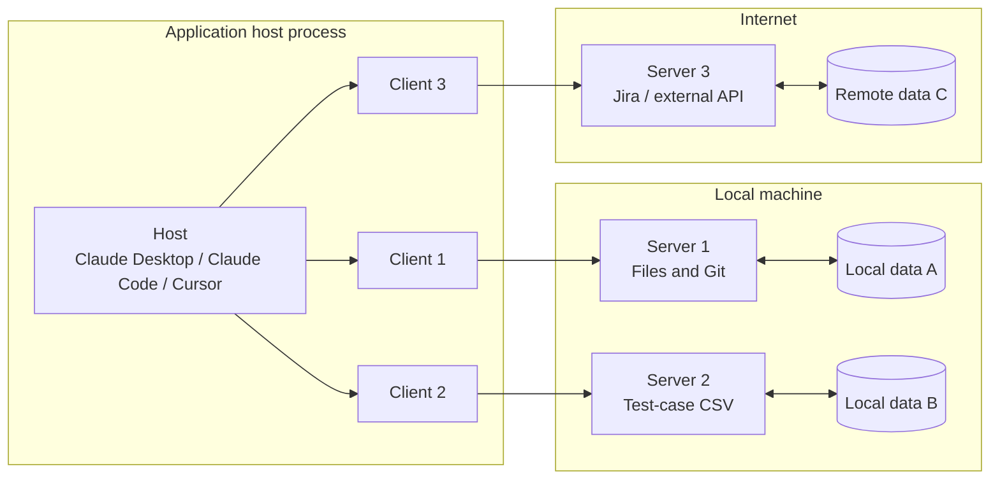
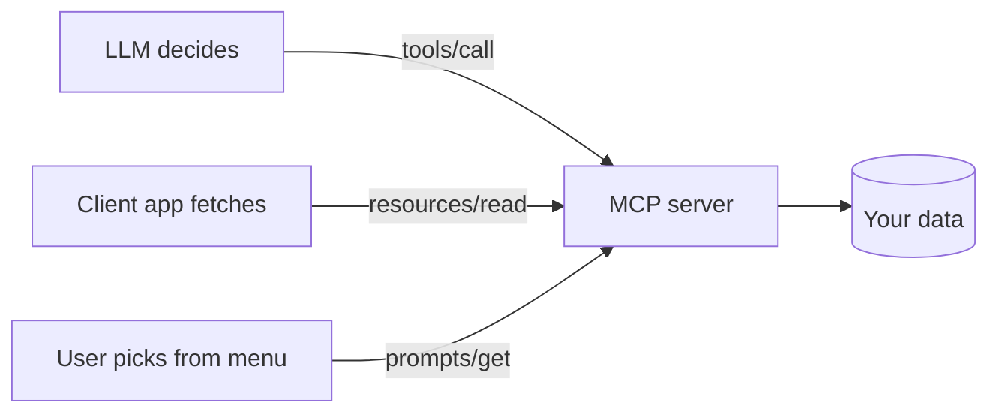
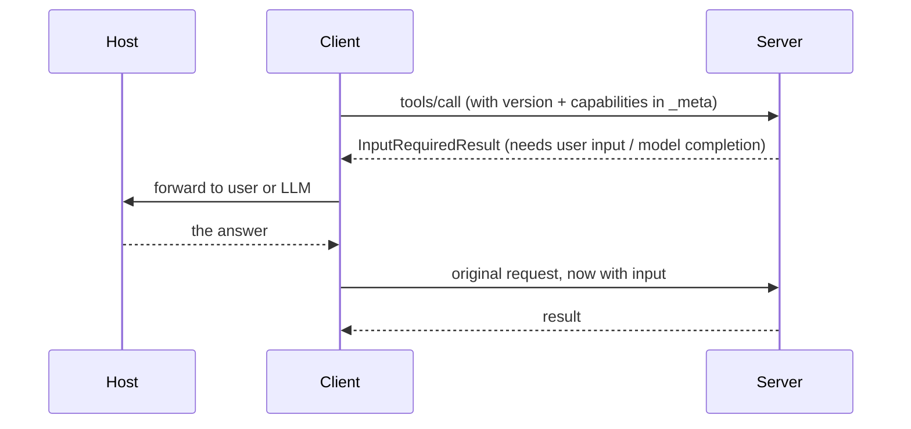

# MCP Basics — the Model Context Protocol for Testers

> Chapter 09 is the **concepts** chapter. It answers *what MCP is and why it exists*.
> Chapter 10 (`chapter_10_MCP_Creation_VIBE/`) is the **build** chapter — you write a real
> FastMCP server over 5,000 test cases. Read this first, then go build it.

Reference: the MCP specification, revision **`2026-07-28`** — <https://modelcontextprotocol.io/specification>

---

## 1. The problem MCP solves

An LLM on its own is a closed box. It knows what was in its training data and whatever you
paste into the chat window. It cannot read your Jira board, query your test-case export,
or look at last night's Jenkins log.

The obvious fix is "paste more into the prompt". That fails three ways:

| Failure | What it looks like in QA work |
|---|---|
| **Context burn** | Pasting a 5,000-row test-case CSV consumes the whole context window before the model has answered anything. |
| **Staleness** | The pasted copy is frozen at paste time. Someone edits the sheet, your answer is now wrong and nothing tells you. |
| **N×M integrations** | 5 AI clients × 8 data sources = 40 bespoke integrations, each rewritten when either side changes. |

**MCP (Model Context Protocol) is an open protocol that standardises the connection between
an LLM application and an external data source or tool.** Write one server; every MCP client
— Claude Desktop, Claude Code, Cursor, or your own app — can use it. The N×M problem
collapses to N+M.

The specification takes explicit inspiration from the **Language Server Protocol**. LSP
standardised "how do I add language support to an editor" so that one Python language server
works in VS Code, Neovim, and JetBrains. MCP does the same for "how do I add context and
tools to an AI application".

---

## 2. Why a tester should care

- **Your data becomes queryable, not pasted.** The model asks for 3 matching test cases instead of ingesting 5,000.
- **It is always current.** The server reads the live source on each call.
- **One server, every client.** The same test-case server works in Claude Desktop and in your CI script.
- **It is a testable surface.** An MCP server is a piece of software with inputs, outputs, and error paths. Tools, resources, prompts, and their failure modes are all things you can write test cases against — see the Inspector checklist in chapter 10.

---

## 3. Architecture — host, client, server

MCP uses a **client-host-server** architecture.



| Role | What it is | Responsibilities |
|---|---|---|
| **Host** | The AI application the human uses | Creates and manages clients, enforces security policy, asks the user for consent, coordinates the LLM, aggregates context |
| **Client** | A connector inside the host | Talks to **exactly one** server (1:1), attaches protocol version and capabilities to every request, routes messages, keeps servers isolated from each other |
| **Server** | Your program | Exposes resources, tools, and prompts. Focused, independent, can be a local subprocess or a remote service |

**The 1:1 client-server rule is the security boundary.** It is what makes the third design
principle enforceable.

### Design principles (from the spec)

1. **Servers should be extremely easy to build.** The host does the hard orchestration; a server just exposes a narrow capability.
2. **Servers should be highly composable.** Each does one thing; many combine cleanly.
3. **Servers should not be able to read the whole conversation, nor see into other servers.** A server sees only what it is handed. Full history stays with the host. This is why a malicious or buggy server cannot exfiltrate your chat with a different server.
4. **Features can be added progressively.** A minimal core, with capabilities negotiated on top — so clients and servers evolve independently.

---

## 4. The wire — JSON-RPC 2.0

MCP messages are **JSON-RPC 2.0**, UTF-8 encoded. If you have tested a REST API, this is
familiar territory with different plumbing: instead of a URL path and verb, you send a
`method` name and a `params` object, and correlate the reply by `id`.

A tool call on the wire:

```json
{
  "jsonrpc": "2.0",
  "id": 7,
  "method": "tools/call",
  "params": {
    "name": "search_test_cases",
    "arguments": { "query": "invite user", "limit": 3 }
  }
}
```

And the reply:

```json
{
  "jsonrpc": "2.0",
  "id": 7,
  "result": {
    "content": [{ "type": "text", "text": "[{\"id\": \"VWO-1042\", ...}]" }]
  }
}
```

Only two message directions exist: the client sends **requests and notifications**; the
server sends **responses and notifications**. Servers do not initiate JSON-RPC requests, and
clients do not send JSON-RPC responses. That constraint matters — it is why a server that
needs something from the client (see §6) has to ask for it inside a *reply* rather than by
calling the client.

---

## 5. The three server primitives

This is the part people get wrong, and the distinction chapter 10 is built to make concrete.
Ask **who decides to use it**:

| Primitive | Who triggers it | Analogy | Example |
|---|---|---|---|
| **Tools** | The **model** decides, mid-conversation | A function call | `search_test_cases(query, limit)` |
| **Resources** | The **application** fetches it by URI | A file read / `GET` | `testcases://schema` |
| **Prompts** | The **user** picks it from a menu | A slash command | `/review_test_case VWO-1001` |



### Tools — model-invoked

Functions the model can call when it judges them useful. They take arguments the model
computes, and they can have side effects. The model reads the tool's **name, description,
and input schema** to decide whether and how to call it — which means those fields are
functional code, not documentation. A vague description produces a tool the model never
calls, or calls wrongly.

**Rule of thumb: if it needs arguments the model has to work out, it is a tool.**

Because a tool is arbitrary code execution, the spec is blunt about it: hosts must obtain
explicit user consent before invoking any tool, and tool descriptions from an untrusted
server must themselves be treated as untrusted input.

### Resources — application-fetched

Context the application pulls by **URI**, before or alongside the model's turn. Closer to
reading a file than calling a function: no side effects, identified by address.

Resources can be **templated** — one URI pattern serving many documents:

```
testcases://schema                 # a fixed resource
testcases://modules                # a fixed resource: the list of valid module names
testcases://module/{name}          # a templated resource: 17 modules, one declaration
```

Pair a templated resource with a plain resource that lists the valid values, or clients have
to guess what `{name}` accepts.

### Prompts — user-invoked

Templated messages and workflows the **user** selects, typically surfaced as slash commands
or menu items. Good for canonical, repeatable jobs: "review this test case for coverage
gaps", "generate a regression suite for this module".

---

## 6. What the client offers the server

The flow is not one-way. A client may offer features back to the server — **elicitation**
(the server asks the user for more information), and historically **sampling** (the server
asks the host's LLM to complete something) and **roots** (the filesystem boundaries the
server may operate in).

Since servers cannot initiate requests, these travel as an **`InputRequiredResult`** inside a
reply: the server answers "I need X before I can finish", the client obtains X, then re-sends
the original request with the input attached.



---

## 7. Capability negotiation

Neither side assumes what the other supports. Capabilities are declared, not guessed.

- The **client** attaches its capabilities to every request, in `_meta.io.modelcontextprotocol/clientCapabilities`.
- The **server** advertises its capabilities in response to **`server/discover`**, which a client may call before anything else.

Both sides must respect what was declared. A server that never advertised tool support will
not be sent `tools/call`.

> **Era note.** Revision `2026-07-28` is **stateless**: every request is self-contained and
> carries its own protocol version and capabilities, and discovery happens via
> `server/discover`. Earlier revisions were session-based — they opened with an `initialize`
> handshake, and allowed servers to initiate requests. Both eras exist in the wild, so a
> client that wants to talk to old and new servers probes with `server/discover` first and
> falls back to `initialize` if the server does not answer like a modern one. Many SDKs
> (including the FastMCP version pinned in chapter 10) still implement the session-based
> model — check your SDK's version before assuming which era you are writing against.

---

## 8. Transports

Protocol semantics are **identical on every transport**. A transport is a *binding*: it
defines how messages are framed and delivered, not what they mean.

| Transport | Shape | Use when |
|---|---|---|
| **stdio** | Client launches the server as a subprocess; newline-delimited JSON-RPC over `stdin`/`stdout` | Local servers. Simplest to build and debug — chapter 10 uses this. |
| **Streamable HTTP** | Each message is an HTTP POST to a single MCP endpoint; the reply is a JSON object or a request-scoped SSE stream | Remote/hosted servers, multiple users, network boundaries |

Custom transports are allowed (Unix sockets, TCP), and should reuse the stdio framing rather
than inventing a new one.

### The stdio rule that bites everyone

> ### ⚠️ Never write to stdout in a stdio MCP server
>
> The spec is explicit: **the server MUST NOT write anything to its `stdout` that is not a
> valid MCP message.** `stdout` *is* the JSON-RPC channel.
>
> One stray `print()` — a debug line, a banner, a progress bar, a stray library warning —
> corrupts the message stream and the client disconnects with a JSON parse error. The symptom
> looks nothing like the cause, so it costs real debugging time.
>
> **Log to `stderr` instead.** The spec explicitly permits it: the server MAY write UTF-8 to
> `stderr` for any logging purpose. Clients may capture, forward, or ignore it, and should
> not treat output on `stderr` as an error signal.

Messages are newline-delimited and **must not contain embedded newlines**. Shutdown is
graceful: the client closes the server's `stdin`, and the server should exit promptly on EOF.

---

## 9. Beyond the core: extensions

The core protocol is deliberately small. Optional **extensions** add specialised
functionality — always opt-in, and negotiated by both sides:

| Extension | What it adds |
|---|---|
| **Tasks** | Asynchronous execution of long-running operations — polling, mid-flight input, durable handles |
| **Skills over MCP** | Rich structured instructions for agent workflows, discovered and consumed through MCP |
| **MCP Apps** | Interactive UI elements (charts, forms, players) rendered inline in the conversation |

---

## 10. Security — read this before you ship a server

MCP enables arbitrary data access and code execution. The spec sets out principles that
implementors must address, and they are worth reading as a tester because they are exactly
where the interesting bugs live:

1. **User consent and control** — users explicitly consent to and understand all data access and operations, and retain control over what is shared and what runs.
2. **Data privacy** — hosts obtain explicit consent before exposing user data to a server, and must not transmit resource data elsewhere without consent.
3. **Tool safety** — tools are arbitrary code execution. Hosts obtain explicit consent before invoking any tool, and treat tool descriptions and annotations from untrusted servers as untrusted.

MCP cannot enforce these at the protocol level — they are implementation obligations. Which
means "does the host actually ask before running this tool?" is a legitimate and important
test case.

---

## 11. Try it before you build it

The **MCP Inspector** is a browser UI that speaks MCP and lets you drive any server by hand —
the closest thing to Postman for MCP, and the fastest way to make the three primitives feel
real:

```bash
npx -y @modelcontextprotocol/inspector <command to start your server>
```

Open the printed `localhost:6274` URL, hit **Connect**, then walk the **Tools**, **Resources**,
and **Prompts** tabs. Exercise the happy path and the error path for each.

---

## 12. Glossary

| Term | Meaning |
|---|---|
| **Host** | The AI application that owns the conversation and the security policy |
| **Client** | A connector inside the host; talks to exactly one server |
| **Server** | Your program, exposing tools / resources / prompts |
| **Tool** | Model-invoked function, takes arguments, may have side effects |
| **Resource** | Application-fetched context, addressed by URI |
| **Templated resource** | One URI pattern (`scheme://thing/{name}`) serving many documents |
| **Prompt** | User-invoked templated message or workflow |
| **Elicitation** | Server asking the user, through the client, for more information |
| **Sampling** | Server asking the host's LLM to complete something |
| **Roots** | The filesystem boundaries a server is permitted to operate within |
| **stdio transport** | Server runs as a subprocess; JSON-RPC over stdin/stdout |
| **Streamable HTTP** | Each message is an HTTP POST to one endpoint; reply is JSON or an SSE stream |
| **`server/discover`** | The request a client uses to learn a server's versions and capabilities |
| **Capability negotiation** | Both sides declaring what they support, so neither guesses |

---

## 13. Common failure modes

| Symptom | Cause | Fix |
|---|---|---|
| Client disconnects with a JSON parse error | Something wrote to `stdout` that was not an MCP message | Route all logging to `stderr` |
| Model never calls your tool | Vague name, description, or input schema | Rewrite them — the model reads them to decide |
| Client guesses wrong values for a templated resource | No companion resource listing valid values | Publish a `scheme://things` resource alongside `scheme://thing/{name}` |
| Server appears to hang on launch | Correct behaviour — a stdio server waits on `stdin` for a client | Drive it with the Inspector, not a bare terminal |
| Wrong ID / bad argument returns a stack trace | Unhandled exception instead of a typed protocol error | Raise typed errors with messages that name the valid values |
| Modern client cannot talk to an old server | Era mismatch — stateless vs `initialize` handshake | Probe with `server/discover`, fall back to `initialize` |

---

## 14. Next

You now know what MCP is, who the three parties are, what the three primitives mean, and how
messages get from one side to the other.

**→ Chapter 10 — `chapter_10_MCP_Creation_VIBE/`** builds a FastMCP server over a real
5,000-row VWO test-case export, exposing 3 tools, 4 resources, and 2 prompts, and walks an
11-step Inspector checklist that exercises every primitive plus its error path.
