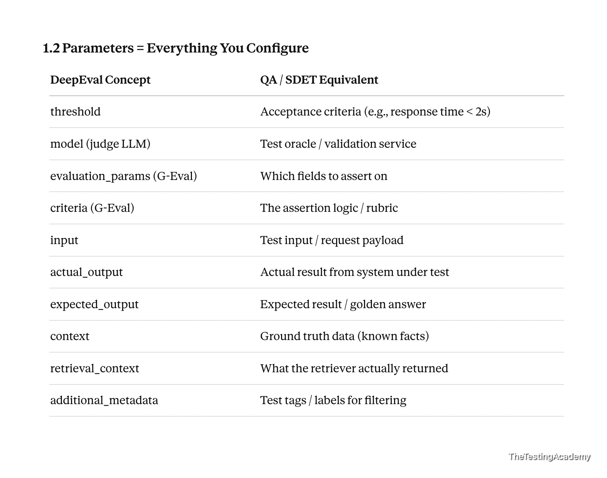
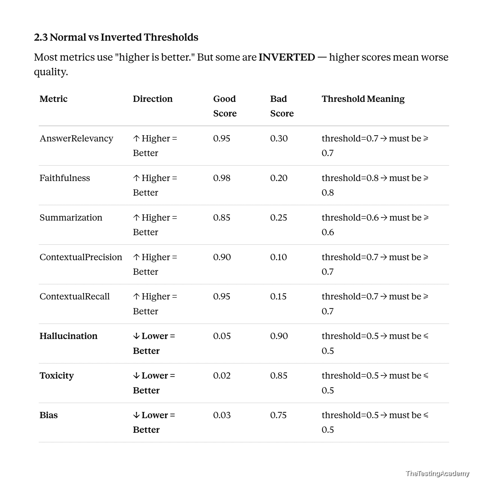

# Deepeval

### Pre Req.
* Python Installed
* pytest Basics knowledge
* LLM Brain - openai key or deepseek api key or groq api key, claude api ($5), 

* FREE LLM Brain
    * nvidia api free
    * amd api free (limited)



### Installation of Deepeval
* ```python3 -m venv venv```
* ```source venv/bin/activate```
* ```pip install --upgrade pip```
* ```pip install -U deepeval requests```

### Verify 
```
python -c "import deepeval, requests; print(deepeval.__version__, requests.__version__)"
```



**Deactivate later:**

```
deactivate
```

### Pick the judge LLM
DeepEval scores your output with a *second* LLM. Configure it once per machine.

**Groq (cheap, free tier).** Groq speaks the OpenAI API, so register it as a "local model".
`deepeval set-grok` is xAI's Grok, not Groq.com, so do not use it.
```
deepeval set-local-model \
  --model openai/gpt-oss-120b \
  --base-url "https://api.groq.com/openai/v1" \
  --format json \
  --prompt-api-key
```

**OpenAI.**
```
export OPENAI_API_KEY=sk-...
deepeval set-openai --model gpt-4o-mini
```

Add `--save dotenv:.env.local` to either command to persist the key across sessions.
Switch back with `deepeval unset-local-model`.

### Run
```
pytest test_01_Anwser_Relevancy.py
```

### Watch out
* Every metric assertion is a real, paid LLM call. Keep the golden dataset small.
* `.env`, `.env.local`, `venv/` and `.deepeval/` are gitignored. Never commit a key.
